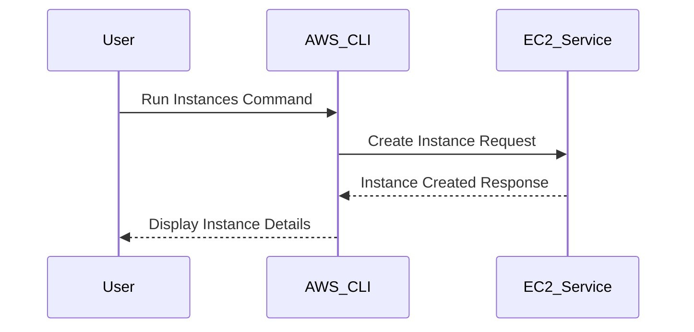

## Introduction to AWS CLI Installation and Usage for Efficient Management

### What is AWS CLI?

The AWS Command Line Interface (CLI) is a unified tool to control and manage your AWS services. It allows you to interact with various AWS services using commands from the terminal or script files. The AWS CLI provides a powerful way to automate tasks, manage resources, and perform operations that would otherwise require manual intervention through the AWS Management Console.

### Why Use AWS CLI?

Using the AWS CLI offers several advantages:

1. **Automation**: You can automate repetitive tasks, such as creating and managing EC2 instances, S3 buckets, and RDS databases.
2. **Scripting**: You can write scripts to perform complex operations that involve multiple AWS services.
3. **Efficiency**: The CLI allows you to perform tasks quickly and efficiently, reducing the time spent on manual operations.
4. **Consistency**: Scripts and commands ensure consistency across different environments and deployments.

### How Does AWS CLI Work?

The AWS CLI works by sending API requests to AWS services. Each command you run translates into one or more API calls. The CLI handles authentication, error handling, and output formatting, making it easier to interact with AWS services.

### Installing AWS CLI

To install the AWS CLI, follow these steps:

1. **Prerequisites**:
   - Ensure Python is installed on your machine. The AWS CLI requires Python 3.7 or later.
   - Install `pip`, the Python package installer, if it is not already installed.

2. **Installation Commands**:
   ```sh
   pip install awscli --upgrade --user
   ```

3. **Verification**:
   After installation, verify the installation by checking the version:
   ```sh
   aws --version
   ```

### Configuring AWS CLI

Before using the AWS CLI, you need to configure it with your AWS credentials. This can be done using the `aws configure` command:

```sh
aws configure
```

This command prompts you to enter your AWS Access Key ID, Secret Access Key, default region name, and default output format.

### Basic Usage of AWS CLI

#### Creating an EC2 Instance

Creating an EC2 instance using the AWS CLI involves specifying several parameters. Here’s a detailed breakdown of the process:

1. **Command Structure**:
   ```sh
   aws ec2 run-instances --image-id ami-0c94855ba95c71c99 --count 1 --instance-type t2.micro --key-name my-key-pair --security-group-ids sg-0123456789abcdef0 --subnet-id subnet-0123456789abcdef0
   ```

2. **Parameters Explanation**:
   - `--image-id`: Specifies the AMI (Amazon Machine Image) to use for the instance. This is the base operating system image.
   - `--count`: Number of instances to launch.
   - `--instance-type`: Type of instance to launch (e.g., `t2.micro`).
   - `--key-name`: Name of the key pair to use for SSH access.
   - `--security-group-ids`: IDs of the security groups to associate with the instance.
   - `--subnet-id`: ID of the subnet in which to launch the instance.

### Detailed Example of Creating an EC2 Instance

Let’s walk through a detailed example of creating an EC2 instance using the AWS CLI.

1. **Retrieve Required Information**:
   - **AMI ID**: Retrieve the AMI ID of the desired operating system image.
   - **Key Pair**: Ensure you have a key pair created in AWS.
   - **Security Group ID**: Retrieve the ID of the security group you want to use.
   - **Subnet ID**: Retrieve the ID of the subnet where you want to launch the instance.

2. **Run the Command**:
   ```sh
   aws ec2 run-instances --image-id ami-0c94855ba95c71c99 --count 1 --instance-type t2.micro --key-name my-key-pair --security-group-ids sg-0123456789abcdef0 --subnet-id subnet-0123456789abcdef0
   ```

3. **Output**:
   The command will return a JSON object containing details about the newly launched instance.

### Mermaid Diagram: EC2 Instance Creation Flow



### Common Pitfalls and How to Avoid Them

1. **Incorrect Parameters**:
   - **Pitfall**: Providing incorrect parameter values can lead to errors.
   - **Prevention**: Always double-check the values of parameters like AMI ID, key pair name, security group ID, and subnet ID.

2. **Insufficient Permissions**:
   - **Pitfall**: Insufficient permissions can result in failed operations.
   - **Prevention**: Ensure that the IAM user or role has the necessary permissions to perform the required actions.

### Secure Coding Practices

1. **Use IAM Roles Instead of Access Keys**:
   - **Vulnerable Code**:
     ```sh
     aws configure set aws_access_key_id <access_key>
     aws configure set aws_secret_access_key <secret_key>
     ```
   - **Secure Code**:
     Use IAM roles for EC2 instances to avoid hardcoding access keys.

2. **Limit IAM Permissions**:
   - **Vulnerable Code**:
     ```json
     {
       "Version": "2012-10-17",
       "Statement": [
         {
           "Effect": "Allow",
           "Action": "*",
           "Resource": "*"
         }
       ]
     }
     ```
   - **Secure Code**:
     Limit permissions to only the necessary actions and resources.
     ```json
     {
       "Version": "2012-10-17",
       "Statement": [
         {
           "Effect": "Allow",
           "Action": [
             "ec2:RunInstances",
             "ec2:DescribeInstances"
           ],
           "Resource": "*"
         }
       ]
     }
     ```

### Real-World Examples and Breaches

1. **CVE-2021-20225**: A vulnerability in the AWS CLI allowed unauthorized access to sensitive data due to improper handling of credentials.
   - **Impact**: Unauthorized access to AWS resources.
   - **Mitigation**: Ensure the latest version of the AWS CLI is installed and use IAM roles instead of hardcoding access keys.

2. **Breaches Due to Misconfigured IAM Policies**: Several breaches occurred due to overly permissive IAM policies.
   - **Impact**: Unauthorized access to critical resources.
   - **Mitigation**: Regularly audit IAM policies and limit permissions to the minimum required.

### How to Prevent / Defend

1. **Regular Audits**:
   - Perform regular audits of IAM policies and credentials.
   - Use tools like AWS Trusted Advisor to identify potential security issues.

2. **IAM Best Practices**:
   - Use least privilege principle.
   - Rotate access keys regularly.
   - Enable multi-factor authentication (MFA).

3. **Monitoring and Logging**:
   - Enable CloudTrail to log API calls.
   - Monitor logs for suspicious activity.

### Hands-On Labs

For practical experience with AWS CLI, consider the following labs:

- **PortSwigger Web Security Academy**: Offers hands-on labs for web application security.
- **OWASP Juice Shop**: A deliberately insecure web application for practicing security skills.
- **DVWA (Damn Vulnerable Web Application)**: A PHP/MySQL web application that contains numerous security vulnerabilities.
- **WebGoat**: An interactive, gamified training application for learning about web application security.

### Conclusion

Mastering the AWS CLI is essential for efficient management of AWS resources. By understanding the concepts, parameters, and best practices, you can automate tasks, improve efficiency, and enhance security. Regular audits, least privilege principles, and monitoring are key to maintaining a secure environment.

---
<!-- nav -->
[[DevOps/DevOps Bootcamp/04-Cloud Computing (AWS & DigitalOcean)/03-AWS CLI Installation and Usage for Efficient Management/00-Overview|Overview]] | [[02-Introduction to AWS CLI Installation and Usage|Introduction to AWS CLI Installation and Usage]]
