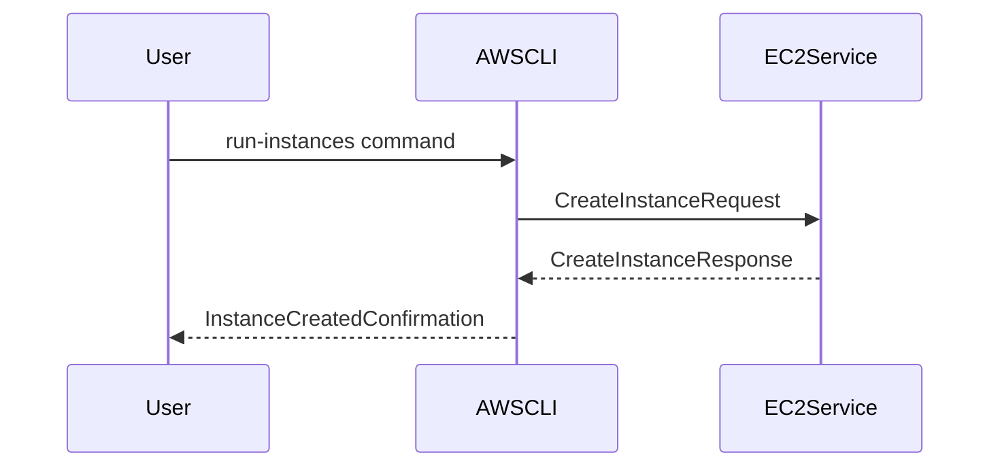

## Introduction to AWS CLI

The Amazon Web Services Command Line Interface (AWS CLI) is a powerful tool that allows users to manage their AWS resources programmatically. This means that instead of manually interacting with the AWS Management Console, you can automate tasks using scripts and commands. This is particularly useful for DevOps engineers and system administrators who need to manage large numbers of resources across multiple accounts and regions.

### What is AWS CLI?

AWS CLI is a unified command-line tool that enables you to control and manage your AWS services. It provides a consistent interface to interact with various AWS services such as EC2, S3, RDS, Lambda, and many others. The CLI is built on top of the AWS SDK, which provides a set of libraries and tools to interact with AWS services.

#### Why Use AWS CLI?

1. **Automation**: Automate repetitive tasks and reduce manual errors.
2. **Efficiency**: Perform operations faster than through the UI.
3. **Scalability**: Manage multiple resources across different regions and accounts.
4. **Integration**: Integrate with other tools and scripts for continuous integration and deployment.

### How Does AWS CLI Work?

AWS CLI uses the AWS SDK to communicate with AWS services. When you run a command, the CLI sends a request to the AWS API, which processes the request and returns a response. The CLI then formats the response and displays it to the user.

#### Example: Creating an EC2 Instance

Let's consider a simple example of creating an EC2 instance using the AWS CLI:

```sh
aws ec2 run-instances --image-id ami-0c94855ba95c71c99 --count 1 --instance-type t2.micro --key-name MyKeyPair --security-group-ids sg-0123456789abcdef0 --subnet-id subnet-0123456789abcdef0
```

This command creates a new EC2 instance with the specified parameters. The `--image-id` specifies the AMI (Amazon Machine Image) to use, `--count` specifies the number of instances to launch, `--instance-type` specifies the type of instance, `--key-name` specifies the key pair to use for SSH access, `--security-group-ids` specifies the security group(s) to associate with the instance, and `--subnet-id` specifies the subnet in which to launch the instance.

### Installing AWS CLI

To install the AWS CLI, you can use pip, the Python package manager. First, ensure that Python and pip are installed on your system. Then, run the following command:

```sh
pip install awscli --upgrade --user
```

This command installs the latest version of the AWS CLI. After installation, you need to configure the CLI with your AWS credentials. Run the following command:

```sh
aws configure
```

This command prompts you to enter your AWS Access Key ID, Secret Access Key, default region name, and default output format. These credentials are stored in a configuration file (`~/.aws/credentials`) and are used to authenticate your requests to AWS services.

### Using AWS CLI Commands

Once the AWS CLI is installed and configured, you can start using it to manage your AWS resources. Here are some common commands and their usage:

#### Listing Resources

To list all EC2 instances in a specific region, you can use the following command:

```sh
aws ec2 describe-instances --region us-east-1
```

This command returns a detailed JSON output containing information about all EC2 instances in the specified region.

#### Creating Resources

To create an S3 bucket, you can use the following command:

```sh
aws s3api create-bucket --bucket my-bucket --region us-east-1 --create-bucket-configuration LocationConstraint=us-east-1
```

This command creates a new S3 bucket named `my-bucket` in the `us-east-1` region.

#### Deleting Resources

To delete an S3 bucket, you can use the following command:

```sh
aws s3api delete-bucket --bucket my-bucket --region us-east-1
```

This command deletes the S3 bucket named `my-bucket`.

### Mermaid Diagrams

Here is a mermaid diagram showing the flow of creating an EC2 instance using the AWS CLI:



### Common Pitfalls and Best Practices

When using the AWS CLI, there are several common pitfalls to avoid:

1. **Incorrect Permissions**: Ensure that your IAM user or role has the necessary permissions to perform the desired actions.
2. **Region Mismatch**: Always specify the correct region when running commands to avoid unintended actions in the wrong region.
3. **Security Group Configuration**: Ensure that security groups are correctly configured to allow necessary traffic.

### How to Prevent / Defend

#### Detection

To detect unauthorized use of the AWS CLI, you can enable CloudTrail logging and monitor for unexpected API calls. CloudTrail logs all API calls made to your AWS account, including those made via the AWS CLI.

#### Prevention

1. **IAM Policies**: Use IAM policies to restrict access to specific resources and actions.
2. **MFA**: Enable Multi-Factor Authentication (MFA) for IAM users to add an extra layer of security.
3. **Least Privilege Principle**: Follow the principle of least privilege by granting only the minimum permissions required to perform a task.

#### Secure Coding Fixes

Here is an example of a vulnerable IAM policy and its secure counterpart:

**Vulnerable Policy:**

```json
{
    "Version": "2012-10-17",
    "Statement": [
        {
            "Effect": "Allow",
            "Action": "*",
            "Resource": "*"
        }
    ]
}
```

**Secure Policy:**

```json
{
    "Version": "2012-10-17",
    "Statement": [
        {
            "Effect": "Allow",
            "Action": [
                "ec2:RunInstances",
                "ec2:DescribeInstances"
            ],
            "Resource": "*"
        }
    ]
}
```

### Real-World Examples

#### Recent Breaches

In 2021, a major breach occurred due to misconfigured IAM roles and permissions. An attacker gained access to an S3 bucket containing sensitive data by exploiting a misconfigured IAM role. This highlights the importance of proper IAM policy management and regular audits.

#### CVEs

CVE-2021-26614 was a critical vulnerability in the AWS CLI that allowed attackers to execute arbitrary code on the target system. This vulnerability was patched, but it underscores the importance of keeping the AWS CLI up to date.

### Practice Labs

For hands-on practice with AWS CLI, consider the following labs:

- **PortSwigger Web Security Academy**: Offers interactive labs on AWS CLI usage and automation.
- **CloudGoat**: Provides a series of labs focused on AWS security and automation using the CLI.
- **flaws.cloud**: Contains real-world scenarios for practicing AWS CLI commands and securing resources.

By mastering the AWS CLI, you can significantly enhance your ability to manage and automate AWS resources efficiently and securely.

---
<!-- nav -->
[[02-Introduction to AWS CLI Installation and Usage|Introduction to AWS CLI Installation and Usage]] | [[DevOps/DevOps Bootcamp/04-Cloud Computing (AWS & DigitalOcean)/03-AWS CLI Installation and Usage for Efficient Management/00-Overview|Overview]] | [[04-Introduction to Key Pairs in AWS EC2|Introduction to Key Pairs in AWS EC2]]
