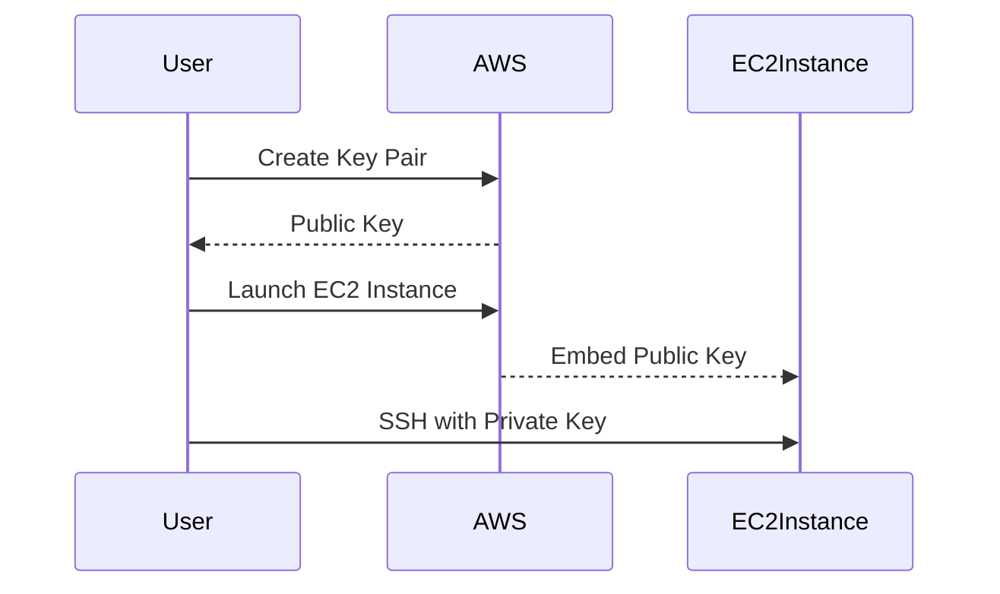

## Key Pair Management in AWS

### Introduction to Key Pairs

In Amazon Web Services (AWS), key pairs are used to securely access EC2 instances. A key pair consists of a public key and a private key. The public key is stored in AWS, while the private key (in `.pem` format) is kept by the user. This mechanism ensures that only authorized users can access the EC2 instances.

#### Why Use Key Pairs?

Key pairs provide a secure method of accessing EC2 instances. By using SSH keys, you avoid the need for passwords, which can be more easily compromised. Additionally, key pairs allow you to manage access to multiple instances efficiently.

#### How Key Pairs Work

When you launch an EC2 instance, you associate it with a key pair. The public key is embedded in the instance, and the private key is used to authenticate SSH connections. Here’s a high-level overview:



### Reusing vs. Creating New Key Pairs

You can either reuse an existing key pair or create a new one. Reusing a key pair simplifies management but may pose security risks if the private key is compromised. Creating a new key pair provides better isolation and security.

#### Reusing a Key Pair

Reusing a key pair is straightforward and reduces the number of keys you need to manage. However, if the private key is lost or compromised, all instances associated with that key pair will be affected.

#### Creating a New Key Pair

Creating a new key pair is recommended for better security. Each key pair should be unique to minimize the impact of a compromise.

### Creating a Key Pair Using the AWS CLI

To create a new key pair, you can use the `aws ec2 create-key-pair` command. Here’s a detailed example:

```bash
aws ec2 create-key-pair --key-name my-new-key-pair --query 'KeyMaterial' --output text > my-new-key-pair.pem
chmod 400 my-new-key-pair.pem
```

This command creates a new key pair named `my-new-key-pair` and saves the private key to `my-new-key-pair.pem`. The `chmod 400` command sets the correct permissions for the private key file.

### Security Group Management

Security groups act as virtual firewalls that control inbound and outbound traffic to your EC2 instances. They define rules that specify which traffic is allowed to reach your instances.

#### Reusing vs. Creating New Security Groups

Similar to key pairs, you can either reuse an existing security group or create a new one. Reusing a security group simplifies management but may introduce security risks if the rules are not specific enough. Creating a new security group allows you to tailor the rules to the specific needs of your instance.

### Creating a Security Group Using the AWS CLI

To create a new security group, you can use the `aws ec2 create-security-group` command. Here’s a detailed example:

```bash
aws ec2 create-security-group --group-name my-new-security-group --description "My new security group" --vpc-id vpc-xxxxxxxx
```

This command creates a new security group named `my-new-security-group` within the specified VPC (`vpc-xxxxxxxx`). You can then add rules to this security group using the `aws ec2 authorize-security-group-ingress` command.

### Adding Rules to a Security Group

To add rules to a security group, you can use the following command:

```bash
aws ec2 authorize-security-group-ingress --group-id sg-xxxxxxxx --protocol tcp --port 22 --cidr 0.0.0.0/0
```

This command adds a rule to allow inbound TCP traffic on port 22 (SSH) from any IP address (`0.0.0.0/0`).

### Subnet Management

Subnets are segments of your VPC that help you organize and isolate resources. Each subnet is associated with a specific Availability Zone (AZ).

#### Reusing vs. Creating New Subnets

You can either reuse an existing subnet or create a new one. Reusing a subnet simplifies management but may introduce security risks if the subnet is not properly isolated. Creating a new subnet allows you to tailor the subnet to the specific needs of your instance.

### Creating a Subnet Using the AWS CLI

To create a new subnet, you can use the `aws ec2 create-subnet` command. Here’s a detailed example:

```bash
aws ec2 create-subnet --subnet-id subnet-xxxxxxxx --vpc-id v-xxxxxxxx --availability-zone us-west-2a --cidr-block 10.0.1.0/24
```

This command creates a new subnet within the specified VPC (`v-xxxxxxxx`) and AZ (`us-west-2a`).

### Launching an EC2 Instance

To launch an EC2 instance, you can use the `aws ec2 run-instances` command. Here’s a detailed example:

```bash
aws ec2 run-instances --image-id ami-xxxxxxxx --count 1 --instance-type t2.micro --key-name my-new-key-pair --security-group-ids sg-xxxxxxxx --subnet-id subnet-xxxxxxxx
```

This command launches a new EC2 instance using the specified AMI (`ami-xxxxxxxx`), key pair (`my-new-key-pair`), security group (`sg-xxxxxxxx`), and subnet (`subnet-xxxxxxxx`).

### Pitfalls and Best Practices

#### Key Pair Management

- **Pitfall:** Losing the private key file or having it compromised.
- **Best Practice:** Store the private key file securely and back it up. Consider using a password manager or a secure storage solution.

#### Security Group Management

- **Pitfall:** Allowing unrestricted access (e.g., `0.0.0.0/0`).
- **Best Practice:** Restrict access to specific IP addresses or ranges. Use security groups to isolate different types of traffic.

#### Subnet Management

- **Pitfall:** Not properly isolating subnets.
- **Best Practice:** Use subnets to isolate different types of resources and apply appropriate security policies.

### Real-World Examples

#### Recent Breaches

- **Example:** In 2021, a misconfigured security group allowed unauthorized access to sensitive data. The breach was caused by allowing unrestricted access (`0.0.0.0/0`) to a database instance.
- **Impact:** The breach resulted in the exposure of personal data and financial information.
- **Prevention:** Ensure that security groups are properly configured and restrict access to specific IP addresses or ranges.

### How to Prevent / Defend

#### Secure Key Pair Management

- **Detection:** Monitor access logs and alert on unauthorized access attempts.
- **Prevention:** Store private key files securely and back them up. Use multi-factor authentication (MFA) for additional security.
- **Secure Code Fix:**
  - **Vulnerable Code:**
    ```bash
    aws ec2 create-key-pair --key-name my-key-pair --query 'KeyMaterial' --output text > my-key-pair.pem
    chmod 644 my-key-pair.pem
    ```
  - **Fixed Code:**
    ```bash
    aws ec2 create-key-pair --key-name my-key-pair --query 'KeyMaterial' --output text > my-key-pair.pem
    chmod 400 my-key-pair.pem
    ```

#### Secure Security Group Management

- **Detection:** Monitor security group changes and alert on unauthorized modifications.
- **Prevention:** Restrict access to specific IP addresses or ranges. Use security groups to isolate different types of traffic.
- **Secure Code Fix:**
  - **Vulnerable Code:**
    ```bash
    aws ec2 authorize-security-group-ingress --group-id sg-xxxxxxxx --protocol tcp --port 22 --cidr 0.0.0.0/0
    ```
  - **Fixed Code:**
    ```bash
    aws ec2 authorize-security-group-ingress --group-id sg-xxxxxxxx --protocol tcp --port 22 --cidr 192.168.1.0/24
    ```

#### Secure Subnet Management

- **Detection:** Monitor subnet changes and alert on unauthorized modifications.
- **Prevention:** Use subnets to isolate different types of resources and apply appropriate security policies.
- **Secure Code Fix:**
  - **Vulnerable Code:**
    ```bash
    aws ec2 create-subnet --subnet-id subnet-xxxxxxxx --vpc-id v-xxxxxxxx --availability-zone us-west-2a --cidr-block 10.0.1.0/24
    ```
  - **Fixed Code:**
    ```bash
    aws ec2 create-subnet --subnet-id subnet-yyyyyyyy --vpc-id v-yyyyyyyy --availability-zone us-west-2b --cidr-block 10.0.2.0/24
    ```

### Hands-On Labs

For hands-on practice with AWS CLI and EC2 management, consider the following labs:

- **PortSwigger Web Security Academy**: Focuses on web application security but includes sections on AWS security.
- **CloudGoat**: Provides a series of labs to learn about AWS security and compliance.
- **flaws.cloud**: Offers a variety of labs to practice securing AWS environments.

By following these best practices and using the provided tools, you can effectively manage key pairs, security groups, and subnets in AWS, ensuring the security and efficiency of your EC2 instances.

---
<!-- nav -->
[[05-AWS CLI Installation and Usage for Efficient Management|AWS CLI Installation and Usage for Efficient Management]] | [[DevOps/DevOps Bootcamp/04-Cloud Computing (AWS & DigitalOcean)/03-AWS CLI Installation and Usage for Efficient Management/00-Overview|Overview]] | [[07-User Permission Grouping in AWS IAM|User Permission Grouping in AWS IAM]]
