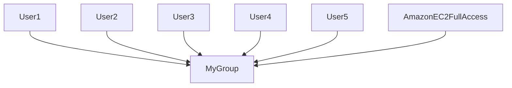

## User Permission Grouping in AWS IAM

### Background Theory

In the context of managing access control in cloud environments like AWS, user permission grouping is a fundamental concept. Instead of individually assigning permissions to each user, you can create groups and assign permissions to those groups. This approach simplifies management and ensures consistency across multiple users.

#### What is User Permission Grouping?

User permission grouping involves creating a group of users and assigning permissions to that group rather than to each user individually. This method is particularly useful in scenarios where multiple users require the same set of permissions. By grouping users, you can manage permissions more efficiently and maintain a cleaner structure.

#### Why Use User Permission Grouping?

1. **Efficiency**: Managing permissions at the group level reduces administrative overhead. Instead of updating permissions for each user individually, you can update them once for the entire group.
   
2. **Consistency**: Ensuring that all members of a group have the same set of permissions helps maintain consistency and reduces the likelihood of errors.

3. **Scalability**: As your organization grows, managing permissions at the group level becomes increasingly important. It allows you to scale your access control strategy without becoming overwhelmed by individual user permissions.

### How User Permission Grouping Works in AWS IAM

AWS Identity and Access Management (IAM) provides tools to manage access control for AWS services. One of the key features of IAM is the ability to create and manage user groups and assign permissions to those groups.

#### Creating a Group in IAM

To create a group in IAM:

1. Log in to the AWS Management Console.
2. Navigate to the IAM dashboard.
3. Click on "Groups" in the left-hand menu.
4. Click on "Create group".
5. Enter a name for the group and click "Next: Permissions".
6. Attach the necessary policies to the group.
7. Click "Review" and then "Create group".

#### Assigning Users to a Group

Once a group is created, you can add users to it:

1. Go to the IAM dashboard.
2. Click on "Users" in the left-hand menu.
3. Select the user you want to add to the group.
4. Click on "Add to group".
5. Select the group you created and click "Add".

### Attaching Policies to Groups

Policies define the permissions that are granted to a group. In IAM, you can attach policies to groups using the `attach-group-policy` command.

#### What is an IAM Policy?

An IAM policy is a JSON document that specifies permissions. It defines what actions are allowed or denied, and on which resources those actions can be performed.

#### Example IAM Policy

Here is an example of an IAM policy that grants full access to Amazon EC2:

```json
{
    "Version": "2012-10-17",
    "Statement": [
        {
            "Effect": "Allow",
            "Action": "ec2:*",
            "Resource": "*"
        }
    ]
}
```

This policy allows all actions (`*`) on all EC2 resources (`*`).

#### Attaching a Policy to a Group

To attach a policy to a group using the AWS CLI, you need the policy's Amazon Resource Name (ARN). The ARN uniquely identifies the policy within AWS.

#### Getting the Policy ARN

You can obtain the policy ARN from the IAM console:

1. Log in to the AWS Management Console.
2. Navigate to the IAM dashboard.
3. Click on "Policies" in the left-hand menu.
4. Find the policy you want to attach (e.g., `AmazonEC2FullAccess`).
5. Click on the policy name to view its details.
6. Copy the ARN from the "Summary" section.

#### Using the AWS CLI to Attach a Policy

The `attach-group-policy` command requires the group name and the policy ARN.

```bash
aws iam attach-group-policy --group-name MyGroup --policy-arn arn:aws:iam::aws:policy/AmazonEC2FullAccess
```

### Complete Example

Let's walk through a complete example of creating a group, attaching a policy, and verifying the setup.

#### Step 1: Create a Group

```bash
aws iam create-group --group-name MyGroup
```

#### Step 2: Attach a Policy to the Group

```bash
aws iam attach-group-policy --group-name MyGroup --policy-arn arn:aws:iam::aws:policy/AmazonEC2FullAccess
```

#### Step 3: Verify the Setup

You can verify that the policy is attached to the group by listing the group's policies:

```bash
aws iam list-attached-group-policies --group-name MyGroup
```

### Mermaid Diagrams

#### Group Structure Diagram



### Real-World Examples

#### Recent Breaches and CVEs

One notable breach involving misconfigured IAM roles was the Capital One data breach in 2019 (CVE-2019-11216). The attacker exploited a misconfigured IAM role that had excessive permissions, leading to unauthorized access to sensitive data.

#### Secure Coding Practices

To prevent such breaches, it is crucial to follow secure coding practices:

1. **Least Privilege Principle**: Ensure that users and groups have only the minimum permissions required to perform their tasks.
2. **Regular Audits**: Conduct regular audits of IAM policies to identify and correct any overly permissive settings.
3. **Multi-Factor Authentication (MFA)**: Enable MFA for all IAM users to add an extra layer of security.

### How to Prevent / Defend

#### Detection

Use AWS CloudTrail to monitor API calls made to IAM. This can help detect unauthorized changes to IAM policies and roles.

```bash
aws cloudtrail lookup-events --lookup-attributes AttributeKey=EventName,AttributeValue=AttachGroupPolicy
```

#### Prevention

1. **IAM Policy Simulator**: Use the IAM Policy Simulator to test policies before attaching them to groups.
2. **IAM Access Analyzer**: Utilize IAM Access Analyzer to automatically discover and analyze permissions granted by IAM policies.

#### Secure-Coding Fixes

Compare the insecure and secure versions of an IAM policy:

**Insecure Policy**

```json
{
    "Version": "2012-10-17",
    "Statement": [
        {
            "Effect": "Allow",
            "Action": "*",
            "Resource": "*"
        }
    ]
}
```

**Secure Policy**

```json
{
    "Version": "2012-10-17",
    "Statement": [
        {
            "Effect": "Allow",
            "Action": "ec2:*",
            "Resource": "*"
        }
    ]
}
```

### Configuration Hardening

1. **IAM Role Usage**: Use IAM roles instead of IAM users whenever possible. Roles can be assumed by AWS services, reducing the risk of credential exposure.
2. **IAM User Key Rotation**: Regularly rotate access keys for IAM users to minimize the window of opportunity for unauthorized access.

### Practice Labs

For hands-on practice with IAM and user permission grouping, consider the following labs:

- **PortSwigger Web Security Academy**: Offers modules on IAM and access control.
- **OWASP Juice Shop**: Provides a web application with various security vulnerabilities, including IAM misconfigurations.
- **CloudGoat**: A cloud security training platform that includes exercises on IAM and user management.

By following these guidelines and practicing with real-world examples, you can effectively manage user permissions in AWS IAM and ensure robust security for your cloud environment.

---
<!-- nav -->
[[06-Key Pair Management in AWS|Key Pair Management in AWS]] | [[DevOps/DevOps Bootcamp/04-Cloud Computing (AWS & DigitalOcean)/03-AWS CLI Installation and Usage for Efficient Management/00-Overview|Overview]] | [[DevOps/DevOps Bootcamp/04-Cloud Computing (AWS & DigitalOcean)/03-AWS CLI Installation and Usage for Efficient Management/08-Practice Questions & Answers|Practice Questions & Answers]]
