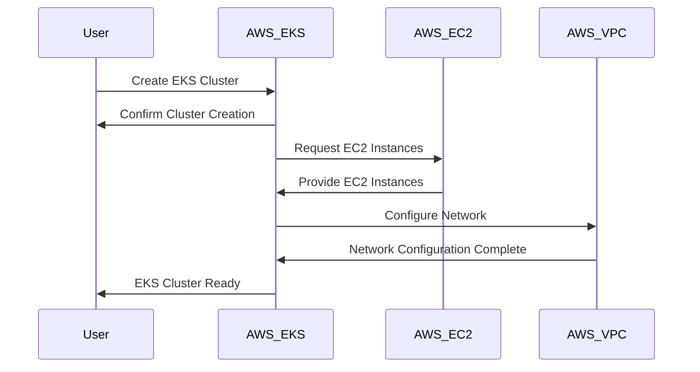
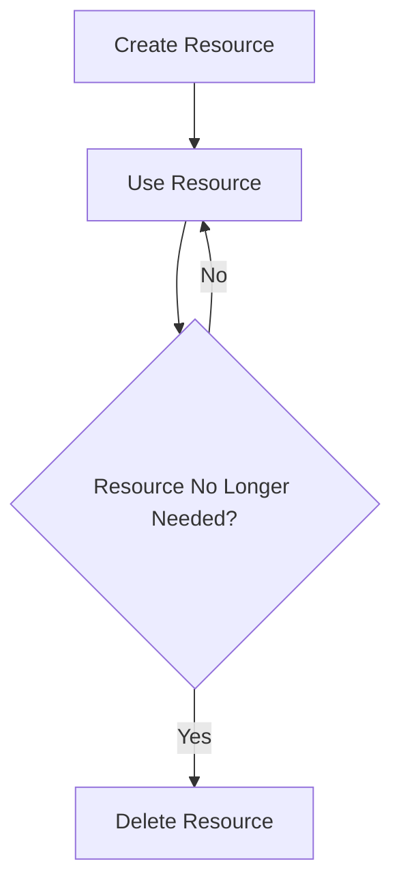
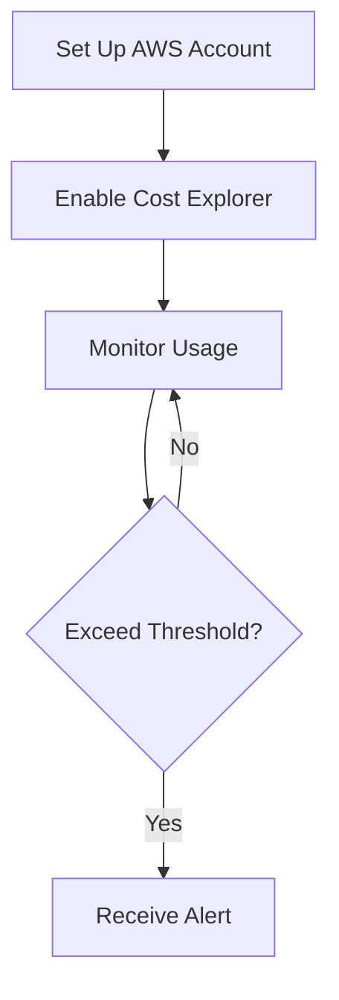
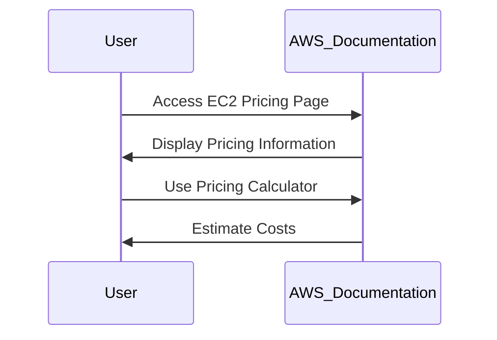

## AWS Free Tier Account Setup and Usage

### Introduction to AWS Free Tier

AWS Free Tier is a program offered by Amazon Web Services that provides users with a limited amount of free usage of various AWS services. This is designed to help new users get familiar with AWS and experiment with different services without incurring immediate costs. However, it is crucial to understand the limitations and the potential charges associated with using AWS services outside the free tier.

### Understanding the Free Tier Limitations

The AWS Free Tier includes a selection of services that are provided at no cost for a specified period, typically 12 months from the date your AWS account was created. These services include:

- **Amazon EC2**: A limited number of instances, such as t2.micro, are available for free.
- **Amazon RDS**: Free usage for certain database engines like MySQL and PostgreSQL.
- **Amazon S3**: Limited storage and data transfer.
- **Amazon VPC**: Basic networking capabilities.
- **AWS Lambda**: Limited compute time.
- **Amazon DynamoDB**: Limited read/write capacity units.

However, it is important to note that not all services are covered under the free tier. For instance, more powerful EC2 instances, additional storage, and advanced features may incur charges.

#### Example of Free Tier Usage

Let's consider a scenario where you are setting up an EKS (Elastic Kubernetes Service) cluster. EKS is not included in the free tier, so you will be charged for the resources used. Here’s how you might set up an EKS cluster and the associated costs:



In this sequence, the user initiates the creation of an EKS cluster, which triggers the provisioning of EC2 instances and VPC configuration. Since EKS and potentially more powerful EC2 instances are not part of the free tier, these actions will result in charges.

### Managing Costs and Resources

To avoid unexpected charges, it is essential to manage your AWS resources effectively. Here are some key practices:

#### Deleting Unused Resources

Always ensure that you delete resources that are no longer needed. This includes stopping and terminating EC2 instances, deleting S3 buckets, and removing unused VPCs.



#### Monitoring Usage and Costs

AWS provides tools to monitor your usage and costs. The AWS Cost Explorer and Budgets features allow you to track your spending and set alerts for when you exceed certain thresholds.



### Detailed Pricing Information

AWS offers detailed documentation on the pricing of its services. Each service page includes a pricing calculator that allows you to estimate costs based on your usage. For example, the pricing page for Amazon EC2 provides information on the cost per hour for different instance types.

#### Example: Amazon EC2 Pricing

Here is an example of how to access the pricing information for Amazon EC2:



### Hands-On Practice

To gain practical experience with AWS Free Tier, you can use the following labs:

- **PortSwigger Web Security Academy**: Offers hands-on labs for web application security.
- **OWASP Juice Shop**: A deliberately insecure web application for security training.
- **DVWA (Damn Vulnerable Web Application)**: Another popular web application for security testing.
- **WebGoat**: An interactive web application security training tool.

These labs provide a controlled environment to practice and learn about AWS services and their usage.

### Conclusion

Understanding the AWS Free Tier and managing your resources effectively is crucial to avoid unexpected charges. By following best practices and utilizing the tools provided by AWS, you can maximize the benefits of the free tier while minimizing costs. Always ensure that you delete unused resources and monitor your usage to stay within the free tier limits.

### How to Prevent / Defend

#### Detecting Unnecessary Charges

- **Regularly review your AWS billing dashboard** to identify any unexpected charges.
- **Set up AWS Budgets** to receive alerts when your spending exceeds predefined thresholds.

#### Preventing Unnecessary Charges

- **Automate resource cleanup**: Use scripts or AWS Lambda functions to automatically terminate resources that are no longer needed.
- **Use AWS Cost Explorer**: Regularly analyze your spending patterns to identify areas where you can reduce costs.

#### Secure Coding Practices

When working with AWS resources, ensure that you follow secure coding practices to prevent unauthorized access and misuse. For example, when creating IAM roles and policies, use the principle of least privilege.

```yaml
# IAM Policy Example
{
    "Version": "2012-10-17",
    "Statement": [
        {
            "Effect": "Allow",
            "Action": [
                "ec2:DescribeInstances"
            ],
            "Resource": "*"
        }
    ]
}
```

This policy grants minimal permissions necessary to describe EC2 instances, reducing the risk of unauthorized access.

By adhering to these practices, you can effectively manage your AWS resources and avoid unnecessary charges while ensuring the security of your environment.

---
<!-- nav -->
[[01-Introduction to AWS Free Tier Account Setup and Usage|Introduction to AWS Free Tier Account Setup and Usage]] | [[DevOps/DevOps Bootcamp/04-Cloud Computing (AWS & DigitalOcean)/04-AWS Free Tier Account Setup And Usage/00-Overview|Overview]] | [[DevOps/DevOps Bootcamp/04-Cloud Computing (AWS & DigitalOcean)/04-AWS Free Tier Account Setup And Usage/03-Practice Questions & Answers|Practice Questions & Answers]]
