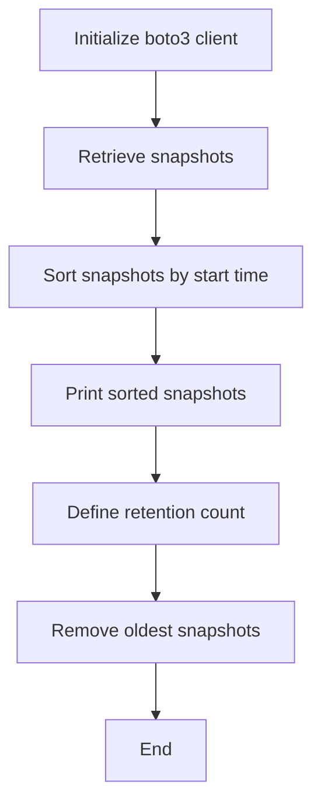

## Introduction to Automated Snapshot Cleanup Program for AWS

In this section, we will delve into the details of creating an automated snapshot cleanup program for AWS. This program will help manage and clean up old snapshots, ensuring that storage costs are minimized and that only necessary data is retained. We will cover the necessary background, theory, and practical implementation steps to achieve this goal.

### Background Theory

AWS provides various services for managing data, including EC2 instances, EBS volumes, and RDS databases. One of the key features of these services is the ability to create snapshots, which are point-in-time copies of your data. Snapshots are useful for backup purposes and can be used to restore data in case of failure or corruption.

However, managing snapshots can become cumbersome over time, especially if you do not have a proper cleanup mechanism in place. Old snapshots can accumulate, leading to increased storage costs and potential data management issues. Therefore, automating the process of cleaning up old snapshots is crucial for maintaining efficient and cost-effective operations.

### Prerequisites

Before diving into the implementation, ensure you have the following:

1. **AWS Account**: You need an active AWS account with appropriate permissions to manage snapshots.
2. **IAM Role**: Ensure you have an IAM role with the necessary permissions to access and manage snapshots.
3. **Python Environment**: A Python environment is required to run the script. Ensure you have Python installed along with the necessary libraries.

### Importing Required Libraries

To implement the automated snapshot cleanup program, we need to import several libraries. One of the key libraries is `boto3`, which is the Amazon Web Services (AWS) Software Development Kit (SDK) for Python. Additionally, we will use the `operator` module for sorting the snapshots based on their start times.

```python
import boto3
from operator import itemgetter
```

### Retrieving Snapshots

The first step in our program is to retrieve the list of snapshots from AWS. We will use the `boto3` library to interact with the AWS API and fetch the snapshots.

```python
# Initialize the boto3 client for EC2
ec2 = boto3.client('ec2')

# Retrieve the list of snapshots
snapshots_response = ec2.describe_snapshots(OwnerIds=['self'])

# Extract the snapshots from the response
snapshots = snapshots_response['Snapshots']
```

### Sorting Snapshots by Start Time

Once we have retrieved the list of snapshots, the next step is to sort them based on their start times. This will allow us to identify and remove the oldest snapshots first.

```python
# Sort the snapshots by start time
sorted_snapshots = sorted(snapshots, key=itemgetter('StartTime'))
```

### Printing Sorted Snapshots

To verify that the snapshots are correctly sorted, we can print out the start times of each snapshot.

```python
for snapshot in sorted_snapshots:
    print(f"Snapshot ID: {snapshot['SnapshotId']}, Start Time: {snapshot['StartTime']}")
```

### Removing Old Snapshots

After sorting the snapshots, we can proceed to remove the oldest snapshots. To determine which snapshots to remove, we can set a threshold based on the number of days or the total number of snapshots to retain.

```python
# Define the number of snapshots to retain
retain_count = 5

# Remove the oldest snapshots
for snapshot in sorted_snapshots[:-retain_count]:
    ec2.delete_snapshot(SnapshotId=snapshot['SnapshotId'])
    print(f"Deleted snapshot: {snapshot['SnapshotId']}")
```

### Full Implementation Example

Here is the complete implementation of the automated snapshot cleanup program:

```python
import boto3
from operator import itemgetter

# Initialize the boto3 client for EC2
ec2 = boto3.client('ec2')

# Retrieve the list of snapshots
snapshots_response = ec2.describe_snapshots(OwnerIds=['self'])

# Extract the snapshots from the response
snapshots = snapshots_response['Snapshots']

# Sort the snapshots by start time
sorted_snapshots = sorted(snapshots, key=itemgetter('StartTime'))

# Print the sorted snapshots
for snapshot in sorted_snapshots:
    print(f"Snapshot ID: {snapshot['SnapshotId']}, Start Time: {snapshot['StartTime']}")

# Define the number of snapshots to retain
retain_count = 5

# Remove the oldest snapshots
for snapshot in sorted_snapshots[:-retain_count]:
    ec2.delete_snapshot(SnapshotId=snapshot['SnapshotId'])
    print(f"Deleted snapshot: {snapshot['SnapshotId']}")
```

### Mermaid Diagrams

Let's visualize the process using a mermaid diagram:



### Pitfalls and Common Mistakes

1. **Incorrect Permissions**: Ensure that the IAM role has the necessary permissions to manage snapshots. Missing permissions can lead to errors.
2. **Incomplete Data**: Make sure to extract all necessary data from the AWS response. Missing data can result in incorrect sorting or deletion.
3. **Hardcoded Values**: Avoid hardcoding values such as the retention count. Use configurable values to make the script more flexible.

### How to Prevent / Defend

#### Detection

To detect if the snapshot cleanup program is working correctly, you can monitor the number of snapshots and their ages. You can also set up CloudWatch alarms to notify you if the number of snapshots exceeds a certain threshold.

#### Prevention

1. **Regular Monitoring**: Regularly monitor the number of snapshots and their ages to ensure that the cleanup program is functioning as expected.
2. **Automated Testing**: Implement automated tests to verify that the cleanup program works correctly in different scenarios.

#### Secure Coding Fixes

Here is an example of a vulnerable script and its secure counterpart:

**Vulnerable Script**

```python
import boto3

# Initialize the boto3 client for EC2
ec2 = boto3.client('ec2')

# Retrieve the list of snapshots
snapshots_response = ec2.describe_snapshots(OwnerIds=['self'])

# Extract the snapshots from the response
snapshots = snapshots_response['Snapshots']

# Delete all snapshots
for snapshot in snapshots:
    ec2.delete_snapshot(SnapshotId=snapshot['SnapshotId'])
```

**Secure Script**

```python
import boto3
from operator import itemgetter

# Initialize the boto3 client for EC2
ec2 = boto3.client('ec2')

# Retrieve the list of snapshots
snapshots_response = ec2.describe_snapshots(OwnerIds=['self'])

# Extract the snapshots from the response
snapshots = snapshots_response['Snapshots']

# Sort the snapshots by start time
sorted_snapshots = sorted(snapshots, key=itemgetter('StartTime'))

# Define the number of snapshots to retain
retain_count = 5

# Remove the oldest snapshots
for snapshot in sorted_snapshots[:-retain_count]:
    ec2.delete_snapshot(SnapshotId=snapshot['SnapshotId'])
```

### Configuration Hardening

Ensure that your IAM roles and policies are properly configured to limit access to only the necessary resources. Use least privilege principles to minimize the risk of unauthorized access.

### Real-World Examples

Recent breaches and vulnerabilities related to snapshot management include:

- **CVE-2021-20225**: This vulnerability allowed unauthorized access to AWS resources, including snapshots. Ensuring proper IAM policies and regular monitoring can help mitigate such risks.
- **AWS S3 Bucket Exposure**: In 2021, several organizations exposed their S3 buckets, leading to unauthorized access to sensitive data. Proper snapshot management and monitoring can help prevent such incidents.

### Practice Labs

For hands-on practice, consider the following labs:

- **PortSwigger Web Security Academy**: Offers comprehensive training on web application security.
- **OWASP Juice Shop**: A deliberately insecure web application for practicing security skills.
- **DVWA (Damn Vulnerable Web Application)**: Another popular web application for learning web security.

These labs provide practical experience in managing and securing AWS resources, including snapshots.

### Conclusion

In this section, we covered the implementation of an automated snapshot cleanup program for AWS. We discussed the necessary background, theory, and practical steps to achieve this goal. By following the steps outlined, you can efficiently manage and clean up old snapshots, ensuring optimal storage usage and minimizing costs.

---
<!-- nav -->
[[DevOps/DevOps Bootcamp/04-Cloud Computing (AWS & DigitalOcean)/05-Automated Snapshot Cleanup Program For AWS/00-Overview|Overview]] | [[02-Introduction to Automated Snapshot Cleanup in AWS|Introduction to Automated Snapshot Cleanup in AWS]]
