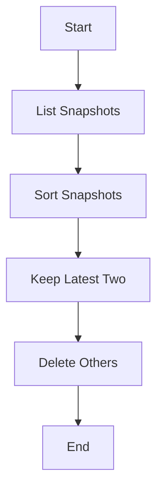

## Introduction to Automated Snapshot Cleanup in AWS

In the realm of DevOps and cloud computing, managing resources efficiently is crucial. One such resource management task is the cleanup of snapshots in Amazon Web Services (AWS). Snapshots are point-in-time copies of your data stored in Amazon Elastic Block Store (EBS). They are essential for data recovery and backup purposes but can quickly consume storage space if not managed properly. This chapter delves into creating an automated snapshot cleanup program using Python and the Boto3 library, which is the AWS Software Development Kit (SDK) for Python.

### Background Theory

#### What Are Snapshots?

Snapshots are a feature provided by AWS EBS that allows you to capture the state of a volume at a specific point in time. These snapshots can be used to restore volumes to a previous state, providing a robust backup mechanism. Snapshots are incremental, meaning that only the changes since the last snapshot are stored, which makes them efficient in terms of storage usage.

#### Why Manage Snapshots?

Managing snapshots is important because they can accumulate over time, leading to increased storage costs and cluttered environments. By automating the cleanup process, you can ensure that only the most recent and necessary snapshots are retained, thereby optimizing storage usage and reducing costs.

### Setting Up the Environment

To begin, you need to set up your development environment. This involves installing Python and the Boto3 library, which is the official AWS SDK for Python.

#### Installing Python and Boto3

First, ensure that Python is installed on your system. You can check this by running:

```bash
python --version
```

If Python is not installed, download and install it from the official Python website.

Next, install Boto3 using pip:

```bash
pip install boto3
```

### Creating the Snapshot Cleanup Script

Now, let's create a new file named `Clean_Up_Snapshots.py`.

```python
# Clean_Up_Snapshots.py
import boto3

def main():
    # Initialize the EC2 client
    ec2 = boto3.client('ec2', region_name='eu-west-3')

    # List all snapshots
    snapshots = ec2.describe_snapshots(OwnerIds=['self'])

    # Filter and sort snapshots by creation date
    sorted_snapshots = sorted(snapshots['Snapshots'], key=lambda x: x['StartTime'], reverse=True)

    # Keep only the latest two snapshots
    latest_two_snapshots = sorted_snapshots[:2]

    # Delete the rest of the snapshots
    for snapshot in sorted_snapshots[2:]:
        print(f"Deleting snapshot {snapshot['SnapshotId']}")
        ec2.delete_snapshot(SnapshotId=snapshot['SnapshotId'])

if __name__ == "__main__":
    main()
```

### Understanding the Code

Let's break down the code step-by-step:

1. **Import Boto3 Library**:
   ```python
   import boto3
   ```
   This imports the Boto3 library, which provides the necessary functions to interact with AWS services.

2. **Initialize the EC2 Client**:
   ```python
   ec2 = boto3.client('ec2', region_name='eu-west-3')
   ```
   Here, we initialize the EC2 client for the specified region (`eu-west-3`). This region is where our instances and volumes are running.

3. **List All Snapshots**:
   ```python
   snapshots = ec2.describe_snapshots(OwnerIds=['self'])
   ```
   The `describe_snapshots` function lists all snapshots owned by the current AWS account. The `OwnerIds` parameter filters the snapshots to those owned by the current account.

4. **Filter and Sort Snapshots**:
   ```python
   sorted_snapshots = sorted(snapshots['Snapshots'], key=lambda x: x['StartTime'], reverse=True)
   ```
   We sort the snapshots based on their creation date (`StartTime`) in descending order, so the most recent snapshots come first.

5. **Keep Only the Latest Two Snapshots**:
   ```python
   latest_two_snapshots = sorted_snapshots[:2]
   ```
   We keep only the latest two snapshots by slicing the sorted list.

6. **Delete the Rest of the Snapshots**:
   ```python
   for snapshot in sorted_snapshots[2:]:
       print(f"Deleting snapshot {snapshot['SnapshotId']}")
       ec2.delete_snapshot(SnapshotId=snapshot['SnapshotId'])
   ```
   We iterate over the remaining snapshots and delete them using the `delete_snapshot` function.

### Handling Edge Cases and Errors

It's important to handle potential errors and edge cases gracefully. For instance, if there are fewer than two snapshots, the script should handle this scenario appropriately.

```python
def main():
    ec2 = boto3.client('ec2', region_name='eu-west-3')
    snapshots = ec2.describe_snapshots(OwnerIds=['self'])['Snapshots']

    if len(snapshots) <= 2:
        print("No snapshots to delete.")
        return

    sorted_snapshots = sorted(snapshots, key=lambda x: x['StartTime'], reverse=True)
    latest_two_snapshots = sorted_snapshots[:2]

    for snapshot in sorted_snapshots[2:]:
        print(f"Deleting snapshot {snapshot['SnapshotId']}")
        try:
            ec2.delete_snapshot(SnapshotId=snapshot['SnapshotId'])
        except Exception as e:
            print(f"Failed to delete snapshot {snapshot['SnapshotId']}: {e}")
```

### How to Prevent / Defend

#### Detection

To detect unnecessary snapshots, you can regularly run the cleanup script or integrate it into a scheduled job using tools like AWS Lambda or cron jobs.

#### Prevention

1. **Automate the Cleanup Process**: Integrate the cleanup script into your CI/CD pipeline or schedule it to run periodically.
2. **Use Lifecycle Policies**: AWS provides lifecycle policies for EBS snapshots, which can automate the retention and deletion of snapshots based on predefined rules.
3. **Secure Coding Practices**: Ensure that the script handles errors gracefully and logs actions for auditing purposes.

#### Secure-Coding Fixes

Here’s a comparison of the insecure and secure versions of the script:

**Insecure Version**:
```python
for snapshot in sorted_snapshots[2:]:
    ec2.delete_snapshot(SnapshotId=snapshot['SnapshotId'])
```

**Secure Version**:
```python
for snapshot in sorted_snapshots[2:]:
    try:
        ec2.delete_snapshot(SnapshotId=snapshot['SnapshotId'])
    except Exception as e:
        print(f"Failed to delete snapshot {snapshot['SnapshotId']}: {e}")
```

### Real-World Examples

#### Recent CVEs and Breaches

While there are no specific CVEs related to snapshot management, improper management of snapshots can lead to data exposure and increased storage costs. For example, if an attacker gains access to your AWS account, they could potentially delete critical snapshots, leading to data loss.

### Diagrams

#### Mermaid Diagrams

Here’s a mermaid diagram illustrating the flow of the snapshot cleanup process:



### Conclusion

By automating the snapshot cleanup process, you can ensure that your AWS environment remains optimized and secure. This chapter covered the theoretical background, practical implementation, and best practices for managing snapshots in AWS. Regularly reviewing and updating your snapshot management strategy is crucial for maintaining a robust and cost-effective cloud infrastructure.

### Practice Labs

For hands-on practice, consider the following labs:

- **PortSwigger Web Security Academy**: Offers modules on AWS security and automation.
- **OWASP Juice Shop**: Provides a simulated environment for practicing various security tasks, including snapshot management.
- **CloudGoat**: A cloud security training platform that includes scenarios for managing AWS resources effectively.

These labs will help you gain practical experience in managing AWS resources, including snapshots.

---
<!-- nav -->
[[01-Introduction to Automated Snapshot Cleanup Program for AWS|Introduction to Automated Snapshot Cleanup Program for AWS]] | [[DevOps/DevOps Bootcamp/04-Cloud Computing (AWS & DigitalOcean)/05-Automated Snapshot Cleanup Program For AWS/00-Overview|Overview]] | [[03-Automated Snapshot Cleanup Program For AWS|Automated Snapshot Cleanup Program For AWS]]
