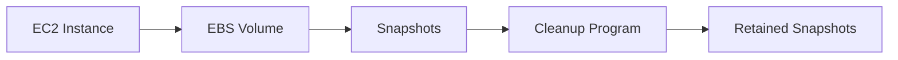

## Automated Snapshot Cleanup Program for AWS

### Background Theory

In the context of AWS, snapshots are point-in-time copies of your Amazon Elastic Block Store (EBS) volumes. They are essential for data protection and recovery, but managing them efficiently is crucial to avoid unnecessary costs and clutter. Snapshots can consume significant storage space, especially when created frequently, such as daily backups. This leads to a scenario where you might end up with numerous snapshots, which can quickly escalate your AWS billing.

### Problem Statement

Consider an environment where automated backups are set up to create daily snapshots of EBS volumes. Over time, this results in a large number of snapshots, which can lead to several issues:

1. **Storage Costs**: Each snapshot consumes storage space, leading to higher AWS bills.
2. **Management Overhead**: Managing a large number of snapshots can become cumbersome.
3. **Data Recovery Complexity**: With too many snapshots, identifying the correct one for recovery becomes challenging.

To address these issues, we need a program that automates the cleanup process, ensuring that only the necessary snapshots are retained.

### Solution Overview

The solution involves writing a Python program that:

1. Identifies all snapshots associated with each EBS volume.
2. Sorts these snapshots based on their creation date.
3. Retains only the most recent snapshots (e.g., the two most recent).
4. Deletes all other snapshots.

This ensures that you have the necessary snapshots for recovery while minimizing storage costs and management overhead.

### Implementation Steps

#### Step 1: Setting Up the Environment

Before diving into the code, ensure you have the necessary AWS SDK installed. In this case, we will use `boto3`, the AWS SDK for Python.

```bash
pip install boto3
```

#### Step 2: Authenticating with AWS

To interact with AWS services, you need to authenticate using your AWS credentials. You can configure these credentials using the AWS CLI or by setting environment variables.

```bash
aws configure
```

Alternatively, you can set the environment variables directly:

```bash
export AWS_ACCESS_KEY_ID=your_access_key_id
export AWS_SECRET_ACCESS_KEY=your_secret_access_key
export AWS_DEFAULT_REGION=your_region
```

#### Step 3: Writing the Python Program

Let's start by importing the necessary modules and initializing the AWS client.

```python
import boto3
from datetime import datetime

# Initialize the AWS client
ec2 = boto3.client('ec2')
```

Next, we define a function to retrieve all snapshots associated with a specific volume.

```python
def get_snapshots(volume_id):
    response = ec2.describe_snapshots(Filters=[{'Name': 'volume-id', 'Values': [volume_id]}])
    return response['Snapshots']
```

We then sort these snapshots based on their creation date.

```python
def sort_snapshots(snapshots):
    return sorted(snapshots, key=lambda x: x['StartTime'], reverse=True)
```

Finally, we define a function to retain only the most recent snapshots and delete the rest.

```python
def cleanup_snapshots(volume_id, keep_count=2):
    snapshots = get_snapshots(volume_id)
    sorted_snapshots = sort_snapshots(snapshots)
    
    # Keep the most recent snapshots
    for snapshot in sorted_snapshots[keep_count:]:
        print(f"Deleting snapshot {snapshot['SnapshotId']}")
        ec2.delete_snapshot(SnapshotId=snapshot['SnapshotId'])
```

Putting it all together, we can now write a main function to iterate through all volumes and perform the cleanup.

```python
def main():
    response = ec2.describe_volumes()
    volumes = response['Volumes']
    
    for volume in volumes:
        volume_id = volume['VolumeId']
        print(f"Cleaning up snapshots for volume {volume_id}")
        cleanup_snapshots(volume_id)

if __name__ == "__main__":
    main()
```

### Full Example Code

Here is the complete Python script for automated snapshot cleanup:

```python
import boto3
from datetime import datetime

# Initialize the AWS client
ec2 = boto3.client('ec2')

def get_snapshots(volume_id):
    response = ec2.describe_snapshots(Filters=[{'Name': 'volume-id', 'Values': [volume_id]}])
    return response['Snapshots']

def sort_snapshots(snapshots):
    return sorted(snapshots, key=lambda x: x['StartTime'], reverse=True)

def cleanup_snapshots(volume_id, keep_count=2):
    snapshots = get_snapshots(volume_id)
    sorted_snapshots = sort_snapshots(snapshots)
    
    # Keep the most recent snapshots
    for snapshot in sorted_snapshots[keep_count:]:
        print(f"Deleting snapshot {[snapshot['SnapshotId']]")
        ec2.delete_snapshot(SnapshotId=snapshot['SnapshotId'])

def main():
    response = ec2.describe_volumes()
    volumes = response['Volumes']
    
    for volume in volumes:
        volume_id = volume['VolumeId']
        print(f"Cleaning up snapshots for volume {volume_id}")
        cleanup_snapshots(volume_id)

if __name__ == "__main__":
    main()
```

### Diagrams

#### AWS Architecture Diagram



### Pitfalls and Common Mistakes

1. **Incorrect Authentication**: Ensure that your AWS credentials are correctly configured.
2. **Incomplete Snapshot Deletion**: Double-check that the cleanup process retains the correct number of snapshots.
3. **Unexpected Costs**: Verify that the cleanup process does not inadvertently delete critical snapshots.

### How to Prevent / Defend

#### Detection

Regularly monitor your AWS usage and costs to identify unexpected increases due to excessive snapshots.

#### Prevention

1. **Automate Cleanup**: Use the provided Python script to automate the cleanup process.
2. **Retention Policy**: Define a clear retention policy for snapshots and enforce it through automation.
3. **Secure Coding Practices**: Ensure that your scripts handle exceptions and errors gracefully to avoid unintended deletions.

#### Secure-Coding Fixes

**Vulnerable Code**

```python
def cleanup_snapshots(volume_id, keep_count=2):
    snapshots = get_snapshots(volume_id)
    sorted_snapshots = sort_snapshots(snapshots)
    
    # Keep the most recent snapshots
    for snapshot in sorted_snapshots[keep_count:]:
        print(f"Deleting snapshot {[snapshot['SnapshotId']]")
        ec2.delete_snapshot(SnapshotId=snapshot['SnapshotId'])
```

**Fixed Code**

```python
def cleanup_snapshots(volume_id, keep_count=2):
    snapshots = get_snapshots(volume_id)
    sorted_snapshots = sort_snapshots(snapshots)
    
    # Keep the most recent snapshots
    for snapshot in sorted_snapshots[keep_count:]:
        print(f"Deleting snapshot {snapshot['SnapshotId']}")
        try:
            ec2.delete_snapshot(SnapshotId=snapshot['SnapshotId'])
        except Exception as e:
            print(f"Failed to delete snapshot {snapshot['SnapshotId']}: {str(e)}")
```

### Real-World Examples

#### Recent Breaches/CVEs

While there are no specific CVEs related to snapshot management, the importance of proper snapshot management is highlighted in various security incidents where unmanaged snapshots led to increased costs and potential data exposure.

### Practice Labs

For hands-on practice, consider the following labs:

- **PortSwigger Web Security Academy**: Offers exercises on AWS security practices.
- **OWASP Juice Shop**: Provides a simulated environment to practice various security scenarios, including AWS management.
- **CloudGoat**: A series of labs designed to teach cloud security principles, including snapshot management.

By following these steps and best practices, you can effectively manage your AWS snapshots, ensuring both data protection and cost efficiency.

---
<!-- nav -->
[[03-Automated Snapshot Cleanup Program For AWS|Automated Snapshot Cleanup Program For AWS]] | [[DevOps/DevOps Bootcamp/04-Cloud Computing (AWS & DigitalOcean)/05-Automated Snapshot Cleanup Program For AWS/00-Overview|Overview]] | [[DevOps/DevOps Bootcamp/04-Cloud Computing (AWS & DigitalOcean)/05-Automated Snapshot Cleanup Program For AWS/05-Practice Questions & Answers|Practice Questions & Answers]]
