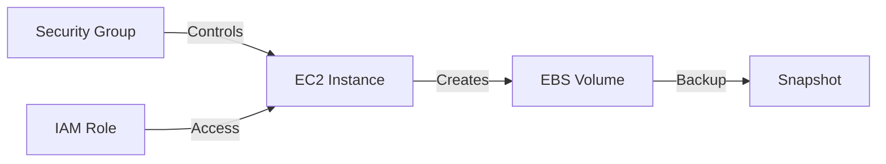
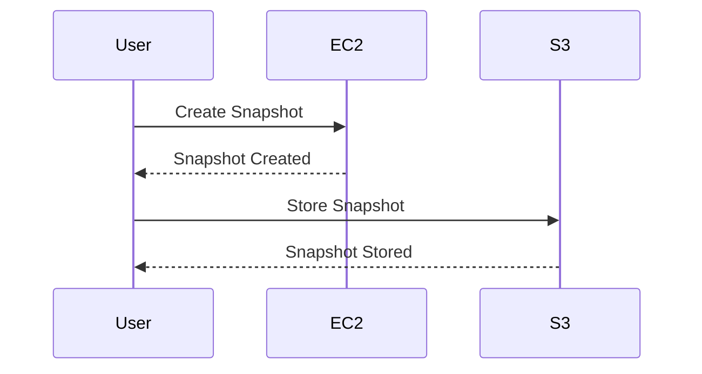

## Introduction to Automating AWS Maintenance Tasks with Python

AWS is a vast ecosystem of services and components, often used to manage large-scale infrastructure. Managing hundreds or thousands of servers and resources manually can be extremely time-consuming and error-prone. This is where automation comes into play. By automating routine tasks, DevOps engineers and developers can focus on more critical and productive activities.

### Background Theory

#### What is Automation?

Automation refers to the use of technology to perform tasks with minimal human intervention. In the context of AWS, automation can involve creating, managing, and maintaining resources through scripts and tools. This reduces the likelihood of human error and ensures consistency across operations.

#### Why Automate?

Automating tasks in AWS offers several benefits:

1. **Efficiency**: Reduces the time required to perform repetitive tasks.
2. **Consistency**: Ensures that tasks are performed in a consistent manner.
3. **Scalability**: Facilitates the management of large-scale infrastructure.
4. **Error Reduction**: Minimizes human errors associated with manual operations.
5. **Cost Savings**: Reduces operational costs by optimizing resource usage.

### Tools for Automation

One of the most powerful tools for automating AWS tasks is Python, particularly with the help of the `boto3` library. `boto3` is the Amazon Web Services (AWS) Software Development Kit (SDK) for Python, which allows Python developers to write software that makes use of AWS services like Amazon S3 and Amazon EC2.

### Using `boto3` for AWS Automation

#### Installing `boto3`

To get started with `boto3`, you first need to install it using pip:

```bash
pip install boto3
```

#### Configuring AWS Credentials

Before you can use `boto3`, you need to configure your AWS credentials. This can be done by setting up the AWS CLI or by directly specifying the access key and secret key in your script.

##### Setting Up AWS CLI

1. Install the AWS CLI:
    ```bash
    pip install awscli
    ```

2. Configure the CLI:
    ```bash
    aws configure
    ```
    Enter your AWS Access Key ID, Secret Access Key, default region name, and default output format.

##### Specifying Credentials Directly in Script

Alternatively, you can specify the credentials directly in your script:

```python
import boto3

session = boto3.Session(
    aws_access_key_id='YOUR_ACCESS_KEY',
    aws_secret_access_key='YOUR_SECRET_KEY',
    region_name='us-west-2'
)
```

### Common AWS Maintenance Tasks

#### Backups

Automating backups is crucial for ensuring data integrity and availability. Using `boto3`, you can create snapshots of EC2 instances or EBS volumes.

##### Example: Creating an EBS Snapshot

```python
import boto3

ec2 = boto3.resource('ec2')

# Get the volume
volume = ec2.Volume('vol-0123456789abcdef0')

# Create a snapshot
snapshot = volume.create_snapshot(Description='Daily backup')
print(f'Snapshot created: {snapshot.id}')
```

#### Cleanups

Cleaning up unused resources is essential for cost optimization and maintaining a tidy environment. You can automate the deletion of unused resources such as EC2 instances, S3 buckets, or RDS instances.

##### Example: Deleting Unused EC2 Instances

```python
import boto3

ec2 = boto3.resource('ec2')

# Filter instances based on certain criteria
instances = ec2.instances.filter(Filters=[{'Name': 'instance-state-name', 'Values': ['stopped']}])

# Terminate instances
for instance in instances:
    instance.terminate()
    print(f'Terminated instance: {instance.id}')
```

#### Tagging

Adding tags to resources helps in organizing and identifying them. You can automate the addition of tags to multiple resources.

##### Example: Adding Tags to EC2 Instances

```python
import boto3

ec2 = boto3.resource('ec2')

# Get the instances
instances = ec2.instances.all()

# Add tags
for instance in instances:
    instance.create_tags(Tags=[{'Key': 'Environment', 'Value': 'Production'}])
    print(f'Tagged instance: {instance.id}')
```

#### Health Checks and Monitoring

Monitoring the health of your resources is crucial for proactive issue resolution. You can automate health checks and alerting using `boto3`.

##### Example: Checking EC2 Instance Status

```python
import boto3

ec2 = boto3.client('ec2')

response = ec2.describe_instance_status(InstanceIds=['i-0123456789abcdef0'])
for status in response['InstanceStatuses']:
    print(f'Instance: {status["InstanceId"]}, Status: {status["InstanceState"]["Name"]}')
```

### Real-World Examples and Recent CVEs

#### Example: CVE-2021-20225

CVE-2021-20225 was a vulnerability in AWS Lambda that allowed unauthorized access to sensitive information. Automating the monitoring and patching of such vulnerabilities can help mitigate risks.

##### Example Code: Monitoring Lambda Functions

```python
import boto3

lambda_client = boto3.client('lambda')

response = lambda_client.list_functions()
for function in response['Functions']:
    print(f'Function: {function["FunctionName"]}, Runtime: {function["Runtime"]}')
```

### Pitfalls and Best Practices

#### Common Mistakes

1. **Incorrect Permissions**: Ensure that the IAM role attached to your script has the necessary permissions.
2. **Resource Overuse**: Be cautious of creating too many resources, which can lead to increased costs.
3. **Security Risks**: Ensure that sensitive information is not exposed in your scripts.

#### Best Practices

1. **Use IAM Roles**: Assign specific IAM roles to your scripts to ensure least privilege.
2. **Regular Audits**: Regularly audit your scripts and configurations to identify and fix issues.
3. **Secure Coding**: Follow secure coding practices to prevent common vulnerabilities.

### How to Prevent / Defend

#### Detection

1. **Logging and Monitoring**: Use AWS CloudTrail and AWS CloudWatch to monitor and log API calls and resource changes.
2. **Security Groups**: Use security groups to control inbound and outbound traffic to your resources.

#### Prevention

1. **IAM Policies**: Define strict IAM policies to limit access to resources.
2. **Encryption**: Use encryption for sensitive data stored in S3 or other storage services.

#### Secure-Coding Fixes

##### Vulnerable Code: Exposing Sensitive Information

```python
import boto3

s3 = boto3.client('s3')
response = s3.get_object(Bucket='my-bucket', Key='secret-file.txt')
print(response['Body'].read())
```

##### Fixed Code: Securing Sensitive Information

```python
import boto3

s3 = boto3.client('s3')
response = s3.get_object(Bucket='my-bucket', Key='secret-file.txt')
# Ensure the response is securely handled
secure_data = response['Body'].read()
# Process the secure data
```

### Complete Example: Automating Backup and Cleanup

#### Full Example Code

```python
import boto3

def create_backup(volume_id):
    ec2 = boto3.resource('ec2')
    volume = ec2.Volume(volume_id)
    snapshot = volume.create_snapshot(Description='Daily backup')
    print(f'Snapshot created: {snapshot.id}')

def cleanup_instances():
    ec2 = boto3.resource('ec2')
    instances = ec2.instances.filter(Filters=[{'Name': 'instance-state-name', 'Values': ['stopped']}])
    for instance in instances:
        instance.terminate()
        print(f'Terminated instance: {instance.id}')

if __name__ == '__main__':
    create_backup('vol-0123456789abcdef0')
    cleanup_instances()
```

#### Expected Result

```plaintext
Snapshot created: snap-0123456789abcdef0
Terminated instance: i-0123456789abcdef0
```

### Mermaid Diagrams

#### AWS Architecture Diagram



#### Request/Response Flow



### Hands-On Labs

For hands-on practice, consider the following labs:

- **PortSwigger Web Security Academy**: Offers comprehensive labs on web application security.
- **OWASP Juice Shop**: A deliberately insecure web app for practicing security skills.
- **DVWA (Damn Vulnerable Web Application)**: Another popular web app for learning web security.
- **WebGoat**: An interactive training application designed to teach web application security.

These labs provide practical experience in automating AWS maintenance tasks using Python and `boto3`.

### Conclusion

Automating AWS maintenance tasks with Python and `boto3` is a powerful way to streamline operations and reduce the workload on DevOps engineers and developers. By following best practices and securing your scripts, you can ensure that your AWS environment remains robust and efficient.

---
<!-- nav -->
[[DevOps/DevOps Bootcamp/04-Cloud Computing (AWS & DigitalOcean)/06-Automating AWS Maintenance Tasks With Python/00-Overview|Overview]] | [[DevOps/DevOps Bootcamp/04-Cloud Computing (AWS & DigitalOcean)/06-Automating AWS Maintenance Tasks With Python/02-Practice Questions & Answers|Practice Questions & Answers]]
