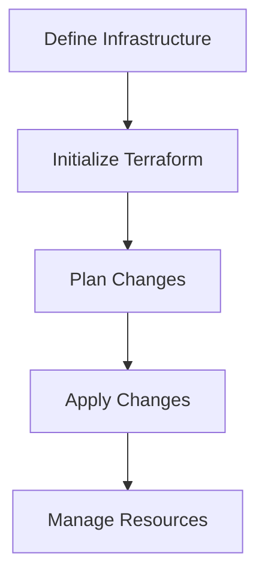
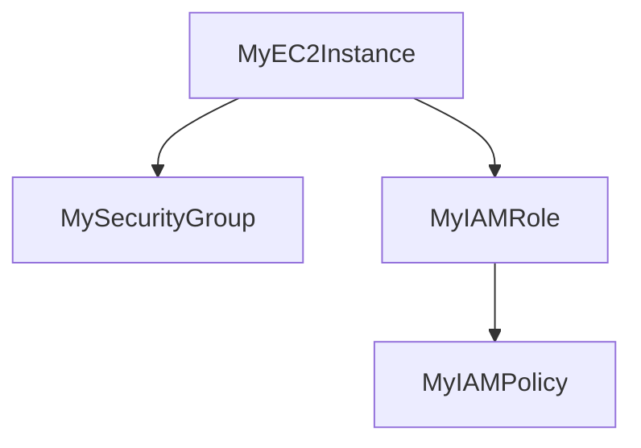

## Introduction to Automating AWS Setup with Infrastructure Tools

In the realm of DevOps, managing cloud infrastructure efficiently is crucial. The manual creation of resources such as EC2 instances, IAM users, and security groups can quickly become cumbersome and error-prone, especially as the complexity of the environment grows. This chapter delves into the importance of automating AWS setup using infrastructure-as-code (IaC) tools, which provide a structured and repeatable way to manage cloud resources.

### Why Manual Setup is Inefficient

Consider a scenario where you manually create an EC2 instance, an IAM user, and attach a policy to that user. While this might seem straightforward for a small setup, it becomes increasingly difficult to manage as the number of resources increases. Here’s a breakdown of the issues:

1. **Complexity**: As the number of resources grows, keeping track of what has been created and how they are interconnected becomes challenging.
2. **Repeatability**: Manually setting up resources each time can lead to inconsistencies and errors.
3. **Scalability**: Scaling up or down requires re-executing numerous commands, which can be time-consuming and prone to mistakes.
4. **Auditability**: Without a record of changes, it is difficult to audit and understand the current state of the infrastructure.

### Overview of Automation Tools

To address these challenges, DevOps engineers use automation tools that allow them to define their infrastructure in code. These tools provide a declarative way to specify the desired state of the infrastructure, making it easier to manage, scale, and audit.

#### Common IaC Tools

1. **Terraform**: A popular open-source tool developed by HashiCorp that allows you to define and provision infrastructure across multiple cloud providers.
2. **AWS CloudFormation**: A service provided by AWS that enables you to model and provision AWS resources using templates written in JSON or YAML.
3. **Ansible**: An automation tool that can be used to configure and manage infrastructure, including AWS resources.
4. **Pulumi**: A modern IaC tool that supports multiple programming languages, allowing you to write infrastructure as code using familiar languages like TypeScript, Python, or Go.

### Benefits of Using IaC Tools

Using IaC tools offers several benefits:

1. **Consistency**: Ensures that resources are created consistently across environments.
2. **Version Control**: Allows you to keep your infrastructure definitions in version control systems like Git, enabling collaboration and tracking changes.
3. **Automation**: Simplifies the process of provisioning and updating resources, reducing the likelihood of human error.
4. **Documentation**: Provides a clear and detailed record of the infrastructure, making it easier to understand and maintain.

### Example: Setting Up an EC2 Instance with Terraform

Let’s walk through an example of setting up an EC2 instance using Terraform. This will illustrate how IaC tools can simplify the process of managing cloud resources.

#### Step 1: Define the Infrastructure

First, you need to define the infrastructure in a Terraform configuration file. Here’s an example of a `main.tf` file that sets up an EC2 instance:

```hcl
provider "aws" {
  region = "us-west-2"
}

resource "aws_instance" "example" {
  ami           = "ami-0c55b159cbfafe1f0"
  instance_type = "t2.micro"

  tags = {
    Name = "example-instance"
  }
}
```

#### Step 2: Initialize Terraform

Before you can use Terraform, you need to initialize it. This step downloads the necessary provider plugins and sets up the backend.

```sh
terraform init
```

#### Step 3: Plan the Changes

Next, you should plan the changes to see what Terraform will do. This step is crucial as it allows you to review the proposed changes before applying them.

```sh
terraform plan
```

#### Step 4: Apply the Changes

Once you are satisfied with the plan, you can apply the changes to create the EC2 instance.

```sh
terraform apply
```

### Diagram: Terraform Workflow



### Real-World Example: CVE-2021-20225

A real-world example of the importance of automation and proper management of cloud resources is the CVE-2021-20225, which affected AWS Elastic Load Balancing (ELB). This vulnerability allowed attackers to bypass authentication mechanisms and gain unauthorized access to internal resources.

#### Vulnerable Configuration

Here’s an example of a vulnerable ELB configuration:

```json
{
  "LoadBalancerName": "my-load-balancer",
  "Listeners": [
    {
      "Protocol": "HTTP",
      "LoadBalancerPort": 80,
      "InstanceProtocol": "HTTP",
      "InstancePort": 80
    }
  ],
  "SecurityGroups": ["sg-12345678"],
  "Subnets": ["subnet-abcdef12"]
}
```

#### Secure Configuration

To mitigate this vulnerability, you should ensure that the ELB is properly configured with security groups and network ACLs to restrict access. Here’s an example of a secure configuration:

```json
{
  "LoadBalancerName": "my-load-balancer",
  "Listeners": [
    {
      "Protocol": "HTTPS",
      "LoadBalancerPort": 443,
      "InstanceProtocol": "HTTPS",
      "InstancePort": 443,
      "SSLCertificateId": "arn:aws:iam::123456789012:server-certificate/my-certificate"
    }
  ],
  "SecurityGroups": ["sg-secure-group"],
  "Subnets": ["subnet-secure-subnet"]
}
```

### How to Prevent / Defend

#### Detection

To detect misconfigurations, you can use tools like AWS Config and AWS Trusted Advisor. These tools provide continuous monitoring and alerting for compliance and security issues.

#### Prevention

1. **Use IaC Tools**: Ensure that all infrastructure is defined in code and managed through tools like Terraform or CloudFormation.
2. **Implement Security Best Practices**: Use security groups, network ACLs, and IAM roles to restrict access and enforce least privilege.
3. **Regular Audits**: Conduct regular audits of your infrastructure to identify and remediate vulnerabilities.

### Complete Example: AWS CloudFormation Template

Here’s a complete example of an AWS CloudFormation template that sets up an EC2 instance with a security group and an IAM role:

```yaml
Resources:
  MyEC2Instance:
    Type: 'AWS::EC2::Instance'
    Properties:
      ImageId: 'ami-0c55b159cbfafe1f0'
      InstanceType: 't2.micro'
      SecurityGroupIds:
        - !Ref MySecurityGroup
      IamInstanceProfile: !Ref MyIAMRole

  MySecurityGroup:
    Type: 'AWS::EC2::SecurityGroup'
    Properties:
      GroupDescription: 'Allow SSH access'
      VpcId: 'vpc-12345678'
      SecurityGroupIngress:
        - IpProtocol: 'tcp'
          FromPort: '22'
          ToPort: '22'
          CidrIp: '0.0.0.0/0'

  MyIAMRole:
    Type: 'AWS::IAM::InstanceProfile'
    Properties:
      Roles:
        - !Ref MyIAMPolicy

  MyIAMPolicy:
    Type: 'AWS::IAM::Policy'
    Properties:
      PolicyName: 'MyPolicy'
      PolicyDocument:
        Version: '2012-10-17'
        Statement:
          - Effect: 'Allow'
            Action: 's3:GetObject'
            Resource: '*'
```

### Diagram: CloudFormation Template Structure



### Conclusion

Automating AWS setup with infrastructure tools is essential for managing complex cloud environments effectively. By using tools like Terraform and CloudFormation, you can ensure consistency, repeatability, and scalability in your infrastructure. This chapter has covered the basics of IaC tools, provided real-world examples, and offered guidance on how to prevent and defend against common vulnerabilities.

### Practice Labs

For hands-on practice, consider the following labs:

- **PortSwigger Web Security Academy**: Offers interactive labs for web application security.
- **OWASP Juice Shop**: A deliberately insecure web application for practicing web security skills.
- **DVWA (Damn Vulnerable Web Application)**: A PHP/MySQL web application that is riddled with vulnerabilities.
- **WebGoat**: An interactive, gamified training application for learning about web application security.

These labs will help you gain practical experience in managing and securing cloud infrastructure.

---
<!-- nav -->
[[DevOps/DevOps Bootcamp/04-Cloud Computing (AWS & DigitalOcean)/07-Automating AWS Setup with Infrastructure Tools/00-Overview|Overview]] | [[02-Overview of Infrastructure as Code (IaC)|Overview of Infrastructure as Code (IaC)]]
