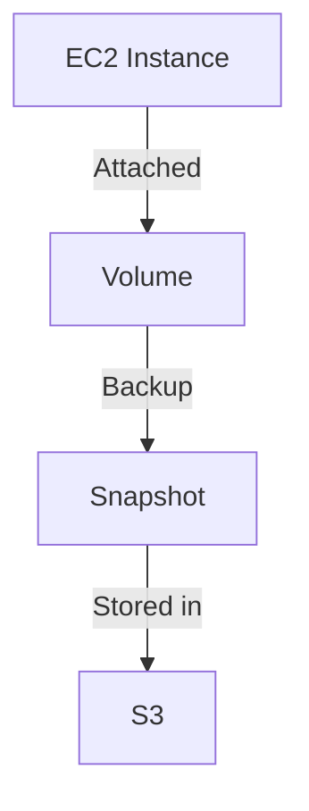

## Introduction to EC2 Instance Backups with Python

In the realm of DevOps, automating tasks such as backing up EC2 instances is crucial for maintaining data integrity and ensuring business continuity. Amazon Elastic Compute Cloud (EC2) provides a robust infrastructure for deploying and managing scalable applications. However, managing the lifecycle of EC2 instances, including their backups, can become complex without automation. In this chapter, we will delve into automating EC2 instance backups using Python and the Boto3 library, which is the Amazon Web Services (AWS) Software Development Kit (SDK) for Python.

### Background Theory

#### What is an EC2 Instance?

Amazon EC2 is a web service that provides resizable compute capacity in the cloud. EC2 instances are virtual servers that run within the AWS environment. Each instance consists of a virtual machine running an operating system, along with other components such as storage and networking.

#### What is a Volume?

In the context of EC2, a volume refers to the storage device attached to an EC2 instance. Think of it as a hard drive that gets attached to the EC2 instance when it starts. Volumes can be either root volumes or additional data volumes. Root volumes contain the operating system and essential files, while data volumes store application data.

#### What is a Snapshot?

A snapshot is a point-in-time backup of a volume. Snapshots are stored in Amazon Simple Storage Service (S3) and can be used to restore the volume to a previous state. Snapshots are particularly useful for disaster recovery and data protection.

### Why Automate EC2 Instance Backups?

Automating EC2 instance backups ensures that your data is regularly backed up without manual intervention. This reduces the risk of data loss due to human error and ensures that your backups are consistent and up-to-date. Additionally, automated backups can be scheduled to run at specific times, ensuring that your data is protected even during peak usage periods.

### How to Automate EC2 Instance Backups Using Python

To automate EC2 instance backups, we will use Python and the Boto3 library. Boto3 is the AWS SDK for Python, which allows developers to write software that makes use of AWS services like Amazon S3 and Amazon EC2.

#### Step-by-Step Guide

1. **Set Up Your Environment**
    - Install Python and Boto3.
    - Configure AWS credentials using the AWS CLI or environment variables.

2. **Create a New Python File**
    - Create a new file named `volume_backups.py`.

3. **Import Boto3 Library**
    - Import the Boto3 library to interact with AWS services.

4. **List Volumes**
    - Use Boto3 to list all volumes associated with your EC2 instances.

5. **Create Snapshots**
    - Iterate through the list of volumes and create snapshots for each volume.

6. **Schedule the Task**
    - Use a scheduler like cron (Linux) or Task Scheduler (Windows) to run the script at regular intervals.

### Complete Code Example

Let's walk through the complete code example to automate EC2 instance backups using Python and Boto3.

```python
import boto3

# Initialize the Boto3 client for EC2
ec2 = boto3.client('ec2')

def list_volumes():
    """List all volumes associated with EC2 instances."""
    response = ec2.describe_volumes()
    return response['Volumes']

def create_snapshot(volume_id):
    """Create a snapshot for a given volume."""
    response = ec2.create_snapshot(VolumeId=volume_id)
    print(f"Snapshot created for volume {volume_id}: {response['SnapshotId']}")

def main():
    volumes = list_volumes()
    for volume in volumes:
        volume_id = volume['VolumeId']
        create_snapshot(volume_id)

if __name__ == "__main__":
    main()
```

### Explanation of the Code

1. **Initialize the Boto3 Client**
    - `boto3.client('ec2')` initializes the Boto3 client for EC2.

2. **List Volumes**
    - `describe_volumes()` retrieves information about all volumes.
    - The function returns a list of volumes.

3. **Create Snapshot**
    - `create_snapshot(VolumeId=volume_id)` creates a snapshot for the specified volume.
    - The function prints the snapshot ID for confirmation.

4. **Main Function**
    - The `main()` function lists all volumes and creates snapshots for each volume.

### Real-World Examples

#### Recent CVEs and Breaches

One notable breach involving AWS was the Capital One data breach in 2019. The breach exposed sensitive customer data due to misconfigured AWS S3 buckets. While this breach did not directly involve EC2 instances, it highlights the importance of securing all AWS resources, including EC2 instances and their associated volumes.

### Mermaid Diagrams

#### EC2 Instance Architecture



### Pitfalls and Common Mistakes

1. **Incorrect Permissions**
    - Ensure that the IAM role or user has the necessary permissions to list volumes and create snapshots.
    - Use the `aws iam get-policy` command to verify the policy attached to your IAM role.

2. **Incomplete Backup**
    - Ensure that all volumes associated with your EC2 instances are included in the backup process.
    - Use the `describe_volumes()` method to list all volumes and verify that none are missed.

3. **Resource Limits**
    - Be aware of AWS resource limits, such as the number of snapshots per region.
    - Use the `describe_account_attributes()` method to check your account attributes and ensure you are within the limits.

### How to Prevent / Defend

#### Detection

1. **Monitor AWS CloudTrail Logs**
    - Enable CloudTrail logging to monitor API calls made to your AWS account.
    - Use the `get_trail_status()` method to verify that CloudTrail is enabled.

2. **Use AWS Config**
    - Enable AWS Config to track changes to your AWS resources.
    - Use the `describe_configuration_recorders()` method to verify that AWS Config is enabled.

#### Prevention

1. **IAM Role and Policy Management**
    - Use IAM roles and policies to restrict access to EC2 instances and their associated volumes.
    - Use the `attach_role_policy()` method to attach policies to your IAM role.

2. **Regular Audits**
    - Perform regular audits of your AWS resources to ensure compliance with security policies.
    - Use the `describe_instances()` method to list all EC2 instances and verify their configurations.

#### Secure Coding Fixes

##### Vulnerable Code

```python
import boto3

ec2 = boto3.client('ec2')
volumes = ec2.describe_volumes()['Volumes']
for volume in volumes:
    ec2.create_snapshot(VolumeId=volume['VolumeId'])
```

##### Secure Code

```python
import boto3

ec2 = boto3.client('ec2')
volumes = ec2.describe_volumes()['Volumes']
for volume in volumes:
    ec2.create_snapshot(VolumeId=volume['VolumeId'], TagSpecifications=[
        {
            'ResourceType': 'snapshot',
            'Tags': [
                {'Key': 'Name', 'Value': 'backup'},
                {'Key': 'Environment', 'Value': 'prod'}
            ]
        }
    ])
```

### Configuration Hardening

1. **Enable Encryption for Snapshots**
    - Use the `create_volume()` method to create encrypted volumes.
    - Use the `modify_volume()` method to enable encryption for existing volumes.

2. **Use IAM Roles with Least Privilege**
    - Assign IAM roles with the least privilege required to perform the backup task.
    - Use the `detach_role_policy()` method to remove unnecessary policies from your IAM role.

### Practice Labs

For hands-on practice with automating EC2 instance backups using Python, consider the following labs:

- **PortSwigger Web Security Academy**: Offers a comprehensive set of labs covering various aspects of web security, including AWS security.
- **OWASP Juice Shop**: A deliberately insecure web application for security training.
- **DVWA (Damn Vulnerable Web Application)**: A PHP/MySQL web application that is riddled with vulnerabilities for educational purposes.
- **WebGoat**: An interactive, gamified training application for learning about web application security.

These labs provide a practical environment to test and validate your understanding of automating EC2 instance backups using Python and Boto3.

### Conclusion

Automating EC2 instance backups using Python and Boto3 is a critical task for maintaining data integrity and ensuring business continuity. By following the steps outlined in this chapter, you can effectively manage the lifecycle of your EC2 instances and protect your data from potential threats. Remember to regularly audit your AWS resources and implement secure coding practices to minimize the risk of data loss.

---
<!-- nav -->
[[DevOps/DevOps Bootcamp/04-Cloud Computing (AWS & DigitalOcean)/08-Automating EC2 Instance Backups with Python/00-Overview|Overview]] | [[02-Introduction to EC2 Instance Backups|Introduction to EC2 Instance Backups]]
