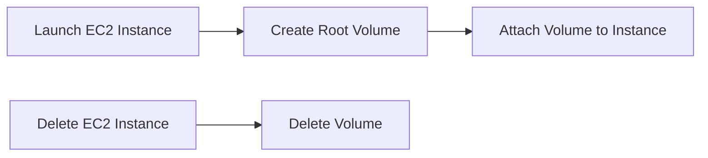

## Understanding EC2 Instances and Volumes

### What Are EC2 Instances?

Amazon Elastic Compute Cloud (EC2) is a web service that provides resizable compute capacity in the cloud. EC2 instances are virtual servers that run within Amazon's cloud infrastructure. These instances provide the computing power needed to execute applications and services. Each EC2 instance runs an operating system (OS) and can host various applications, databases, and other software.

### What Are Volumes?

Volumes are AWS storage components that store the data of an EC2 instance. Think of a volume as a hard drive for your EC2 server. Every EC2 instance has its own volume where it writes all of its data. When an EC2 instance is created, a volume is automatically created and attached to that instance. Conversely, when an EC2 instance is deleted, the associated volume is also deleted.

### Volume Lifecycle

When you launch an EC2 instance, AWS creates a root volume and attaches it to the instance. This root volume contains the OS and any additional data you specify during the instance creation process. The lifecycle of the volume is tied to the lifecycle of the instance. Here’s a simple diagram illustrating this relationship:

### Importance of Volumes

Volumes are crucial because they store all the data that the EC2 instance needs to function. Without a volume, an EC2 instance would not have a place to store its data, making it essentially useless. Therefore, managing and backing up these volumes is critical for ensuring data availability and integrity.

---
<!-- nav -->
[[08-Setting Up the Environment|Setting Up the Environment]] | [[DevOps/DevOps Bootcamp/04-Cloud Computing (AWS & DigitalOcean)/08-Automating EC2 Instance Backups with Python/00-Overview|Overview]] | [[10-Understanding Snapshots|Understanding Snapshots]]
