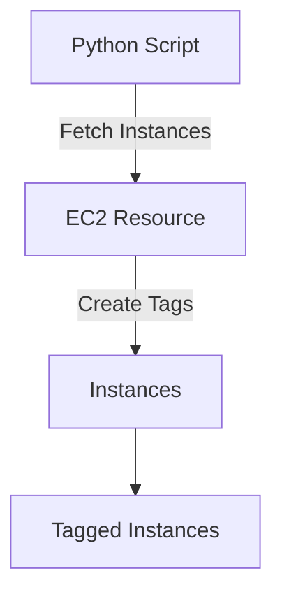

## Introduction to Automating Tag Assignment for AWS Instances Using Python

In the realm of DevOps, automating tasks is crucial for maintaining efficiency and consistency across your infrastructure. One such task is assigning tags to AWS instances. Tags provide metadata that can be used to categorize resources, manage costs, and enforce policies. In this chapter, we will delve into automating the assignment of tags to AWS instances using Python. This process will help you efficiently manage your AWS resources, especially when dealing with large numbers of instances spread across different regions.

### Background Theory

#### What Are AWS Tags?

AWS tags are key-value pairs that you can attach to AWS resources. They allow you to categorize resources based on various criteria, such as environment (production, development), owner, project, etc. Tags can be used to:

- **Organize Resources**: Group resources logically.
- **Manage Costs**: Track costs associated with specific projects or teams.
- **Enforce Policies**: Apply policies based on tags (e.g., security policies).

#### Why Automate Tag Assignment?

Manually assigning tags to each instance can be time-consuming and error-prone, especially when dealing with a large number of instances. Automation ensures that tags are consistently applied across all instances, reducing the likelihood of human error and saving time.

### Scenario Setup

Let's consider a scenario where you have 20 servers in the Paris region (`eu-west-3`) used as production servers and 10 servers in the Frankfurt region (`eu-central-1`) used as development servers. You want to automate the process of adding `environment` tags to these instances using Python.

### Prerequisites

Before diving into the implementation, ensure you have the following:

1. **AWS Account**: Access to an AWS account with appropriate permissions.
2. **Python Environment**: A Python environment set up on your local machine or server.
3. **Boto3 Library**: The AWS SDK for Python, which allows you to interact with AWS services programmatically.

To install Boto3, run:

```bash
pip install boto3
```

### Step-by-Step Implementation

#### Step 1: Setting Up AWS Credentials

To interact with AWS services, you need to configure your AWS credentials. You can do this by setting up the `AWS_ACCESS_KEY_ID`, `AWS_SECRET_ACCESS_KEY`, and `AWS_DEFAULT_REGION` environment variables.

```bash
export AWS_ACCESS_KEY_ID=your_access_key_id
export AWS_SECRET_ACCESS_KEY=your_secret_access_key
export AWS_DEFAULT_REGION=eu-west-3
```

Alternatively, you can configure these settings using the AWS CLI:

```bash
aws configure
```

#### Step 2: Writing the Python Script

We will write a Python script to fetch instances from the specified regions and assign the appropriate tags.

```python
import boto3

def tag_instances(region, tag_key, tag_value):
    ec2 = boto3.resource('ec2', region_name=region)
    instances = ec2.instances.all()

    for instance in instances:
        print(f"Tagging instance {instance.id} with {tag_key}: {tag_value}")
        instance.create_tags(Tags=[{'Key': tag_key, 'Value': tag_value}])

if __name__ == "__main__":
    paris_region = 'eu-west-3'
    frankfurt_region = 'eu-central-1'

    tag_instances(paris_region, 'environment', 'prod')
    tag_instances(frankfurt_region, 'environment', 'dev')
```

#### Step 3: Running the Script

Run the script to tag the instances:

```bash
python tag_instances.py
```

### Detailed Explanation

#### Fetching Instances

The `boto3.resource('ec2', region_name=region)` method creates an EC2 resource object for the specified region. The `instances.all()` method retrieves all instances in that region.

#### Creating Tags

The `create_tags` method adds tags to the instances. Each tag is represented as a dictionary with `Key` and `Value` keys.

### Mermaid Diagrams

#### Architecture Diagram



### Real-World Examples

#### Recent Breaches and CVEs

While tagging itself does not directly prevent breaches, improperly managed tags can lead to misconfigurations. For example, a misconfigured tag might allow unauthorized access to production resources. Ensuring proper tagging practices can help mitigate such risks.

### Pitfalls and Common Mistakes

#### Overlooking Tag Consistency

One common mistake is not ensuring consistent tagging across all instances. This can lead to confusion and mismanagement of resources.

#### Incorrect Permissions

Ensure that the AWS user or role executing the script has the necessary permissions to tag instances. Missing permissions can cause the script to fail.

### How to Prevent / Defend

#### Detection

Regularly audit your AWS resources to ensure that tags are correctly applied. Use AWS Config to monitor changes to your resources.

#### Prevention

1. **Use IAM Policies**: Restrict access to tagging operations based on roles and responsibilities.
2. **Automated Tagging**: Implement automated tagging as part of your deployment pipeline to ensure consistency.

#### Secure Coding Fixes

**Vulnerable Code**

```python
# Vulnerable code: No permission check
def tag_instances(region, tag_key, tag_value):
    ec2 = boto3.resource('ec2', region_name=region)
    instances = ec2.instances.all()
    for instance in instances:
        instance.create_tags(Tags=[{'Key': tag_key, 'Value': tag_value}])
```

**Secure Code**

```python
# Secure code: Check permissions before tagging
def tag_instances(region, tag_key, tag_value):
    ec2 = boto3.resource('ec2', region_name=region)
    instances = ec2.instances.all()
    for instance in instances:
        try:
            instance.create_tags(Tags=[{'Key': tag_key, 'Value': tag_value}])
            print(f"Successfully tagged instance {instance.id}")
        except Exception as e:
            print(f"Failed to tag instance {instance.id}: {str(e)}")
```

### Complete Example

#### Full HTTP Request and Response

While tagging instances does not involve HTTP requests directly, the interaction with AWS services can be visualized through API calls.

**API Call Example**

```http
POST / HTTP/1.1
Host: ec2.amazonaws.com
Content-Type: application/x-www-form-urlencoded
X-Amz-Target: AmazonEC2.CreateTags
Authorization: AWS4-HMAC-SHA256 Credential=<credential>, SignedHeaders=host;x-amz-date, Signature=<signature>
X-Amz-Date: <date>

Action=CreateTags&Version=2016-11-15&ResourceId.1=i-0123456789abcdef0&ResourceId.2=i-0123456789abcdef1&Tag.1.Key=environment&Tag.1.Value=prod
```

**Response**

```http
HTTP/1.1 200 OK
Content-Type: application/xml
Content-Length: <length>

<?xml version="1.0" encoding="UTF-8"?>
<CreateTagsResponse xmlns="http://ec2.amazonaws.com/doc/2016-11-15/">
  <requestId>7a62c49f-347e-4fc4-9331-6e8eEXAMPLE</requestId>
</CreateTagsResponse>
```

### Hands-On Labs

For practical experience, consider the following labs:

- **PortSwigger Web Security Academy**: Focuses on web application security but can provide insights into securing your infrastructure.
- **OWASP Juice Shop**: A deliberately insecure web application for security training.
- **CloudGoat**: A series of labs designed to teach cloud security concepts using AWS.

### Conclusion

Automating the assignment of tags to AWS instances using Python is a powerful way to maintain consistency and manage your resources effectively. By following the steps outlined in this chapter, you can ensure that your instances are properly tagged, reducing the risk of misconfiguration and improving overall management efficiency.

---
<!-- nav -->
[[DevOps/DevOps Bootcamp/04-Cloud Computing (AWS & DigitalOcean)/09-Automating Tag Assignment for AWS Instances Using Python/00-Overview|Overview]] | [[02-Automating Tag Assignment for AWS Instances Using Python|Automating Tag Assignment for AWS Instances Using Python]]
