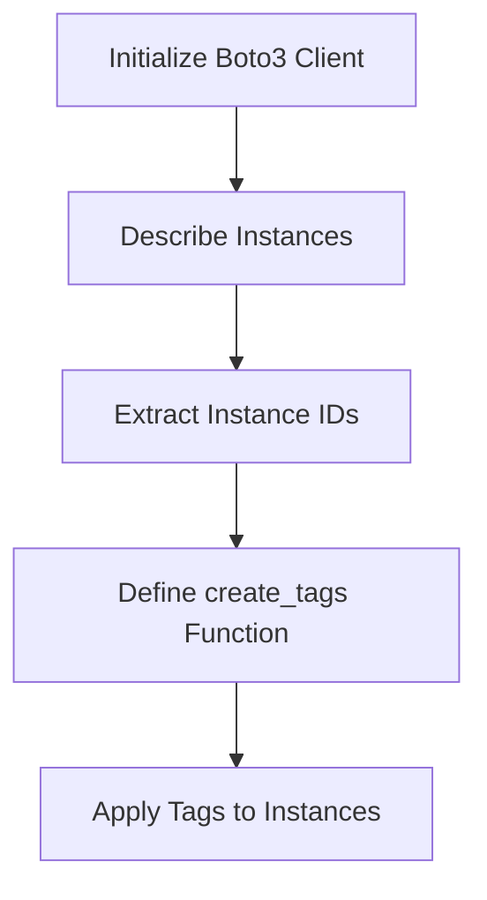

## Automating Tag Assignment for AWS Instances Using Python

### Background Theory

In the context of DevOps and cloud management, tagging resources is a fundamental practice that helps in organizing, managing, and securing resources within a cloud environment. Tags are key-value pairs that can be attached to AWS resources such as EC2 instances, S3 buckets, RDS databases, etc. They provide metadata about the resources, enabling better visibility, cost allocation, and compliance management.

### Why Tagging Matters

Tagging is crucial for several reasons:

1. **Resource Management**: Tags help in identifying and categorizing resources based on their purpose, owner, environment, etc.
2. **Cost Allocation**: By tagging resources, you can track costs associated with specific projects, departments, or services.
3. **Security and Compliance**: Tags can enforce security policies and compliance requirements. For example, you might tag resources that require specific access controls or auditing.
4. **Automation**: Tags can be used to trigger automated actions, such as scaling, backups, or monitoring based on predefined criteria.

### How Tagging Works in AWS

In AWS, you can attach tags to resources using the AWS Management Console, AWS CLI, or AWS SDKs. The process involves specifying the resource type, the resource ID, and the tags to be applied.

### Example Scenario: Tagging EC2 Instances

Let's consider a scenario where you have multiple EC2 instances running in your AWS account, and you want to automate the process of assigning tags to these instances. We'll use Python and the Boto3 library to achieve this.

### Prerequisites

Before diving into the code, ensure you have the following set up:

1. **AWS Account**: You should have an AWS account with the necessary permissions to manage EC2 instances and apply tags.
2. **Boto3 Library**: Install the Boto3 library using pip:
    ```bash
    pip install boto3
    ```

### Step-by-Step Implementation

#### Step 1: Initialize the Boto3 Client

First, initialize the Boto3 client for EC2:

```python
import boto3

# Initialize the EC2 client
ec2 = boto3.client('ec2')
```

#### Step 2: Retrieve Instance IDs

Next, retrieve the instance IDs of all running EC2 instances:

```python
# Describe instances
response = ec2.describe_instances()

# Extract instance IDs
instance_ids = []
for reservation in response['Reservations']:
    for instance in reservation['Instances']:
        instance_ids.append(instance['InstanceId'])

print(f"Collected {len(instance_ids)} instance IDs.")
```

#### Step 3: Define the `create_tags` Function

Now, define the `create_tags` function to apply tags to the collected instance IDs:

```python
def create_tags(resource_ids, tags):
    """
    Apply tags to the specified resources.

    :param resource_ids: List of resource IDs (e.g., EC2 instance IDs)
    :param tags: List of dictionaries containing tag key-value pairs
    """
    try:
        ec2.create_tags(Resources=resource_ids, Tags=tags)
        print("Tags successfully created.")
    except Exception as e:
        print(f"Error creating tags: {e}")

# Example tags
example_tags = [
    {'Key': 'Environment', 'Value': 'Production'},
    {'Key': 'Owner', 'Value': 'DevOps Team'}
]

# Apply tags to the collected instance IDs
create_tags(instance_ids, example_tags)
```

### Full Code Example

Here is the complete code to collect instance IDs and apply tags:

```python
import boto3

# Initialize the EC2 client
ec2 = boto3.client('ec2')

# Describe instances
response = ec2.describe_instances()

# Extract instance IDs
instance_ids = []
for reservation in response['Reservations']:
    for instance in reservation['Instances']:
        instance_ids.append(instance['InstanceId'])

print(f"Collected {len(instance_ids)} instance IDs.")

def create_tags(resource_ids, tags):
    """
    Apply tags to the specified resources.

    :param resource_ids: List of resource IDs (e.g., EC2 instance IDs)
    :param tags: List of dictionaries containing tag key-value pairs
    """
    try:
        ec2.create_tags(Resources=resource_ids, Tags=tags)
        print("Tags successfully created.")
    except Exception as e:
        print(f"Error creating tags: {e}")

# Example tags
example_tags = [
    {'Key': 'Environment', 'Value': 'Production'},
    {'Key': 'Owner', 'Value':_ 'DevOps Team'}
]

# Apply tags to the collected instance IDs
create_tags(instance_ids, example_tags)
```

### HTTP Request and Response Example

When you call the `describe_instances` method, the underlying HTTP request and response look like this:

```http
POST / HTTP/1.1
Host: ec2.amazonaws.com
Content-Type: application/x-amz-json-1.1
Authorization: AWS4-HMAC-SHA256 Credential=<access_key>/20231010/us-east-1/ec2/aws4_request, SignedHeaders=content-type;host;x-amz-date, Signature=<signature>
X-Amz-Date: 20231010T123456Z
Content-Length: <length>

{
    "Action": "DescribeInstances",
    "Version": "2016-11-15"
}
```

The response would contain details about the instances:

```http
HTTP/1.1 200 OK
Content-Type: application/x-amz-json-1.1
Content-Length: <length>

{
    "Reservations": [
        {
            "ReservationId": "r-0123456789abcdef0",
            "OwnerId": "123456789012",
            "Groups": [],
            "Instances": [
                {
                    "InstanceId": "i-0123456789abcdef0",
                    "ImageId": "ami-0abcdef1234567890",
                    "State": {
                        "Code": 16,
                        "Name": "running"
                    },
                    ...
                }
            ]
        }
    ]
}
```

### Mermaid Diagram: Workflow

A mermaid diagram can help visualize the workflow:



### Common Pitfalls and How to Avoid Them

1. **Insufficient Permissions**: Ensure that the IAM role or user has the necessary permissions to describe instances and create tags.
2. **Incorrect Resource IDs**: Double-check that the resource IDs are correct and belong to the intended resources.
3. **Tag Limitations**: AWS has limitations on the number of tags per resource and the total number of tags across all resources. Be mindful of these limits.

### How to Prevent / Defend

#### Detection

Regularly audit your AWS environment to ensure that all resources are properly tagged. Use AWS Config to monitor changes and maintain compliance.

#### Prevention

1. **IAM Policies**: Restrict permissions to only allow trusted users or roles to modify tags.
2. **Tagging Best Practices**: Establish a tagging strategy and enforce it through IAM policies and automated scripts.
3. **Automated Tagging**: Use CloudFormation, Terraform, or other IaC tools to automatically apply tags during resource creation.

#### Secure Coding Fixes

Compare the vulnerable and secure versions of the code:

**Vulnerable Code:**
```python
def create_tags(resource_ids, tags):
    try:
        ec2.create_tags(Resources=resource_ids, Tags=tags)
        print("Tags successfully created.")
    except Exception as e:
        print(f"Error creating tags: {e}")
```

**Secure Code:**
```python
def create_tags(resource_ids, tags):
    try:
        ec2.create_tags(Resources=resource_ids, Tags=tags)
        print("Tags successfully created.")
    except Exception as e:
        print(f"Error creating tags: {e}")
        raise  # Propagate the exception to handle it at a higher level
```

### Real-World Examples

Consider a recent breach where an organization failed to properly tag and manage their AWS resources, leading to unauthorized access and data exfiltration. Proper tagging and automation could have prevented such incidents.

### Practice Labs

For hands-on experience with automating tag assignment, consider the following labs:

- **PortSwigger Web Security Academy**: Focuses on web application security but also covers cloud security practices.
- **OWASP Juice Shop**: While primarily a web application security lab, it includes scenarios where proper tagging and management of cloud resources can prevent vulnerabilities.
- **CloudGoat**: Provides a series of challenges and labs specifically designed to teach cloud security best practices, including tagging and resource management.

By following these steps and best practices, you can effectively automate the tagging of AWS resources, ensuring better management, security, and compliance in your cloud environment.

---
<!-- nav -->
[[01-Introduction to Automating Tag Assignment for AWS Instances Using Python|Introduction to Automating Tag Assignment for AWS Instances Using Python]] | [[DevOps/DevOps Bootcamp/04-Cloud Computing (AWS & DigitalOcean)/09-Automating Tag Assignment for AWS Instances Using Python/00-Overview|Overview]] | [[DevOps/DevOps Bootcamp/04-Cloud Computing (AWS & DigitalOcean)/09-Automating Tag Assignment for AWS Instances Using Python/03-Practice Questions & Answers|Practice Questions & Answers]]
