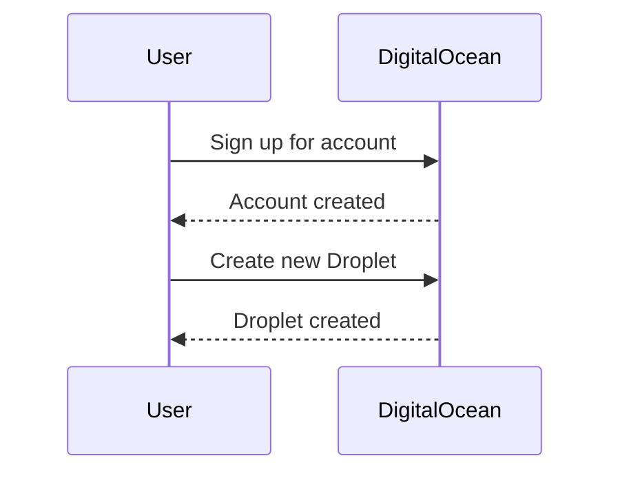
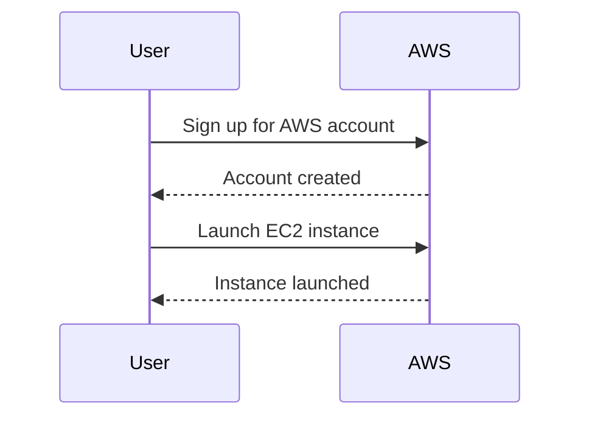
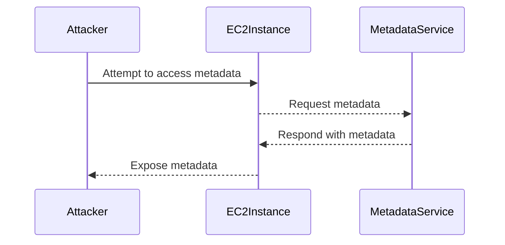

## Introduction to Digital Ocean Droplets and AWS EC2 Instances

In the world of cloud computing, DigitalOcean Droplets and AWS EC2 instances are two of the most popular services used for deploying and managing virtual machines. Both platforms offer scalable and flexible solutions for hosting applications and services. In this chapter, we will delve into the details of creating and configuring DigitalOcean Droplets and AWS EC2 instances, comparing their features and functionalities.

### What Are DigitalOcean Droplets?

DigitalOcean Droplets are virtual machines provided by DigitalOcean, a cloud infrastructure provider. These droplets are designed to be simple, easy to use, and highly customizable. They come with various operating systems and configurations, allowing users to quickly set up and deploy applications.

#### Key Features of DigitalOcean Droplets

- **Ease of Use**: DigitalOcean provides a user-friendly interface and API for creating and managing droplets.
- **Customizability**: Users can choose from a variety of operating systems and configurations.
- **Scalability**: Droplets can be resized and scaled up or down based on demand.
- **Snapshots**: Users can create snapshots of droplets for backup and recovery purposes.

### What Are AWS EC2 Instances?

AWS EC2 (Elastic Compute Cloud) instances are virtual servers provided by Amazon Web Services (AWS). EC2 instances are highly configurable and can be used for a wide range of applications, from web hosting to data processing and machine learning.

#### Key Features of AWS EC2 Instances

- **Flexibility**: EC2 offers a wide range of instance types optimized for different workloads.
- **Security**: AWS provides robust security features, including VPCs (Virtual Private Clouds) and IAM (Identity and Access Management).
- **Scalability**: EC2 instances can be easily scaled up or down using auto-scaling groups.
- **Management Tools**: AWS provides a comprehensive set of management tools, including CloudFormation and Elastic Beanstalk.

### Creating DigitalOcean Droplets

To create a DigitalOcean Droplet, follow these steps:

1. **Sign Up for DigitalOcean**: Create an account on DigitalOcean.
2. **Create a New Droplet**:
    - Choose the size of the droplet (e.g., 1GB RAM, 1 vCPU).
    - Select the image (operating system) for the droplet (e.g., Ubuntu 20.04).
    - Add any additional settings, such as SSH keys.
    - Choose the region where the droplet will be hosted.
    - Click "Create Droplet".



### Connecting to DigitalOcean Droplets

Once the droplet is created, you can connect to it using SSH. To do this, you need to have an SSH key pair.

1. **Generate SSH Key Pair**:
    ```bash
    ssh-keygen -t rsa -b 4096 -C "your_email@example.com"
    ```
2. **Add SSH Key to DigitalOcean**:
    - Go to the DigitalOcean dashboard.
    - Navigate to "Security" > "SSH Keys".
    - Add your public SSH key.
3. **Connect to Droplet**:
    ```bash
    ssh root@<droplet_ip_address>
    ```

### Creating AWS EC2 Instances

To create an AWS EC2 instance, follow these steps:

1. **Sign Up for AWS**:
    - Create an account on AWS.
2. **Launch EC2 Instance**:
    - Go to the EC2 Dashboard.
    - Click "Launch Instance".
    - Choose an Amazon Machine Image (AMI) (e.g., Amazon Linux 2).
    - Choose an instance type (e.g., t2.micro).
    - Configure instance details (e.g., number of instances, networking).
    - Add storage as needed.
    - Tag the instance.
    - Configure security group (firewall rules).
    - Review and launch the instance.



### Connecting to AWS EC2 Instances

Once the EC2 instance is launched, you can connect to it using SSH.

1. **Create Key Pair**:
    - Go to the EC2 Dashboard.
    - Navigate to "Key Pairs".
    - Create a new key pair (e.g., `Ansible_key_pair.pem`).
    - Download the private key.
2. **Connect to Instance**:
    ```bash
    ssh -i Ansible_key_pair.pem ec2-user@<public_dns_name>
    ```

### Configuring Servers in Ansible Hosts File

After setting up the droplets and EC2 instances, you can configure them in the Ansible hosts file.

1. **Open Hosts File**:
    ```bash
    nano /etc/ansible/hosts
    ```
2. **Add Droplets and EC2 Instances**:
    ```yaml
    [digitalocean]
    <droplet_ip_address_1>
    <droplet_ip_address_2>

    [ec2]
    <public_dns_name_1>
    <public_dns_name_2>
    ```

### Security Considerations

When working with cloud instances, security is paramount. Here are some key security considerations:

#### SSH Key Management

- **Secure Storage**: Store SSH keys securely (e.g., encrypted).
- **Access Control**: Limit access to SSH keys to authorized personnel only.
- **Regular Rotation**: Rotate SSH keys regularly to minimize exposure.

#### Network Security

- **Firewall Rules**: Use security groups (AWS) or firewall rules (DigitalOcean) to restrict inbound and outbound traffic.
- **Private Networking**: Use private networking to isolate instances from the public internet.

#### Monitoring and Logging

- **CloudWatch (AWS)**: Use CloudWatch to monitor and log activity on EC2 instances.
- **DigitalOcean Monitoring**: Use DigitalOcean's built-in monitoring tools to track instance performance.

### Real-World Examples and Breaches

#### CVE-2021-20225: AWS EC2 Metadata Service Vulnerability

In 2021, a critical vulnerability was discovered in the AWS EC2 metadata service. This vulnerability allowed unauthorized access to sensitive metadata, including IAM credentials. To mitigate this risk, AWS recommended enabling the `imdsv2` feature, which requires a token for metadata requests.



#### How to Prevent / Defend

- **Enable IMDSv2**: Ensure that the `imdsv2` feature is enabled on all EC2 instances.
- **Restrict Metadata Access**: Use security groups to restrict access to the metadata service.
- **Monitor Activity**: Use CloudWatch to monitor and alert on suspicious metadata access attempts.

### Conclusion

In this chapter, we explored the creation and configuration of DigitalOcean Droplets and AWS EC2 instances. We covered the key features, setup processes, and security considerations for both platforms. By following the detailed steps and best practices outlined here, you can effectively manage and secure your cloud-based virtual machines.

---
<!-- nav -->
[[DevOps/DevOps Bootcamp/04-Cloud Computing (AWS & DigitalOcean)/11-Comparing Digital Ocean Droplets with AWS EC2 Instances/00-Overview|Overview]] | [[02-Introduction to DigitalOcean Droplets and AWS EC2 Instances|Introduction to DigitalOcean Droplets and AWS EC2 Instances]]
