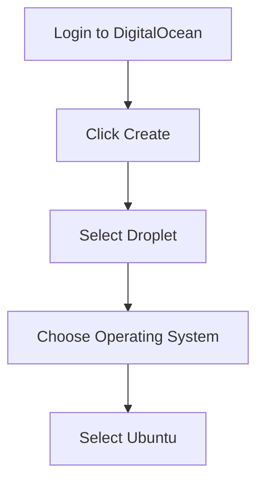
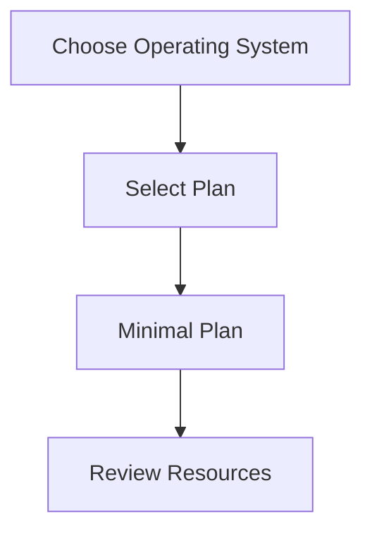
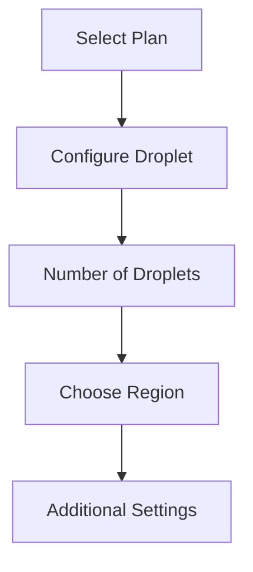
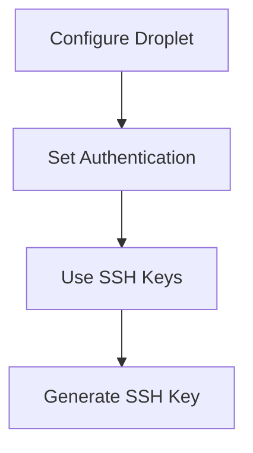

## Introduction to DigitalOcean and Droplets

DigitalOcean is a popular cloud computing platform that provides developers and businesses with scalable infrastructure services. One of the key offerings of DigitalOcean is the **Droplet**, which is essentially a virtual private server (VPS) that can run various operating systems, including Linux distributions like Ubuntu. In this section, we will delve into the process of creating a Linux Droplet on DigitalOcean, covering every step in detail.

### Prerequisites

Before you begin, ensure you have a DigitalOcean account. DigitalOcean offers a free trial period, which includes a certain amount of credits that can be used to create and manage Droplets without incurring costs. This makes it an ideal platform for learning and experimenting with cloud infrastructure.

### Creating a Droplet

To create a Droplet, follow these steps:

1. **Log in to Your DigitalOcean Account**: Navigate to the DigitalOcean website and log in using your credentials.
2. **Create a Droplet**: Click on the "Create" button and select "Droplet" from the dropdown menu.

#### Selecting the Operating System

Once you click on "Create Droplet," you will be presented with several options. The first choice is the operating system. DigitalOcean supports a variety of Linux distributions, including Ubuntu, Debian, CentOS, and more. For this tutorial, we will choose **Ubuntu**.



#### Choosing the Plan

After selecting the operating system, you need to choose a plan. Each plan comes with specific resources such as CPU cores, RAM, and storage. For a basic setup, the minimal plan should suffice. However, depending on your requirements, you might need to choose a higher-tier plan.



#### Configuring the Droplet

Next, configure the Droplet by specifying the number of Droplets, the region, and additional settings.

- **Number of Droplets**: Typically, you would start with one Droplet.
- **Region**: Choose a region that is geographically close to your location to minimize latency. For example, if you are located in Europe, you might choose the Frankfurt region.
- **Additional Settings**: These include SSH keys, backups, monitoring, and more. For now, you can leave these settings as default.



#### Authentication

The final step is to configure the authentication method. DigitalOcean supports several methods, including SSH keys, password-based authentication, and more. Using SSH keys is generally recommended for security reasons.



### Setting Up SSH Keys

SSH keys provide a secure way to authenticate to your Droplet without using a password. To set up SSH keys, follow these steps:

1. **Generate an SSH Key Pair**: If you don't already have an SSH key pair, generate one using the `ssh-keygen` command.

    ```bash
    ssh-keygen -t rsa -b 4096 -C "your_email@example.com"
    ```

2. **Add the Public Key to DigitalOcean**: Copy the contents of your public key (usually found at `~/.ssh/id_rsa.pub`) and paste it into the SSH keys section of the DigitalOcean control panel.

    ```mermaid
graph TD
        A[Generate SSH Key] --> B[Copy Public Key]
        B --> C[Paste Public Key in DigitalOcean]
```

3. **Create the Droplet**: Once all configurations are set, click on "Create Droplet" to finalize the creation process.

### Accessing the Droplet

After the Droplet is created, you can access it via SSH using the IP address provided by DigitalOcean.

```bash
ssh root@<droplet_ip_address>
```

### Example of Full HTTP Request and Response

When interacting with DigitalOcean's API to create a Droplet programmatically, you would send an HTTP POST request to the appropriate endpoint. Below is an example of a full HTTP request and response:

```http
POST /v2/droplets HTTP/1.1
Host: api.digitalocean.com
Authorization: Bearer <your_api_token>
Content-Type: application/json

{
  "name": "my-droplet",
  "region": "fra1",
  "size": "s-1vcpu-1gb",
  "image": "ubuntu-20-04-x64",
  "ssh_keys": ["<your_ssh_key_id>"],
  "tags": ["web"]
}
```

Response:

```http
HTTP/1.1 202 Accepted
Date: Mon, 01 Jan 2024 00:00:00 GMT
Server: nginx
Content-Type: application/json
Content-Length: 234

{
  "droplet": {
    "id": 123456789,
    "name": "my-droplet",
    "memory": 1024,
    "vcpus": 1,
    "disk": 25,
    "locked": false,
    "status": "new",
    "kernel": {
      "id": 222,
      "name": "Latest 64 bit",
      "version": "4.4.0"
    },
    "created_at": "2024-01-01T00:00:00Z",
    "features": [],
    "backup_ids": [],
    "next_backup_window": null,
    "snapshots": [],
    "image": {
      "id": 123456,
      "name": "Ubuntu 20.04 x64",
      "distribution": "Ubuntu",
      "slug": "ubuntu-20-04-x64",
      "public": true,
      "regions": [
        "fra1",
        "nyc1",
        "sfo2"
      ],
      "created_at": "2023-01-01T00:00:00Z",
      "type": "snapshot"
    },
    "size": {
      "slug": "s-1vcpu-1gb",
      "memory": 1024,
      "vcpus": 1,
      "disk": 25,
      "transfer": 1,
      "price_monthly": 5,
      "price_hourly": 0.0075,
      "available": true,
      "regions": [
        "fra1",
        "nyc1",
        "sfo2"
      ]
    },
    "networks": {
      "v4": [
        {
          "ip_address": "<droplet_ip_address>",
          "netmask": "255.255.255.0",
          "gateway": "10.132.0.1",
          "type": "public"
        }
      ],
      "v6": []
    },
    "region": {
      "name": "Frankfurt 1",
      "slug": "fra1",
      "features": [
        "backups",
        "ipv6",
        "metadata"
      ],
      "sizes": [
        "s-1vcpu-1gb",
        "s-1vcpu-2gb",
        "s-2vcpu-4gb"
      ],
      "available": true
    },
    "tags": [
      "web"
    ],
    "volumes": [],
    "links": {
      "self": "https://api.digitalocean.com/v2/droplets/123456789"
    },
    "actions": [
      {
        "id": 987654321,
        "type": "create",
        "status": "in-progress",
        "started_at": "2024-01-01T00:00:00Z",
        "completed_at": null,
        "resource_id": 123456789,
        "resource_type": "droplet",
        "region": {
          "name": "Frankfurt 1",
          "slug": "fra1"
        }
      }
    ],
    "resize": {
      "id": 123456789,
      "type": "resize",
      "status": "in-progress",
      "started_at": "2024-01-01T00:00:00Z",
      "completed_at": null,
      "resource_id": 123456789,
      "resource_type": "droplet",
      "region": {
        "name": "Frankfurt 1",
        "slug": "fra1"
      }
    }
  }
}
```

### Common Pitfalls and How to Prevent Them

#### Incorrect SSH Key Configuration

One common pitfall is incorrectly configuring the SSH key. Ensure that the public key is correctly copied and pasted into the DigitalOcean control panel.

**How to Prevent:**

1. Verify the public key content before copying.
2. Double-check the SSH key ID in the DigitalOcean control panel.

#### Insufficient Resources

Another issue is choosing insufficient resources for the Droplet, leading to performance issues.

**How to Prevent:**

1. Assess your application's resource requirements.
2. Choose a plan that meets or exceeds these requirements.

### Secure Coding Practices

Ensure that your Droplet is configured securely by following these practices:

1. **Use Strong Passwords**: If you opt for password-based authentication, use strong passwords.
2. **Enable Firewall Rules**: Configure firewall rules to restrict access to necessary ports.
3. **Keep Software Updated**: Regularly update the operating system and installed packages to patch vulnerabilities.

### Real-World Examples and CVEs

Recent breaches and vulnerabilities often involve misconfigured cloud infrastructure. For instance, the **CVE-2021-3560** (also known as Log4Shell) affected many cloud environments due to insecure configurations and outdated software.

**Example:**

A company had a misconfigured Droplet that allowed unauthorized access to sensitive data due to an outdated version of a logging library. By ensuring regular updates and secure configurations, such vulnerabilities can be mitigated.

### Hands-On Practice

For hands-on practice, consider using the following labs:

- **PortSwigger Web Security Academy**: Offers practical exercises in web application security.
- **OWASP Juice Shop**: A deliberately insecure web application for practicing security skills.
- **DVWA (Damn Vulnerable Web Application)**: Another intentionally vulnerable web app for security training.

These labs provide a controlled environment to experiment with cloud infrastructure and security practices.

### Conclusion

Creating a Linux Droplet on DigitalOcean is a straightforward process that involves selecting the operating system, configuring the plan, and setting up authentication. By following best practices and securing your Droplet, you can effectively manage your cloud infrastructure.

---
<!-- nav -->
[[DevOps/DevOps Bootcamp/04-Cloud Computing (AWS & DigitalOcean)/12-Creating A Linux Droplet On DigitalOcean/00-Overview|Overview]] | [[02-Introduction to Droplets on DigitalOcean|Introduction to Droplets on DigitalOcean]]
