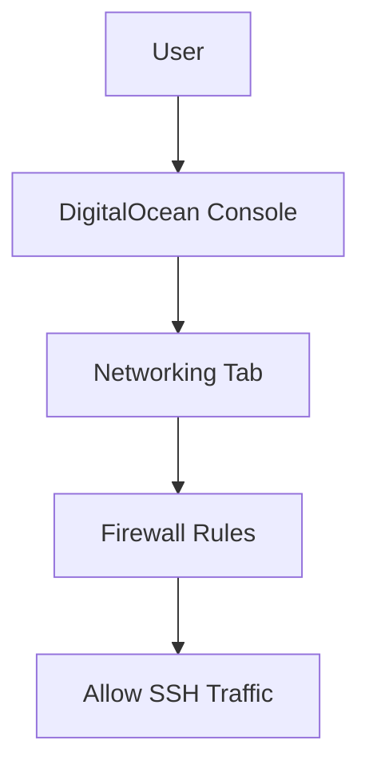
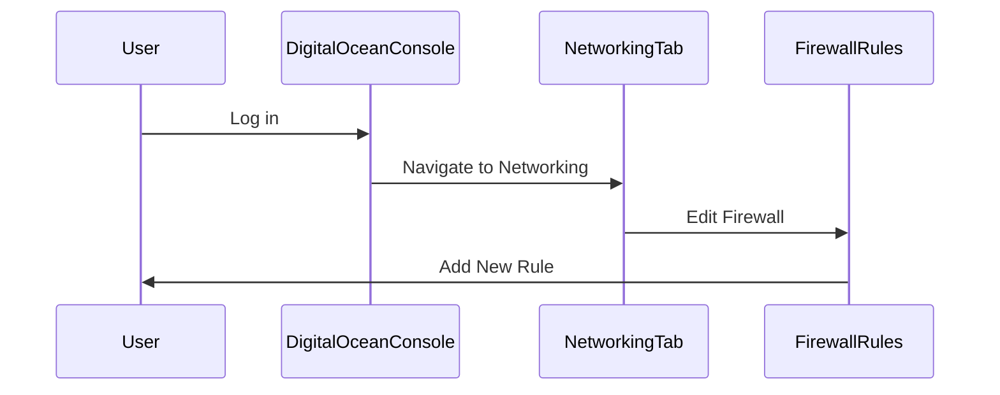
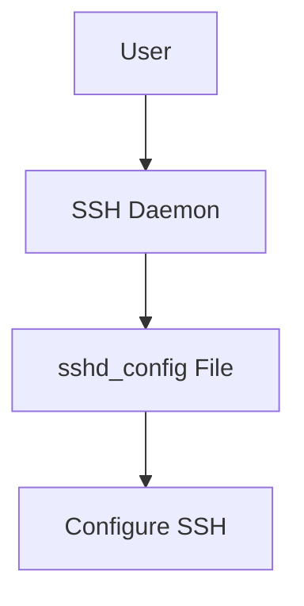
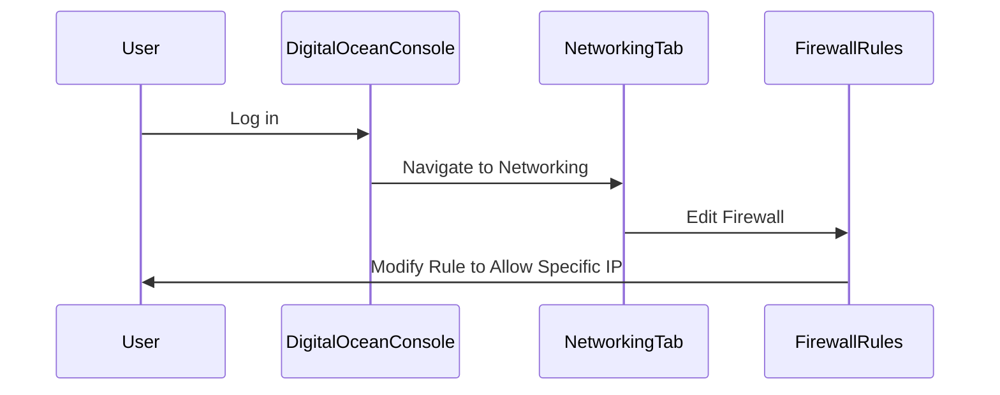

## Introduction to Droplets on DigitalOcean

In the context of DevOps, one of the most common tasks is setting up and managing virtual servers, often referred to as "droplets." DigitalOcean is a popular cloud provider that offers easy-to-use droplets for various purposes, including development, testing, and production environments. This chapter will focus on creating a Linux droplet on DigitalOcean and configuring it securely, particularly focusing on SSH access and firewall rules.

### What is a Droplet?

A droplet is a virtual machine (VM) provided by DigitalOcean. It is essentially a containerized environment that runs an operating system (OS) and allows you to install and run applications. Droplets are highly customizable, allowing you to choose the OS, CPU, memory, storage, and other configurations based on your needs.

### Why Use DigitalOcean?

DigitalOcean is favored by many developers and DevOps engineers due to its simplicity, ease of use, and competitive pricing. It provides a straightforward interface for creating and managing droplets, making it ideal for both beginners and experienced users.

### Setting Up a Linux Droplet

To set up a Linux droplet on DigitalOcean, follow these steps:

1. **Sign Up**: Create an account on DigitalOcean if you haven't already.
2. **Create a Droplet**: Navigate to the "Create" button and select "Droplet."
3. **Choose an Image**: Select the desired Linux distribution, such as Ubuntu.
4. **Select Size**: Choose the appropriate size based on your requirements.
5. **Choose Datacenter Region**: Select a region close to your target audience for better performance.
6. **Add SSH Keys**: Optionally, add SSH keys for secure access.
7. **Create Droplet**: Review your selections and click "Create."

### Configuring SSH Access

SSH (Secure Shell) is a cryptographic network protocol used for secure communication between a client and a server. To allow SSH access to your droplet, you need to ensure that the necessary ports are open and configured correctly.

#### Default SSH Configuration

By default, SSH uses port 22. When you create a droplet, DigitalOcean automatically sets up a basic firewall rule to allow incoming traffic on port 22. However, this default configuration might not be secure enough for production environments.

#### Customizing SSH Configuration

To customize SSH access, you can modify the firewall rules and SSH configuration files.

##### Firewall Rules

Firewall rules control which traffic is allowed to enter or leave your droplet. In DigitalOcean, you can manage these rules through the "Networking" tab.



#### Example: Adding a Custom Firewall Rule

To add a custom firewall rule, follow these steps:

1. **Navigate to Networking**: Go to the "Networking" tab in your DigitalOcean console.
2. **Edit Firewall**: Click on "Edit" next to the existing firewall.
3. **Add New Rule**: Add a new rule to allow SSH traffic on port 22.

Here’s an example of how to configure the firewall rule:



#### Configuring SSH on the Droplet

Once the firewall is configured, you need to ensure that the SSH daemon (`sshd`) is properly set up on the droplet. This involves editing the `sshd_config` file located at `/etc/ssh/sshd_config`.



#### Example: Editing sshd_config

Here’s an example of how to edit the `sshd_config` file:

```bash
sudo nano /etc/ssh/sshd_config
```

Make sure the following lines are present and uncommented:

```plaintext
Port 22
PermitRootLogin no
PasswordAuthentication no
PubkeyAuthentication yes
```

After making changes, restart the SSH service:

```bash
sudo systemctl restart sshd
```

### Securing SSH Access

While the default configuration allows SSH access, it is crucial to secure it further to prevent unauthorized access. Here are some best practices:

#### Limiting Access to Specific IPs

Instead of allowing SSH access from any IP address, you can restrict access to specific IP addresses or ranges. This can be done by modifying the firewall rules.

##### Example: Restricting SSH Access to Specific IPs

To restrict SSH access to a specific IP address, follow these steps:

1. **Identify Your IP Address**: Use a tool like `curl ifconfig.me` to find your current IP address.
2. **Modify Firewall Rule**: Update the firewall rule to allow traffic only from your IP address.

Here’s an example of how to modify the firewall rule:



#### Example: Modifying Firewall Rule

```bash
# Allow SSH traffic from specific IP address
sudo ufw allow from <your_ip_address> to any port 22
```

### How to Prevent / Defend

#### Detection

To detect unauthorized SSH access attempts, you can monitor the logs. The SSH logs are typically located at `/var/log/auth.log`.

```bash
tail -f /var/log/auth.log
```

#### Prevention

1. **Use Strong Passwords**: Ensure that all user accounts have strong passwords.
2. **Disable Root Login**: Disable root login via SSH to prevent direct root access.
3. **Enable Two-Factor Authentication (2FA)**: Use 2FA for added security.
4. **Regularly Update Software**: Keep your SSH daemon and other software up to date to patch vulnerabilities.

#### Secure Coding Fixes

Here’s an example of how to implement secure coding practices:

**Vulnerable Code:**

```plaintext
PermitRootLogin yes
PasswordAuthentication yes
```

**Secure Code:**

```plaintext
PermitRootLogin no
PasswordAuthentication no
PubkeyAuthentication yes
```

### Real-World Examples

#### Recent Breaches

One notable breach involving SSH was the compromise of a large number of servers due to weak SSH credentials. In this case, attackers used brute-force attacks to guess weak passwords and gain unauthorized access.

#### CVE Example

CVE-2021-41773 is a vulnerability in OpenSSH that allows attackers to bypass authentication checks. This highlights the importance of keeping SSH software updated.

### Practice Labs

For hands-on practice, consider the following labs:

- **PortSwigger Web Security Academy**: Offers comprehensive labs on securing SSH and other services.
- **OWASP Juice Shop**: Provides a web application with various security challenges, including SSH-related issues.

### Conclusion

Creating and securing a Linux droplet on DigitalOcean involves careful configuration of SSH access and firewall rules. By following best practices and implementing secure coding techniques, you can significantly enhance the security of your droplet. Regular monitoring and updates are essential to maintain a secure environment.

---
<!-- nav -->
[[01-Introduction to DigitalOcean and Droplets|Introduction to DigitalOcean and Droplets]] | [[DevOps/DevOps Bootcamp/04-Cloud Computing (AWS & DigitalOcean)/12-Creating A Linux Droplet On DigitalOcean/00-Overview|Overview]] | [[03-Introduction to Remote Access and SSH|Introduction to Remote Access and SSH]]
