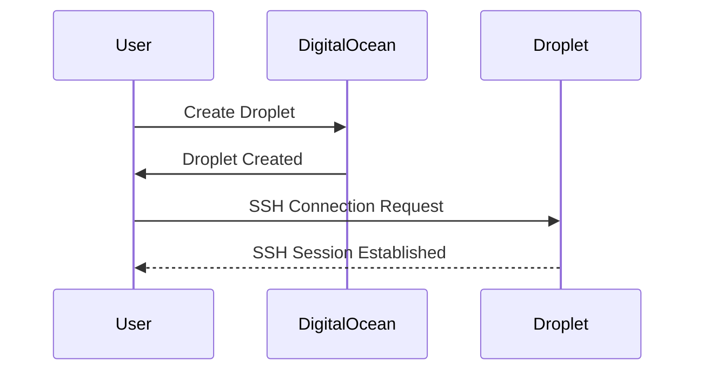
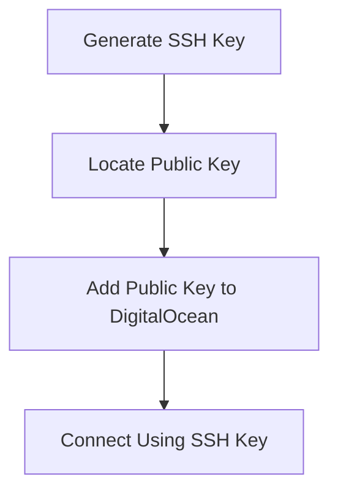

## Introduction to Remote Access and SSH

In the realm of DevOps, managing remote servers is a fundamental task. Whether you are deploying applications, configuring services, or performing routine maintenance, accessing these servers securely and efficiently is crucial. One of the most common methods for achieving this is through Secure Shell (SSH).

### What is SSH?

Secure Shell (SSH) is a cryptographic network protocol used for secure data communication, remote shell services, command execution, and file transfer between two networked computers. It provides a secure channel over an unsecured network in a client-server architecture, connecting a local client to a remote host.

#### Why Use SSH?

SSH offers several advantages over traditional remote access methods:

1. **Security**: SSH encrypts all communications between the client and the server, protecting against eavesdropping and man-in-the-middle attacks.
2. **Authentication**: SSH supports various authentication mechanisms, including passwords, public-key cryptography, and Kerberos.
3. **Flexibility**: SSH can be used for more than just terminal access; it can tunnel other protocols, forward ports, and even provide a secure file transfer mechanism via SCP or SFTP.

### Creating a Linux Droplet on DigitalOcean

DigitalOcean is a popular cloud platform that allows users to create virtual servers called "Droplets." In this section, we will walk through the process of creating a Linux Droplet and setting up SSH access.

#### Step-by-Step Guide

1. **Create a Droplet**:
    - Log in to your DigitalOcean account.
    - Click on the "Create" button and select "Droplet."
    - Choose the image (Linux distribution), size, and region.
    - Configure additional settings such as backups and monitoring.
    - Click "Create Droplet."

2. **Accessing the Droplet**:
    - Once the Droplet is created, you can access it via SSH.
    - By default, a root user is created on the server.
    - You can connect to the Droplet using the root user and set a password.



### SSH Key Authentication vs Password Authentication

While you can connect to the Droplet using a password, it is generally considered better practice to use SSH key authentication.

#### Why Use SSH Keys?

1. **Enhanced Security**: SSH keys are more secure than passwords because they are longer and harder to guess.
2. **Automation**: SSH keys can be used to automate tasks without requiring manual intervention.
3. **Multi-Factor Authentication**: SSH keys can be combined with other authentication methods for added security.

#### Creating an SSH Key Pair

To create an SSH key pair, you can use the `ssh-keygen` command on your local machine.

```bash
ssh-keygen -t rsa -b 4096 -C "your_email@example.com"
```

This command generates a new RSA key pair with a bit length of 4096 and associates it with your email address.

#### Adding the Public Key to DigitalOcean

Once you have generated the SSH key pair, you need to add the public key to DigitalOcean.

1. **Locate the Public Key**:
    - The public key is typically located at `~/.ssh/id_rsa.pub`.

2. **Add the Public Key to DigitalOcean**:
    - Go to the DigitalOcean dashboard.
    - Navigate to the "Security" section and click on "SSH Keys."
    - Click "New SSH Key" and paste the contents of your public key file.



### Connecting to the Droplet Using SSH

Now that you have added the public key to DigitalOcean, you can connect to the Droplet using SSH.

```bash
ssh root@your_droplet_ip
```

If you have set up SSH key authentication correctly, you should be able to log in without being prompted for a password.

### Full Example of SSH Connection

Here is a complete example of the SSH connection process, including the full HTTP request and response.

#### SSH Request

```bash
ssh root@your_droplet_ip
```

#### SSH Response

```plaintext
The authenticity of host 'your_droplet_ip (your_droplet_ip)' can't be established.
ECDSA key fingerprint is SHA256:your_fingerprint.
Are you sure you want to continue connecting (yes/no)? yes
Warning: Permanently added 'your_droplet_ip' (ECDSA) to the list of known hosts.
Welcome to Ubuntu 20.04 LTS (GNU/Linux 5.4.0-x86_64-linode155 x86_64)
```

### Common Pitfalls and How to Prevent Them

#### Pitfall 1: Weak SSH Keys

Using weak SSH keys can make your system vulnerable to brute-force attacks.

##### How to Prevent

- Use strong encryption algorithms (RSA with a bit length of 4096 or higher).
- Regularly rotate your SSH keys.

#### Pitfall 2: Exposing SSH to the Internet

Exposing SSH to the internet without proper security measures can lead to unauthorized access.

##### How to Prevent

- Use a firewall to restrict SSH access to trusted IP addresses.
- Enable two-factor authentication (2FA) for SSH connections.

### Real-World Examples and CVEs

#### CVE-2021-21547: SSH Server Vulnerability

In 2021, a critical vulnerability was discovered in the OpenSSH server, which allowed attackers to bypass authentication checks. This vulnerability highlights the importance of keeping your SSH server up to date with the latest security patches.

#### Example of Secure SSH Configuration

Here is an example of a secure SSH configuration file (`/etc/ssh/sshd_config`):

```plaintext
# Disable root login
PermitRootLogin no

# Only allow specific users
AllowUsers your_username

# Disable password authentication
PasswordAuthentication no

# Enable public key authentication
PubkeyAuthentication yes

# Enable two-factor authentication
UsePAM yes
```

### How to Detect and Mitigate SSH Attacks

#### Detection

- Monitor SSH logs for failed login attempts.
- Use intrusion detection systems (IDS) to detect suspicious activity.

#### Mitigation

- Implement rate limiting to prevent brute-force attacks.
- Use fail2ban to automatically block IP addresses with repeated failed login attempts.

### Practice Labs

For hands-on experience with SSH and remote server management, consider the following labs:

- **PortSwigger Web Security Academy**: Offers a comprehensive course on web security, including SSH and remote access.
- **OWASP Juice Shop**: A deliberately insecure web application for practicing web security skills.
- **DVWA (Damn Vulnerable Web Application)**: Another popular web application for learning web security.

By following these steps and best practices, you can ensure secure and efficient remote access to your Linux Droplets on DigitalOcean.

---
<!-- nav -->
[[02-Introduction to Droplets on DigitalOcean|Introduction to Droplets on DigitalOcean]] | [[DevOps/DevOps Bootcamp/04-Cloud Computing (AWS & DigitalOcean)/12-Creating A Linux Droplet On DigitalOcean/00-Overview|Overview]] | [[04-Creating a Linux Droplet on DigitalOcean|Creating a Linux Droplet on DigitalOcean]]
