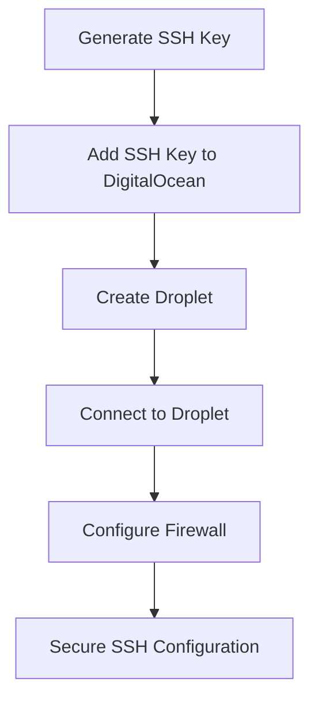
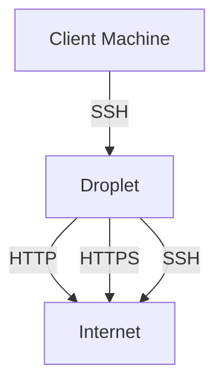

## Creating a Linux Droplet on DigitalOcean

### Introduction to DigitalOcean and Droplets

DigitalOcean is a popular cloud computing platform that provides virtual servers called "droplets." These droplets are essentially virtual machines (VMs) that run on DigitalOcean's infrastructure. They offer a wide range of configurations and operating systems, making them suitable for various applications, from small personal projects to large-scale enterprise solutions.

A droplet is a virtual machine that runs on DigitalOcean's cloud infrastructure. Each droplet has its own CPU, memory, storage, and network resources. When you create a droplet, you specify the size (amount of RAM and CPU cores), the operating system (OS), and other settings such as SSH keys and firewall rules.

### Setting Up SSH Keys for Authentication

One of the first steps in setting up a droplet is to configure SSH keys for authentication. SSH keys provide a secure way to log in to your droplet without needing to enter a password each time.

#### What Are SSH Keys?

SSH keys are a pair of cryptographic keys used for secure authentication between a client and a server. The pair consists of a private key and a public key. The private key is kept secret on the client side, while the public key is stored on the server. When you try to log in to a server, the server uses the public key to verify the identity of the client using the private key.

#### Why Use SSH Keys?

Using SSH keys enhances security by eliminating the need for passwords, which can be guessed or stolen. Additionally, SSH keys can be configured to require additional factors, such as a passphrase, further increasing security.

#### How to Set Up SSH Keys

To set up SSH keys on DigitalOcean, follow these steps:

1. **Generate SSH Key Pair**: If you don't already have an SSH key pair, you can generate one using the `ssh-keygen` command on your local machine.

    ```bash
    ssh-keygen -t rsa -b 4096 -C "your_email@example.com"
    ```

    This command generates a new RSA key pair with a bit length of 4096 and associates it with your email address.

2. **Add SSH Key to DigitalOcean**: Log in to your DigitalOcean account and navigate to the "Security" section under "Settings." Click on "SSH Keys" and then "New SSH Key." Copy and paste the contents of your public key file (usually located at `~/.ssh/id_rsa.pub`) into the provided field.

3. **Create Droplet with SSH Key**: When creating a new droplet, select the SSH key you added in the previous step. This ensures that the droplet is configured to accept connections using your SSH key.

### Creating a Droplet

Now that you have your SSH key set up, you can proceed to create a droplet.

#### Steps to Create a Droplet

1. **Log In to DigitalOcean**: Navigate to the DigitalOcean website and log in to your account.

2. **Click on "Create"**: From the dashboard, click on the "Create" button and select "Droplet."

3. **Choose Image and Size**: Select the desired image (operating system) and size (CPU and memory configuration) for your droplet. For this example, we'll choose an Ubuntu image.

4. **Configure Additional Settings**: Add any additional settings such as tags, backups, and monitoring. Also, select the SSH key you previously added.

5. **Create Droplet**: Click on "Create Droplet" to start the creation process. You can monitor the progress in the dashboard.

### Accessing the Droplet

Once your droplet is created, you can access it using its public IP address.

#### Public IP Address

The public IP address is the address assigned to your droplet by DigitalOcean. This address allows you to connect to your droplet from the internet.

#### Connecting via SSH

To connect to your droplet, use the `ssh` command with your private key.

```bash
ssh root@<public_ip_address>
```

Replace `<public_ip_address>` with the actual public IP address of your droplet.

### Firewall Configuration

By default, all incoming traffic to your droplet is blocked. To allow specific types of traffic, you need to configure firewall rules.

#### Default Firewall Rules

When you create a droplet, the default firewall rules are set to block all incoming traffic. This means that no ports are open by default, providing a basic level of security.

#### Opening Ports

To allow traffic on specific ports, you need to modify the firewall rules. For example, to allow SSH traffic, you would open port 22.

#### Configuring Firewall Rules

You can configure firewall rules using the DigitalOcean firewall interface or by modifying the firewall configuration files directly on the droplet.

##### Using DigitalOcean Firewall

1. **Navigate to Firewall Section**: In the DigitalOcean dashboard, go to the "Firewalls" section.

2. **Create New Firewall**: Click on "Create Firewall" and specify the rules for allowing traffic on specific ports.

3. **Assign to Droplet**: Assign the firewall to your droplet.

##### Modifying Firewall Configuration Files

You can also modify the firewall configuration files directly on the droplet. For example, using `ufw` (Uncomplicated Firewall):

```bash
sudo ufw allow 22/tcp
sudo ufw enable
```

This command allows traffic on port 22 (SSH) and enables the firewall.

### Common Pitfalls and Best Practices

#### Common Pitfalls

1. **Incorrect SSH Key**: Ensure that the correct SSH key is added to both DigitalOcean and your local machine.

2. **Firewall Rules**: Incorrectly configured firewall rules can prevent necessary traffic from reaching your droplet.

3. **Default Passwords**: Avoid using default passwords for root or other accounts. Always change default passwords and use strong, unique passwords.

#### Best Practices

1. **Use Strong SSH Keys**: Generate strong SSH keys with a high bit length (e.g., 4096 bits).

2. **Regularly Update Software**: Keep your droplet's software and dependencies up to date to protect against vulnerabilities.

3. **Monitor Traffic**: Regularly monitor traffic to your droplet to detect any unusual activity.

### Real-World Examples and CVEs

#### Example: CVE-2021-21315

CVE-2021-21315 is a vulnerability in the OpenSSH server that could allow an attacker to bypass authentication and gain unauthorized access to a system. This vulnerability highlights the importance of keeping your SSH server and related software up to date.

#### Example: SSH Brute Force Attacks

SSH brute force attacks involve an attacker attempting to guess the password for an SSH account. This type of attack can be mitigated by using strong SSH keys instead of passwords and configuring firewall rules to limit login attempts.

### How to Prevent / Defend

#### Detection

1. **Log Monitoring**: Monitor logs for failed login attempts and other suspicious activity.

2. **Intrusion Detection Systems (IDS)**: Use IDS tools to detect and alert on potential security threats.

#### Prevention

1. **Strong SSH Keys**: Use strong SSH keys and avoid using passwords for authentication.

2. **Firewall Rules**: Configure firewall rules to allow only necessary traffic and block all other incoming traffic.

3. **Two-Factor Authentication (2FA)**: Implement 2FA for additional security.

#### Secure Coding Fixes

##### Vulnerable Code

```bash
# Vulnerable SSH configuration
PermitRootLogin yes
PasswordAuthentication yes
```

##### Secure Code

```bash
# Secure SSH configuration
PermitRootLogin no
PasswordAuthentication no
PubkeyAuthentication yes
```

### Complete Example: Creating and Securing a Droplet

#### Step-by-Step Guide

1. **Generate SSH Key Pair**

    ```bash
    ssh-keygen -t rsa -b 4096 -C "your_email@example.com"
    ```

2. **Add SSH Key to DigitalOcean**

    - Log in to DigitalOcean.
    - Navigate to "Settings" > "Security" > "SSH Keys."
    - Click "New SSH Key" and paste the public key.

3. **Create Droplet**

    - Click "Create" > "Droplet."
    - Choose an Ubuntu image and desired size.
    - Add the SSH key and create the droplet.

4. **Connect to Droplet**

    ```bash
    ssh root@<public_ip_address>
    ```

5. **Configure Firewall**

    - Use DigitalOcean firewall or modify `/etc/ufw/ufw.conf`.

    ```bash
    sudo ufw allow 22/tcp
    sudo ufw enable
    ```

6. **Secure SSH Configuration**

    - Edit `/etc/ssh/sshd_config`.

    ```bash
    PermitRootLogin no
    PasswordAuthentication no
    PubkeyAuthentication yes
    ```

    - Restart SSH service.

    ```bash
    sudo systemctl restart ssh
    ```

### Mermaid Diagrams

#### Droplet Creation Flow



#### Network Topology



### Practice Labs

For hands-on practice, consider the following labs:

- **PortSwigger Web Security Academy**: Focuses on web application security but includes SSH and cloud-related exercises.
- **OWASP Juice Shop**: While primarily a web application security lab, it can be deployed on a DigitalOcean droplet for additional practice.
- **DVWA (Damn Vulnerable Web Application)**: Similar to OWASP Juice Shop, it can be deployed on a droplet for practice.

These labs provide a practical environment to apply the concepts learned in this chapter.

### Conclusion

Creating and securing a Linux droplet on DigitalOcean involves several steps, including generating and adding SSH keys, creating the droplet, configuring the firewall, and securing the SSH configuration. By following best practices and regularly updating software, you can ensure the security of your droplet.

---
<!-- nav -->
[[03-Introduction to Remote Access and SSH|Introduction to Remote Access and SSH]] | [[DevOps/DevOps Bootcamp/04-Cloud Computing (AWS & DigitalOcean)/12-Creating A Linux Droplet On DigitalOcean/00-Overview|Overview]] | [[DevOps/DevOps Bootcamp/04-Cloud Computing (AWS & DigitalOcean)/12-Creating A Linux Droplet On DigitalOcean/05-Practice Questions & Answers|Practice Questions & Answers]]
