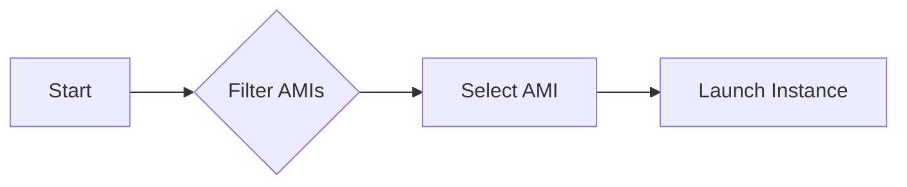

## Introduction to AWS EC2 Instance Configuration

In the realm of DevOps, managing infrastructure efficiently and securely is paramount. One of the key components in AWS is the Elastic Compute Cloud (EC2), which provides scalable computing capacity in the cloud. Configuring an EC2 instance involves selecting the appropriate Amazon Machine Image (AMI), specifying instance types, and setting up various configurations such as security groups and key pairs. This chapter delves deep into creating an EC2 instance configuration using AWS CLI and Terraform, focusing on dynamic AMI selection through filters and regular expressions.

### Understanding Amazon Machine Images (AMIs)

An Amazon Machine Image (AMI) is a pre-configured template for launching instances. Each AMI contains the information required to launch an instance, including the operating system, application server, and applications. AMIs can be public, shared, or private, depending on their accessibility.

#### Why Use AMIs?

Using AMIs allows you to quickly launch new instances with consistent configurations. This is particularly useful in DevOps environments where reproducibility and consistency are crucial. By using AMIs, you can ensure that all your instances are based on the same baseline configuration, reducing the risk of configuration drift.

#### Regular Expressions in AMI Selection

Regular expressions (regex) are powerful tools for pattern matching and text manipulation. In the context of AMI selection, regex can be used to filter AMIs based on specific naming conventions or patterns. This is especially useful when you have multiple AMIs and need to select the most recent one that matches a certain criteria.

### Dynamic AMI Selection Using Filters

Dynamic AMI selection involves using filters to automatically choose the most recent AMI that meets specific criteria. This approach ensures that your instances are always based on the latest available AMI, reducing the need for manual updates.

#### Example Scenario

Suppose you have multiple AMIs named `myapp-v1.0`, `myapp-v1.1`, `myapp-v1.2`, etc. You want to select the most recent AMI that starts with `myapp-v` and ends with a version number. This can be achieved using regular expressions and filters.



### Using AWS CLI for Dynamic AMI Selection

The AWS Command Line Interface (CLI) provides a powerful set of tools for interacting with AWS services. Here’s how you can use the AWS CLI to dynamically select an AMI based on filters and regular expressions.

#### Step-by-Step Process

1. **List Available AMIs**: Use the `aws ec2 describe-images` command to list all available AMIs.
2. **Apply Filters**: Use the `--filters` option to apply specific filters, such as the AMI name and virtualization type.
3. **Sort and Select**: Use the `--query` option to sort the results and select the most recent AMI.

```bash
# List all AMIs
aws ec2 describe-images --owners self amazon

# Apply filters and select the most recent AMI
aws ec2 describe-images \
    --owners self amazon \
    --filters Name=name,Values=myapp-v* Name=virtualization-type,Values=hvm \
    --query 'sort_by(Images, &CreationDate)[-1].ImageId'
```

#### Explanation

- `--owners self amazon`: Specifies the owners of the AMIs to list. `self` refers to your own account, and `amazon` refers to official Amazon AMIs.
- `--filters Name=name,Values=myapp-v* Name=virtualization-type,Values=hvm`: Applies filters to select AMIs whose name starts with `myapp-v` and have a virtualization type of `hvm`.
- `--query 'sort_by(Images, &CreationDate)[-1].ImageId'`: Sorts the AMIs by creation date and selects the most recent one.

### Using Terraform for Dynamic AMI Selection

Terraform is an infrastructure as code (IaC) tool that allows you to define and provision your infrastructure using declarative configuration files. Terraform provides built-in support for dynamic AMI selection using data sources.

#### Step-by-Step Process

1. **Define Data Source**: Use the `data` block to define a data source for AMIs.
2. **Apply Filters**: Use the `filter` block to apply specific filters.
3. **Reference AMI**: Reference the selected AMI in your EC2 instance configuration.

```hcl
# Define data source for AMIs
data "aws_ami" "latest" {
  most_recent = true
  owners      = ["self", "amazon"]

  filter {
    name   = "name"
    values = ["myapp-v*"]
  }

  filter {
    name   = "virtualization-type"
    values = ["hvm"]
  }
}

# Reference the selected AMI in EC2 instance configuration
resource "aws_instance" "example" {
  ami           = data.aws_ami.latest.id
  instance_type = "t2.micro"

  tags = {
    Name = "example-instance"
  }
}
```

#### Explanation

- `data "aws_ami" "latest"`: Defines a data source for AMIs.
- `most_recent = true`: Ensures that the most recent AMI is selected.
- `owners = ["self", "amazon"]`: Specifies the owners of the AMIs to consider.
- `filter { name = "name" values = ["myapp-v*"] }`: Applies a filter to select AMIs whose name starts with `myapp-v`.
- `filter { name = "virtualization-type" values = ["hvm"] }`: Applies a filter to select AMIs with a virtualization type of `hvm`.
- `resource "aws_instance" "example"`: Defines an EC2 instance resource.
- `ami = data.aws_ami.latest.id`: References the selected AMI in the EC2 instance configuration.

### Pitfalls and Best Practices

#### Common Mistakes

1. **Hardcoding AMI IDs**: Hardcoding AMI IDs in your configuration files can lead to outdated and inconsistent instances. Always use dynamic AMI selection to ensure that your instances are based on the latest available AMI.
2. **Incorrect Filters**: Incorrectly applying filters can result in selecting the wrong AMI. Always test your filters thoroughly to ensure that they return the desired results.
3. **Security Risks**: Using public AMIs from unknown sources can introduce security risks. Always verify the source of the AMI and ensure that it is trusted.

#### Best Practices

1. **Use Trusted Sources**: Always use trusted sources for your AMIs, such as official Amazon AMIs or AMIs from reputable third-party providers.
2. **Automate Updates**: Automate the process of updating your AMIs to ensure that your instances are always based on the latest available AMI.
3. **Document Your Configuration**: Document your configuration thoroughly to ensure that others can understand and maintain it.

### Real-World Examples

#### Recent CVEs and Breaches

One recent example of a security breach related to AMI usage was the compromise of a Docker image hosted on Docker Hub. The compromised image was used to deploy malicious software on unsuspecting users' systems. This highlights the importance of verifying the source of your AMIs and ensuring that they are trusted.

#### Secure Coding Practices

To prevent security risks associated with AMI usage, follow these secure coding practices:

1. **Verify AMI Sources**: Always verify the source of your AMIs and ensure that they are trusted.
2. **Use Trusted Repositories**: Use trusted repositories for your AMIs, such as official Amazon AMIs or AMIs from reputable third-party providers.
3. **Automate Security Checks**: Automate the process of checking your AMIs for security vulnerabilities using tools such as Aqua Security or Twistlock.

### How to Prevent / Defend

#### Detection

To detect potential issues with your AMIs, use the following methods:

1. **Monitor AMI Usage**: Monitor the usage of your AMIs to ensure that they are being used correctly and consistently.
2. **Audit AMI Sources**: Audit the sources of your AMIs to ensure that they are trusted and verified.
3. **Check for Vulnerabilities**: Check your AMIs for known vulnerabilities using tools such as Aqua Security or Twistlock.

#### Prevention

To prevent potential issues with your AMIs, use the following methods:

1. **Use Trusted Sources**: Always use trusted sources for your AMIs, such as official Amazon AMIs or AMIs from reputable third-party providers.
2. **Automate Updates**: Automate the process of updating your AMIs to ensure that your instances are always based on the latest available AMI.
3. **Document Your Configuration**: Document your configuration thoroughly to ensure that others can understand and maintain it.

### Conclusion

Dynamic AMI selection using filters and regular expressions is a powerful technique for managing your EC2 instances in AWS. By using this approach, you can ensure that your instances are always based on the latest available AMI, reducing the need for manual updates and ensuring consistency across your infrastructure. Whether you are using the AWS CLI or Terraform, the steps outlined in this chapter provide a comprehensive guide to dynamic AMI selection and management.

### Practice Labs

For hands-on practice with AWS EC2 instance configuration, consider the following labs:

- **PortSwigger Web Security Academy**: Offers a variety of labs focused on web application security, including some that involve configuring AWS EC2 instances.
- **OWASP Juice Shop**: A deliberately insecure web application for security training. While primarily focused on web app security, it can be deployed on AWS EC2 instances for additional practice.
- **CloudGoat**: A series of labs designed to help you learn AWS security best practices. These labs cover a wide range of topics, including EC2 instance configuration and management.

By completing these labs, you can gain practical experience with the concepts covered in this chapter and improve your skills in managing AWS EC2 instances.

---
<!-- nav -->
[[01-Introduction to AWS EC2 Instance Configuration with Terraform|Introduction to AWS EC2 Instance Configuration with Terraform]] | [[DevOps/DevOps Bootcamp/04-Cloud Computing (AWS & DigitalOcean)/13-Creating AWS EC2 Instance Configuration/00-Overview|Overview]] | [[03-Introduction to AWS EC2 Instances and AMIs|Introduction to AWS EC2 Instances and AMIs]]
