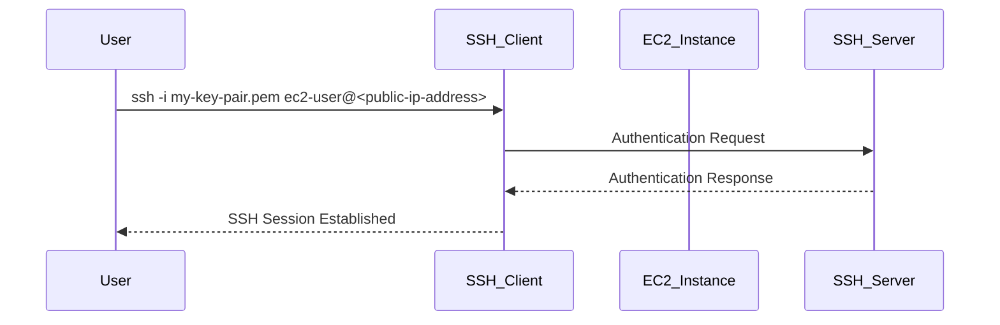

## Introduction to AWS EC2 Instances and SSH Access

### Background Theory

Amazon Web Services (AWS) Elastic Compute Cloud (EC2) provides scalable computing capacity in the cloud. EC2 instances are virtual servers that run within the AWS infrastructure. These instances can be launched and managed using various tools, including the AWS Management Console, AWS Command Line Interface (CLI), and Infrastructure as Code (IaC) tools such as Terraform.

### Key Concepts

#### EC2 Instances
An EC2 instance is a virtual machine that runs in the AWS cloud. Each instance has its own operating system, storage, and networking capabilities. You can launch an instance from a variety of pre-configured Amazon Machine Images (AMIs) or create your own custom AMI.

#### Public IP Address
A public IP address is assigned to an EC2 instance to enable communication over the internet. This IP address allows external systems to connect to the instance, which is essential for tasks such as SSH access.

#### SSH (Secure Shell)
SSH is a cryptographic network protocol for operating network services securely over an unsecured network. It provides a secure channel over an insecure network in a client-server architecture, connecting an SSH client application with an SSH server. Common applications include remote command-line login and remote command execution, but any network service can be secured with SSH.

### Setting Up SSH Access to an EC2 Instance

To SSH into an EC2 instance, you need to follow these steps:

1. **Launch an EC2 Instance**: Use the AWS Management Console, CLI, or Terraform to launch an EC2 instance.
2. **Assign a Public IP Address**: Ensure the instance has a public IP address to allow external connections.
3. **Generate SSH Keys**: Create a public-private key pair to authenticate SSH sessions.
4. **Configure SSH Access**: Associate the public key with the EC2 instance and use the private key to SSH into the instance.

### Detailed Steps

#### Launching an EC2 Instance Using Terraform

First, let's create an EC2 instance using Terraform. Here’s a complete example of a Terraform configuration to launch an EC2 instance:

```hcl
provider "aws" {
  region = "us-west-2"
}

resource "aws_instance" "example" {
  ami           = "ami-0c55b159cbfafe1f0"
  instance_type = "t2.micro"

  tags = {
    Name = "example-instance"
  }

  key_name = "my-key-pair"
}
```

This configuration sets up an EC2 instance in the `us-west-2` region with a specific AMI and instance type. The `key_name` field specifies the name of the key pair to associate with the instance.

#### Retrieving the Public IP Address

Once the instance is launched, you can retrieve its public IP address using Terraform commands. The `terraform state show` command displays the current state of the resources:

```sh
terraform state show aws_instance.example
```

This command outputs detailed information about the `aws_instance.example`, including the public IP address.

#### Generating SSH Keys

Before SSHing into the instance, you need to generate an SSH key pair. This can be done using the `ssh-keygen` command:

```sh
ssh-keygen -t rsa -b 2048 -f my-key-pair
```

This command generates a new RSA key pair with a 2048-bit length and saves it to `my-key-pair`.

#### Associating the Public Key with the EC2 Instance

When launching the instance, ensure the public key is associated with the instance. In the Terraform configuration, the `key_name` field should match the name of the key pair you created.

#### SSHing into the EC2 Instance

Now, you can SSH into the instance using the private key:

```sh
ssh -i my-key-pair.pem ec2-user@<public-ip-address>
```

Here, `<public-ip-address>` is the actual public IP address of the EC2 instance.

### Mermaid Diagram: SSH Access Flow

Let's visualize the SSH access flow using a mermaid diagram:



### Pitfalls and Best Practices

#### Common Mistakes

1. **Incorrect Key Pair**: Ensure the key pair name matches the one specified in the Terraform configuration.
2. **Missing Public IP**: Verify that the instance has a public IP address assigned.
3. **Incorrect Permissions**: Ensure the private key file has the correct permissions (`chmod 400 my-key-pair.pem`).

#### Best Practices

1. **Use Strong Key Pairs**: Generate strong RSA keys with at least 2048 bits.
2. **Secure Key Storage**: Store private keys securely and restrict access to them.
3. **Automate Key Management**: Use tools like Hashicorp Vault for managing SSH keys.

### Real-World Examples and CVEs

#### Example: CVE-2021-20225

In 2021, a vulnerability was discovered in the AWS SDK for Java, which could allow unauthorized access to EC2 instances. This vulnerability highlights the importance of securing SSH access and ensuring that key management practices are robust.

### How to Prevent / Defend

#### Detection

1. **Audit Logs**: Regularly review AWS CloudTrail logs to detect unauthorized access attempts.
2. **Network Monitoring**: Use AWS VPC Flow Logs to monitor network traffic to and from EC2 instances.

#### Prevention

1. **IAM Policies**: Restrict access to EC2 instances using IAM policies.
2. **Security Groups**: Configure security groups to limit inbound and outbound traffic.
3. **Key Rotation**: Regularly rotate SSH keys to minimize exposure.

#### Secure Coding Fixes

**Vulnerable Code:**

```hcl
resource "aws_instance" "example" {
  ami           = "ami-0c55b159cbfafe1f0"
  instance_type = "t2.micro"

  tags = {
    Name = "example-instance"
  }
}
```

**Fixed Code:**

```hcl
resource "aws_instance" "example" {
  ami           = "ami-0c55b159cbfafe1f0"
  instance_type = "t2.micro"

  tags = {
    Name = "example-instance"
  }

  key_name = "my-key-pair"
  vpc_security_group_ids = ["sg-0123456789abcdef0"]
}
```

### Hands-On Labs

For hands-on practice, consider the following labs:

- **PortSwigger Web Security Academy**: Offers a comprehensive course on web security, including sections on SSH and key management.
- **CloudGoat**: Provides a series of labs focused on AWS security, including EC2 instance setup and SSH access.

By following these detailed steps and best practices, you can effectively manage SSH access to AWS EC2 instances while ensuring security and compliance.

---
<!-- nav -->
[[04-Introduction to AWS EC2 Instances and Key Pairs|Introduction to AWS EC2 Instances and Key Pairs]] | [[DevOps/DevOps Bootcamp/04-Cloud Computing (AWS & DigitalOcean)/13-Creating AWS EC2 Instance Configuration/00-Overview|Overview]] | [[06-Introduction to AWS EC2 Instances and SSH Key Management|Introduction to AWS EC2 Instances and SSH Key Management]]
