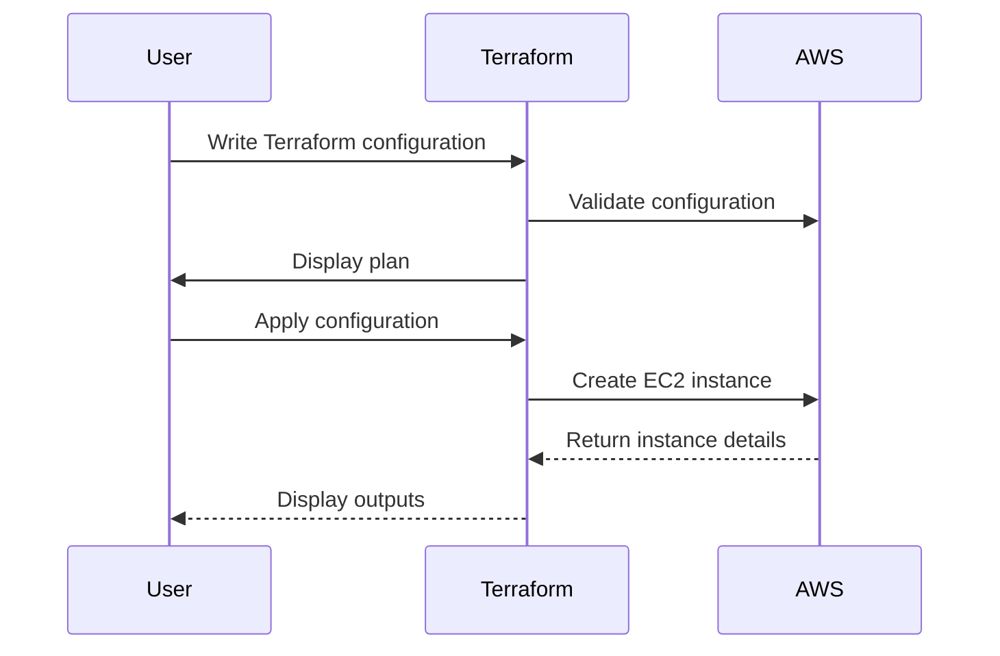
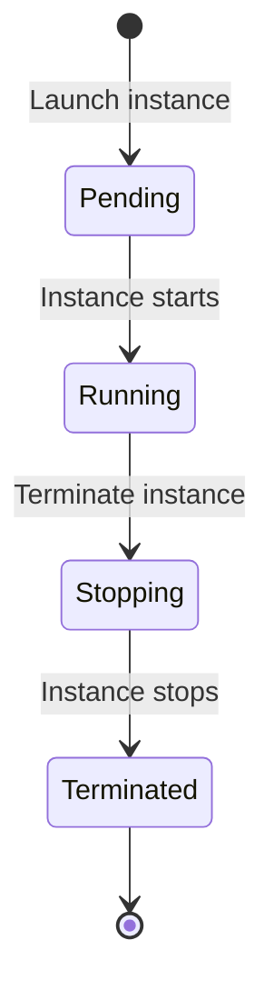

## Introduction to AWS EC2 Instances and Terraform Configuration

In this section, we will delve into the process of creating an AWS EC2 instance using Terraform, a popular infrastructure as code (IaC) tool. We will cover the necessary steps to configure and deploy an EC2 instance, including handling warnings related to syntax and ensuring proper resource management. Additionally, we will discuss the importance of secure coding practices and provide real-world examples to illustrate potential vulnerabilities and their mitigation strategies.

### What is AWS EC2?

Amazon Elastic Compute Cloud (EC2) is a web service that provides resizable compute capacity in the cloud. It allows users to launch virtual servers called instances, which can run applications and services. EC2 instances can be configured with various operating systems, storage options, and networking capabilities.

### What is Terraform?

Terraform is an open-source tool for building, changing, and versioning infrastructure safely and efficiently. It enables users to define infrastructure as code using a declarative language called HCL (HashiCorp Configuration Language). Terraform can manage resources across multiple cloud providers, including AWS, Azure, Google Cloud, and others.

### Why Use Terraform for EC2 Configuration?

Using Terraform to configure EC2 instances offers several benefits:

1. **Consistency**: Terraform ensures that your infrastructure is consistently deployed across different environments.
2. **Version Control**: Infrastructure changes can be tracked and managed using version control systems like Git.
3. **Automation**: Terraform automates the deployment and management of resources, reducing manual errors and improving efficiency.
4. **Multi-Cloud Support**: Terraform supports multiple cloud providers, making it easier to manage hybrid cloud environments.

### Syntax Warnings in Terraform

When working with Terraform configurations, it is essential to pay attention to syntax warnings. These warnings often indicate issues that could lead to unexpected behavior or security vulnerabilities. In the given transcript, we encounter a warning related to string interpolation.

#### String Interpolation in Terraform

String interpolation in Terraform allows you to combine strings and variables into a single string. This is achieved using the `${}` syntax. For example:

```hcl
variable "instance_name" {
  default = "my-instance"
}

resource "aws_instance" "example" {
  ami           = "ami-0c55b159cbfafe1f0"
  instance_type = "t2.micro"
  tags = {
    Name = "${var.instance_name}"
  }
}
```

In this example, `${var.instance_name}` interpolates the value of the `instance_name` variable into the `Name` tag.

#### Deprecation Warning

The warning mentioned in the transcript indicates that certain uses of string interpolation are deprecated. Specifically, the warning suggests avoiding interpolation when only a variable is used without additional string content. For example:

```hcl
variable "public_ip" {
  default = "192.168.1.1"
}

output "public_ip" {
  value = "${var.public_ip}"
}
```

This configuration triggers a deprecation warning because the interpolation is unnecessary when only a variable is being used.

#### Fixing the Warning

To resolve the warning, you can remove the interpolation syntax:

```hcl
output "public_ip" {
  value = var.public_ip
}
```

By removing the `${}` syntax, the warning is eliminated, and the configuration remains clean and readable.

### Running Terraform Commands

After fixing the syntax warning, you can proceed with running Terraform commands to validate and apply the configuration.

#### Terraform Plan

Before applying any changes, it is crucial to run `terraform plan` to preview the changes that will be made:

```sh
terraform plan
```

This command generates a detailed execution plan, showing what resources will be created, updated, or destroyed.

#### Terraform Apply

Once you are satisfied with the plan, you can apply the changes using `terraform apply`. To automatically approve the changes without prompting for confirmation, you can use the `-auto-approve` flag:

```sh
terraform apply -auto-approve
```

### Monitoring EC2 Instance Deployment

During the deployment process, you can monitor the status of the EC2 instance by refreshing the Terraform output:

```sh
terraform output
```

This command displays the current state of the outputs defined in your Terraform configuration.

### Adding Public IP Output

To make it easier to access the newly created EC2 instance, you can add an output for the public IP address:

```hcl
output "ec2_public_ip" {
  value = aws_instance.example.public_ip
}
```

This output will display the public IP address of the EC2 instance after it has been created.

### Mermaid Diagrams

To visualize the process of creating and managing an EC2 instance using Terraform, we can use Mermaid diagrams.

#### Sequence Diagram

A sequence diagram can illustrate the steps involved in deploying an EC2 instance:



#### State Machine Diagram

A state machine diagram can represent the lifecycle of an EC2 instance:



### Real-World Examples and Security Considerations

#### Recent CVEs and Breaches

Recent vulnerabilities and breaches involving AWS EC2 instances highlight the importance of secure configuration and management. For example:

- **CVE-2021-20225**: A vulnerability in the AWS SDK for Java allowed unauthorized access to EC2 instances due to improper validation of user input.
- **AWS RDS Data Exfiltration**: In 2021, a misconfigured AWS RDS instance led to the exposure of sensitive data due to incorrect security group settings.

#### Secure Coding Practices

To prevent such vulnerabilities, it is essential to follow secure coding practices when configuring EC2 instances:

1. **Use Strong IAM Policies**: Ensure that IAM roles and policies are properly configured to restrict access to EC2 instances.
2. **Enable Encryption**: Enable encryption for EBS volumes and S3 buckets to protect data at rest.
3. **Use Security Groups**: Configure security groups to allow only necessary inbound and outbound traffic.
4. **Regularly Update AMIs**: Use the latest AMIs to ensure that instances are patched against known vulnerabilities.

#### Vulnerable vs. Secure Code Example

Here is an example of a vulnerable and secure configuration for an EC2 instance:

**Vulnerable Configuration**

```hcl
resource "aws_instance" "vulnerable" {
  ami           = "ami-0c55b159cbfafe1f0"
  instance_type = "t2.micro"
  security_groups = ["default"]
}
```

**Secure Configuration**

```hcl
resource "aws_instance" "secure" {
  ami           = "ami-0c55b159cbfafe1f0"
  instance_type = "t2.micro"
  security_groups = ["sg-0123456789abcdef0"]
  ebs_block_device {
    encrypted = true
  }
  iam_instance_profile = "my-iam-profile"
}
```

In the secure configuration, we specify a custom security group, enable encryption for EBS volumes, and assign an IAM instance profile with restricted permissions.

### How to Prevent / Defend

#### Detection

To detect potential vulnerabilities in your EC2 instances, you can use tools like:

- **AWS Trusted Advisor**: Provides recommendations for optimizing cost, performance, and security.
- **AWS Config**: Tracks changes to your AWS resources and provides compliance reports.
- **AWS Inspector**: Automatically assesses your AWS resources for security vulnerabilities.

#### Prevention

To prevent vulnerabilities, follow these best practices:

1. **Use Least Privilege Principle**: Assign minimal permissions to IAM roles and policies.
2. **Enable Multi-Factor Authentication (MFA)**: Require MFA for accessing AWS resources.
3. **Regularly Audit IAM Roles**: Review and update IAM roles and policies to ensure they remain secure.
4. **Use AWS Security Hub**: Centralize security findings and automate compliance checks.

#### Secure-Coding Fixes

Here is an example of a secure-coding fix for a vulnerable IAM role:

**Vulnerable IAM Role**

```json
{
  "Version": "2012-10-17",
  "Statement": [
    {
      "Effect": "Allow",
      "Action": "*",
      "Resource": "*"
    }
  ]
}
```

**Secure IAM Role**

```json
{
  "Version": "2012-10-17",
  "Statement": [
    {
      "Effect": "Allow",
      "Action": [
        "ec2:DescribeInstances",
        "ec2:StartInstances",
        "ec2:StopInstances"
      ],
      "Resource": "*"
    }
  ]
}
```

In the secure IAM role, we restrict the actions to only those necessary for managing EC2 instances.

### Hands-On Labs

To practice and reinforce the concepts covered in this section, you can use the following hands-on labs:

- **PortSwigger Web Security Academy**: Offers interactive labs for learning web application security.
- **OWASP Juice Shop**: A deliberately insecure web application for practicing security testing.
- **DVWA (Damn Vulnerable Web Application)**: A PHP/MySQL web application with numerous security vulnerabilities.
- **WebGoat**: An interactive training application for learning about web application security.

These labs provide practical experience in configuring and securing AWS EC2 instances using Terraform.

### Conclusion

In this section, we have covered the process of creating an AWS EC2 instance using Terraform, including handling syntax warnings, running Terraform commands, and adding outputs for monitoring. We have also discussed real-world examples and secure coding practices to ensure the security of your EC2 instances. By following these guidelines and using the provided hands-on labs, you can gain a comprehensive understanding of managing EC2 instances securely.

---
<!-- nav -->
[[06-Introduction to AWS EC2 Instances and SSH Key Management|Introduction to AWS EC2 Instances and SSH Key Management]] | [[DevOps/DevOps Bootcamp/04-Cloud Computing (AWS & DigitalOcean)/13-Creating AWS EC2 Instance Configuration/00-Overview|Overview]] | [[08-Introduction to AWS EC2 Instances|Introduction to AWS EC2 Instances]]
