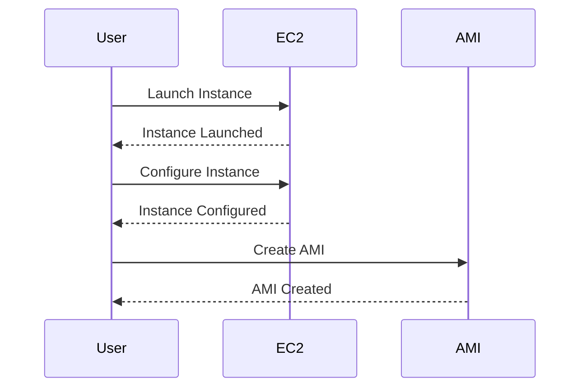

## Creating AWS EC2 Instance Configuration

In this section, we will delve into the process of creating an AWS EC2 instance configuration, focusing specifically on the creation and management of custom AMIs (Amazon Machine Images). This process is crucial for DevOps engineers and system administrators who need to deploy consistent and reproducible environments across their infrastructure.

### Understanding Amazon Machine Images (AMIs)

An Amazon Machine Image (AMI) is a template used to launch an EC2 instance. An AMI contains the information required to launch an instance, including the following:

- **Operating System**: The base OS that the instance will run.
- **Applications**: Any software or applications that are pre-installed on the instance.
- **Configuration Settings**: Network settings, storage configurations, etc.
- **User Data**: Scripts or commands that run when the instance launches.

#### Why Use Custom AMIs?

Using custom AMIs allows you to create a standardized environment that can be easily replicated across multiple instances. This is particularly useful for:

- **Consistency**: Ensures that all instances are configured identically.
- **Reproducibility**: Simplifies the deployment of new instances with the same configuration.
- **Automation**: Facilitates automation through tools like Terraform, Ansible, or AWS CloudFormation.

### Creating Your Own AMI

To create your own AMI, you can follow these steps:

1. **Launch an Instance**: Start by launching an EC2 instance using an existing AMI.
2. **Configure the Instance**: Install and configure the necessary software and settings.
3. **Create the AMI**: Once the instance is configured, you can create a new AMI based on this instance.

Here’s a step-by-step guide to creating an AMI:



### Managing AMIs

Once you have created an AMI, you can manage it using the AWS Management Console or the AWS CLI. Here are some key concepts and operations related to managing AMIs:

#### Owners and Filters

When working with AMIs, you often need to filter and select specific images based on certain criteria. The `owners` parameter allows you to specify who owns the AMI, and the `filters` parameter lets you define more detailed criteria.

For example, you might want to list all AMIs owned by Amazon that match a specific name pattern. Here’s how you can do this using the AWS CLI:

```bash
aws ec2 describe-images --owners amazon --filters "Name=name,Values=amzn2-ami-hvm-2.0.2023*"
```

This command lists all AMIs owned by Amazon whose names start with `amzn2-ami-hvm-2.0.2023`.

#### Filter Blocks

Filter blocks allow you to define complex criteria for selecting AMIs. Each filter block consists of a `name` and `values` attribute. The `name` specifies the key to filter on, and `values` specifies the values to match.

For example, to find AMIs that start with a specific string and end with another string, you can use the following filter:

```bash
aws ec2 describe-images --owners amazon --filters "Name=name,Values=amzn2-ami-hvm-2.0.2023*" "Name=name,Values=*x86_64"
```

This command finds AMIs owned by Amazon that start with `amzn2-ami-hvm-2.0.2023` and end with `x86_64`.

### Real-World Examples

Let’s consider a real-world scenario where you need to deploy a consistent environment across multiple regions. You can use custom AMIs to ensure that all instances are configured identically.

#### Example Scenario: Deploying a Consistent Environment

Suppose you need to deploy a web application across multiple regions. You can create a custom AMI with the necessary software and configurations, and then use this AMI to launch instances in different regions.

Here’s how you can create and use a custom AMI:

1. **Create the AMI**:
   - Launch an EC2 instance using an existing AMI.
   - Install and configure the necessary software and settings.
   - Create a new AMI based on this instance.

2. **Deploy Instances Using the AMI**:
   - Use the new AMI to launch instances in different regions.

Here’s an example of creating an AMI using the AWS CLI:

```bash
# Stop the instance
aws ec2 stop-instances --instance-ids i-0123456789abcdef0

# Create the AMI
aws ec2 create-image --instance-id i-0123456789abcdef0 --name "MyCustomAMI" --description "Custom AMI for my web application"

# Start the instance again
aws ec2 start-instances --instance-ids i-0123456789abcdef0
```

### Pitfalls and Best Practices

While creating and using custom AMIs can greatly simplify your deployment process, there are several pitfalls to be aware of:

- **Security**: Ensure that the AMI is secure and does not contain any sensitive data.
- **Version Control**: Keep track of different versions of your AMIs to avoid confusion.
- **Cost**: Be mindful of the cost associated with storing multiple AMIs.

#### How to Prevent / Defend

To ensure that your AMIs are secure and properly managed, follow these best practices:

1. **Secure the AMI**:
   - Remove any sensitive data before creating the AMI.
   - Use IAM roles and policies to restrict access to the AMI.

2. **Version Control**:
   - Use descriptive names and tags to keep track of different versions of your AMIs.
   - Regularly review and clean up old AMIs to avoid clutter.

3. **Cost Management**:
   - Monitor the storage costs associated with your AMIs.
   - Use lifecycle policies to automatically delete old AMIs.

Here’s an example of securing an AMI using IAM roles and policies:

```json
{
    "Version": "2012-10-17",
    "Statement": [
        {
            "Effect": "Allow",
            "Action": [
                "ec2:DescribeImages",
                "ec2:RegisterImage",
                "ec2:DeregisterImage"
            ],
            "Resource": "*"
        }
    ]
}
```

### Conclusion

Creating and managing custom AMIs is a powerful technique for ensuring consistency and reproducibility in your EC2 deployments. By following the steps outlined above and adhering to best practices, you can effectively leverage AMIs to streamline your DevOps processes.

### Hands-On Practice

To gain practical experience with creating and managing AMIs, consider the following labs:

- **AWS Official Workshops**: AWS provides various workshops and labs that cover EC2 and AMI management.
- **CloudGoat**: A cloud security training platform that includes exercises on creating and managing AMIs.

By completing these labs, you can reinforce your understanding and gain hands-on experience with the concepts covered in this chapter.

---
<!-- nav -->
[[10-Introduction to SSH Key Pairs|Introduction to SSH Key Pairs]] | [[DevOps/DevOps Bootcamp/04-Cloud Computing (AWS & DigitalOcean)/13-Creating AWS EC2 Instance Configuration/00-Overview|Overview]] | [[12-Default VPC and Subnet|Default VPC and Subnet]]
