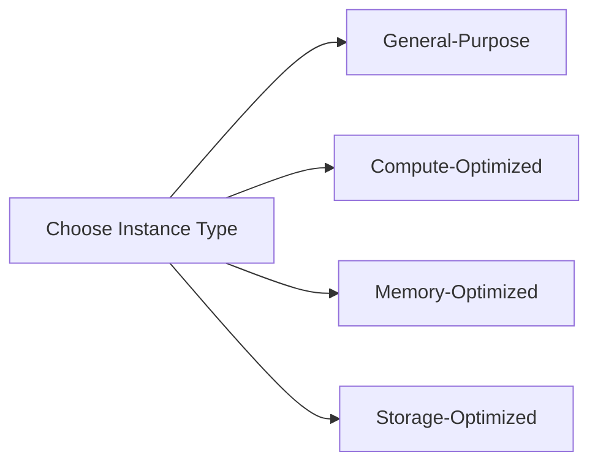

## Required Attributes for Launching an EC2 Instance

### Amazon Machine Image (AMI)

#### What is an AMI?

An Amazon Machine Image (AMI) is a template used to launch an EC2 instance. An AMI contains the information required to launch an instance, including the operating system, application server, and applications.

#### Why is AMI Important?

The AMI determines the initial state of the EC2 instance. Choosing the correct AMI ensures that the instance has the necessary software and configurations to run your application.

#### How to Select an AMI

You can select an AMI from the AWS Marketplace, community AMIs, or create your own custom AMI. For example, if you are deploying a web application, you might choose an AMI with a pre-installed web server like Apache or Nginx.


### Instance Type

#### What is an Instance Type?

An instance type defines the hardware configuration of the EC2 instance, including the number of vCPUs, amount of memory, and storage capacity. AWS offers various instance types optimized for different workloads, such as general-purpose, compute-optimized, memory-optimized, and storage-optimized.

#### Why is Instance Type Important?

Choosing the appropriate instance type ensures that your EC2 instance has the necessary resources to handle your workload efficiently. For example, a compute-optimized instance type would be suitable for CPU-intensive tasks, while a memory-optimized instance type would be better for applications requiring large amounts of RAM.

#### How to Choose an Instance Type

Consider the resource requirements of your application and select an instance type that matches those requirements. For example, if you are deploying a small web application, you might choose a `t2.micro` instance type, which is included in the AWS Free Tier.



### Configuring Instance Type as a Variable

Instead of hardcoding the instance type, you can make it configurable by defining it as a variable. This approach allows you to deploy different instance types in different environments, such as development, testing, and production.

#### Example Configuration

Let's define the instance type as a variable in a Terraform configuration file:

```hcl
variable "instance_type" {
  description = "The type of EC2 instance to launch"
  default     = "t2.micro"
}

resource "aws_instance" "example" {
  ami           = "ami-0c94855ba95b798c7"
  instance_type = var.instance_type
}
```

In this example, the `instance_type` variable is defined with a default value of `t2.micro`. You can override this value when deploying the configuration, allowing you to use different instance types in different environments.

---
<!-- nav -->
[[14-Optional Attributes for Launching an EC2 Instance|Optional Attributes for Launching an EC2 Instance]] | [[DevOps/DevOps Bootcamp/04-Cloud Computing (AWS & DigitalOcean)/13-Creating AWS EC2 Instance Configuration/00-Overview|Overview]] | [[16-Understanding AWS EC2 Instances and AMIs|Understanding AWS EC2 Instances and AMIs]]
