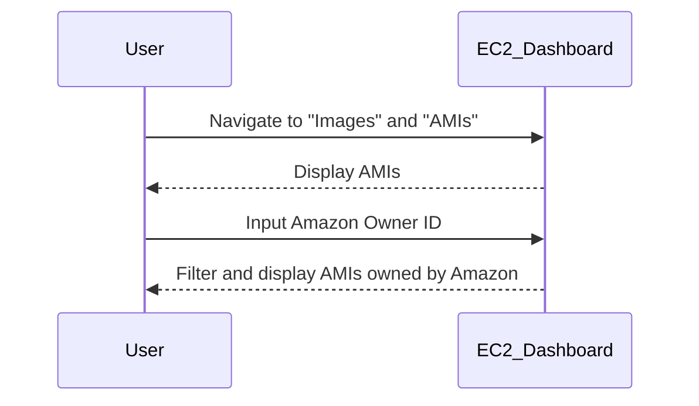
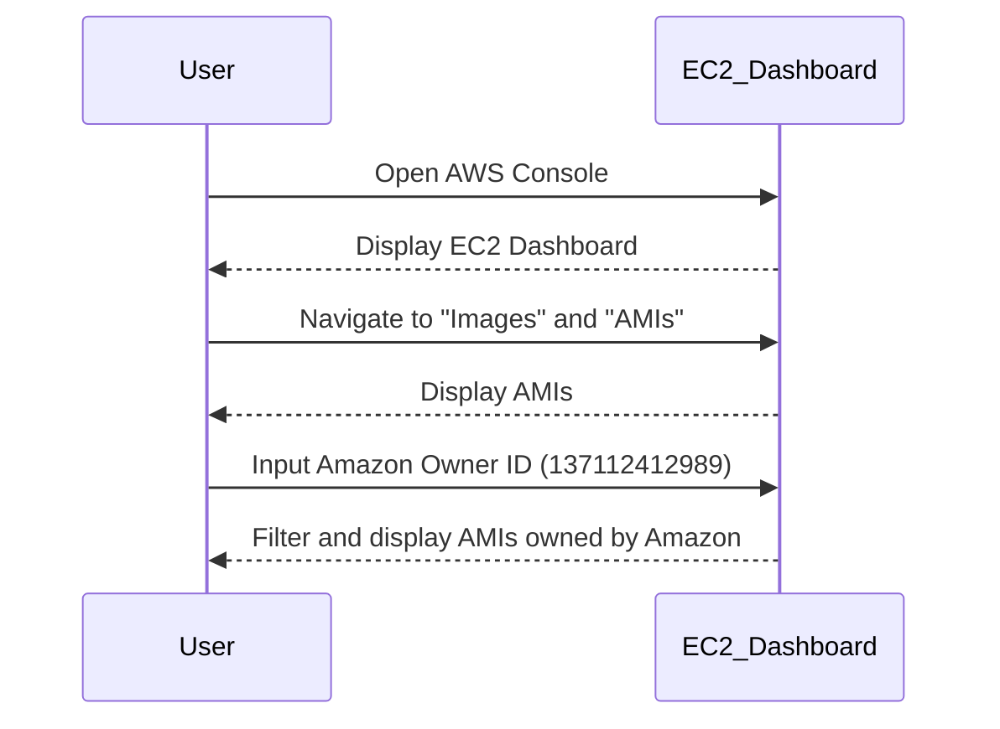
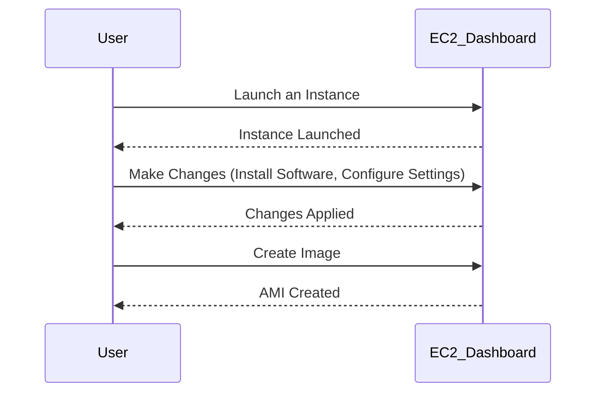
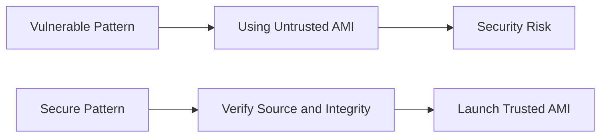

## Understanding AWS EC2 Instances and AMIs

### What is an EC2 Instance?

An Amazon Elastic Compute Cloud (EC2) instance is a virtual server in the cloud provided and managed by Amazon Web Services (AWS). It allows you to run applications and services in the AWS cloud. Each EC2 instance is defined by a combination of hardware specifications (such as CPU, memory, and storage) and a software environment (operating system and pre-installed software).

### What is an AMI?

An Amazon Machine Image (AMI) is a template used to launch an EC2 instance. An AMI contains the information required to launch an instance, including the following:

- **Operating System**: The base OS that the instance will run.
- **Applications**: Any software or applications that are pre-installed on the instance.
- **Launch Permissions**: Who can use the AMI to launch instances.
- **Block Device Mappings**: Specifies the volumes to attach to the instance at launch.

### Owner of an AMI

The owner of an AMI is the entity that created and made the AMI available. This can be:

- **Amazon**: Pre-configured AMIs provided by AWS.
- **AWS Marketplace**: Images created and sold by third-party vendors.
- **Community**: Open-source or shared AMIs created by the community.
- **Yourself**: Custom AMIs that you create and manage.

#### Why Does the Owner Matter?

The owner of an AMI determines the permissions and trust level associated with the image. For example, AMIs owned by Amazon are generally trusted and come with support, whereas AMIs from the AWS Marketplace may require additional vetting and licensing considerations.

### Finding and Using AMIs

To find and use AMIs, you can navigate through the AWS Management Console, specifically the EC2 dashboard.

```mermaid
flowchart LR
    A[Open AWS Console] --> B[Go to EC2 Dashboard]
    B --> C[Click on "Images" and "AMIs"]
    C --> D[Search for AMIs by Owner]
    D --> E[Select an AMI to Launch an Instance]
```

### Searching for AMIs by Owner

In the EC2 dashboard, you can filter AMIs by owner. The owner field allows you to specify the ID of the owner. For example, to find AMIs owned by Amazon, you would input the Amazon owner ID.



### Example: Searching for AMIs Owned by Amazon

To search for AMIs owned by Amazon, you can use the following steps:

1. Open the AWS Management Console.
2. Navigate to the EC2 dashboard.
3. Click on "Images" and then "AMIs".
4. In the "Owner" field, input the Amazon owner ID (`137112412989`).

Here is an example of the search process:



### Creating Your Own AMI

You can create your own AMI by launching an instance, making necessary changes (installing software, configuring settings), and then creating an image from that instance.

#### Steps to Create an AMI:

1. **Launch an Instance**: Start with a base AMI.
2. **Make Changes**: Install software, configure settings, etc.
3. **Create an Image**: Use the "Create Image" option in the EC2 console.

Here is an example of creating an AMI:



### Example: Creating an AMI from an Existing Instance

Suppose you have an existing EC2 instance that you have customized. Here is how you can create an AMI from it:

1. **Launch an Instance**: Start with a base AMI.
2. **Make Changes**: Install necessary software and configure settings.
3. **Create an Image**:
    - Go to the EC2 dashboard.
    - Select the instance.
    - Click on "Actions" > "Image and Templates" > "Create Image".

Here is an example of the commands and configurations involved:

```bash
# Step 1: Launch an Instance
aws ec2 run-instances --image-id ami-0abcdef1234567890 --count 1 --instance-type t2.micro --key-name MyKeyPair --security-group-ids sg-0123456789abcdef0 --subnet-id subnet-0123456789abcdef0

# Step 2: Make Changes (Install Software, Configure Settings)
ssh -i MyKeyPair.pem ec2-user@<public-ip>
sudo yum install <software-package>

# Step 3: Create an Image
aws ec2 create-image --instance-id i-0123456789abcdef0 --name "MyCustomAMI" --description "Custom AMI with installed software"
```

### How to Prevent / Defend Against AMI Misuse

#### Detection

- **Monitor AMI Usage**: Use AWS CloudTrail to monitor API calls related to AMI creation and usage.
- **IAM Policies**: Implement IAM policies to restrict access to specific AMIs.

#### Prevention

- **Use Trusted Sources**: Only use AMIs from trusted sources such as Amazon or verified AWS Marketplace sellers.
- **Secure AMIs**: Ensure that custom AMIs are properly secured and do not contain sensitive data.

#### Secure Coding Fixes

- **Vulnerable Pattern**: Using an untrusted AMI.
- **Secure Pattern**: Verify the source and integrity of the AMI before use.



### Real-World Examples

#### CVE-2021-44228 (Log4Shell)

In the context of AMIs, a vulnerable AMI could be one that includes a version of Log4j affected by CVE-2021-44228. To mitigate this, ensure that any AMI used does not contain the vulnerable version of Log4j.

#### Example: Securing an AMI Against Log4Shell

1. **Identify Vulnerable Version**: Check if the AMI includes a version of Log4j affected by CVE-2021-44228.
2. **Update Log4j**: Ensure that the AMI includes a patched version of Log4j.
3. **Verify**: Use tools like `grep` or `find` to check for the presence of the vulnerable version.

```bash
# Check for vulnerable version of Log4j
ssh -i MyKeyPair.pem ec2-user@<public-ip>
find / -name "log4j-core-2.14.1.jar"

# Update to a patched version
sudo yum update log4j
```

### Hands-On Labs

For hands-on practice with EC2 instances and AMIs, consider the following labs:

- **CloudGoat**: A series of labs designed to help you understand and secure AWS services, including EC2.
- **flaws.cloud**: A platform that provides real-world scenarios for practicing cloud security, including EC2 and AMI management.

These labs provide practical experience in creating, managing, and securing EC2 instances and AMIs.

### Conclusion

Understanding and effectively using AMIs in AWS EC2 is crucial for managing cloud resources efficiently. By carefully selecting and creating AMIs, you can ensure that your instances are secure and optimized for your needs. Always verify the source and integrity of AMIs to avoid potential security risks.

---
<!-- nav -->
[[15-Required Attributes for Launching an EC2 Instance|Required Attributes for Launching an EC2 Instance]] | [[DevOps/DevOps Bootcamp/04-Cloud Computing (AWS & DigitalOcean)/13-Creating AWS EC2 Instance Configuration/00-Overview|Overview]] | [[DevOps/DevOps Bootcamp/04-Cloud Computing (AWS & DigitalOcean)/13-Creating AWS EC2 Instance Configuration/17-Conclusion|Conclusion]]
