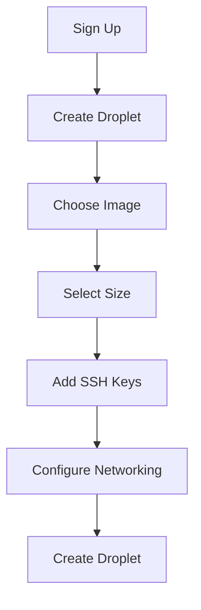

## Introduction to Cloud Computing and Infrastructure as a Service (IaaS)

Cloud computing is a model for delivering computing resources over the internet. These resources include servers, storage, databases, networking, software, and more. Cloud computing allows users to access these resources on-demand, pay-as-you-go, and scale up or down based on their needs. One of the key benefits of cloud computing is its flexibility and scalability, which can significantly reduce costs and improve efficiency.

### What is Infrastructure as a Service (IaaS)?

Infrastructure as a Service (IaaS) is a type of cloud computing where the provider offers virtualized computing resources over the internet. In IaaS, the user manages the operating systems, applications, data, and middleware, while the cloud provider manages the underlying hardware, virtualization layer, and physical data centers. This model provides a high level of control and flexibility to the user, allowing them to customize their environment according to their specific requirements.

#### Why Use IaaS?

Using IaaS offers several advantages:

1. **Scalability**: Users can easily scale their resources up or down based on demand.
2. **Cost Efficiency**: Pay-as-you-go pricing models allow users to pay only for the resources they use.
3. **Flexibility**: Users have the freedom to choose the operating system, software, and configurations that best suit their needs.
4. **Reliability**: Cloud providers typically offer high availability and redundancy to ensure that services remain available even in the event of hardware failures.

### Popular Cloud Providers

There are several popular cloud providers that offer IaaS services:

1. **Amazon Web Services (AWS)**: One of the largest and most comprehensive cloud providers, offering a wide range of services including EC2 instances, S3 storage, RDS databases, and more.
2. **Microsoft Azure**: Another major player in the cloud market, providing services such as Virtual Machines, Storage Accounts, SQL Databases, and more.
3. **Google Cloud Platform (GCP)**: Offers services like Compute Engine, Cloud Storage, BigQuery, and more.
4. **DigitalOcean**: Known for its simplicity and ease of use, DigitalOcean provides virtual servers (Droplets), load balancers, and other services.

### Example: Deploying a Java Application on DigitalOcean

To illustrate the process of deploying a Java application on a cloud server using IaaS, we will use DigitalOcean as our cloud provider. We will create a virtual server (Droplet) on DigitalOcean and deploy our Java application on it. Finally, we will access the application from a browser.

#### Step 1: Create a Virtual Server (Droplet) on DigitalOcean

First, we need to create a Droplet on DigitalOcean. Here are the steps:

1. **Sign Up for DigitalOcean**: If you haven't already, sign up for a DigitalOcean account.
2. **Create a New Droplet**: Navigate to the "Create" button and select "Droplets".
3. **Choose an Image**: Select an image that includes a Java runtime environment, such as Ubuntu 20.04 with OpenJDK pre-installed.
4. **Select a Size**: Choose a size that meets your application's resource requirements. For a simple Java application, a smaller size like `s-1vcpu-1gb` might suffice.
5. **Add SSH Keys**: Add your SSH keys to securely access the Droplet.
6. **Configure Networking**: Ensure that the Droplet is accessible via the internet by selecting the appropriate network settings.
7. **Create Droplet**: Review your selections and click "Create Droplet".



#### Step 2: Access the Droplet via SSH

Once the Droplet is created, you can access it via SSH. Use the following command to connect to the Droplet:

```bash
ssh root@<droplet_ip_address>
```

Replace `<droplet_ip_address>` with the actual IP address of your Droplet.

#### Step 3: Deploy the Java Application

Now that we have access to the Droplet, we can deploy our Java application. For this example, let's assume we have a simple Java application that runs on a Tomcat server.

1. **Install Java and Tomcat**:
   - Update the package list:
     ```bash
     apt-get update
     ```
   - Install OpenJDK:
     ```bash
     apt-get install openjdk-11-jdk
     ```
   - Download and install Tomcat:
     ```bash
     wget https://downloads.apache.org/tomcat/tomcat-9/v9.0.65/bin/apache-tomcat-9.0.65.tar.gz
     tar -xvf apache-tomcat-9.0.65.tar.gz
     mv apache-tomcat-9.0.65 /opt/tomcat
     ```

2. **Deploy the Java Application**:
   - Copy your WAR file to the Tomcat webapps directory:
     ```bash
     cp myapp.war /opt/tomcat/webapps/
     ```
   - Start the Tomcat server:
     ```bash
     /opt/tomcat/bin/startup.sh
     ```

#### Step 4: Access the Application from a Browser

Once the Tomcat server is running, you can access your Java application from a browser. Open a browser and navigate to:

```
http://<droplet_ip_address>:8080/myapp
```

Replace `<droplet_ip_address>` with the actual IP address of your Droplet.

### Common Concepts and Best Practices

When working with virtual servers, there are several common concepts and best practices to keep in mind:

1. **Security**:
   - **SSH Key Management**: Use strong SSH keys and manage them securely.
   - **Firewall Configuration**: Configure firewalls to restrict access to only necessary ports and IP addresses.
   - **Regular Updates**: Keep the operating system and software up-to-date to protect against vulnerabilities.

2. **Performance Optimization**:
   - **Resource Allocation**: Allocate resources based on the application's needs to avoid over-provisioning or under-provisioning.
   - **Monitoring**: Use monitoring tools to track performance metrics and identify bottlenecks.

3. **Backup and Recovery**:
   - **Regular Backups**: Schedule regular backups of critical data and configurations.
   - **Disaster Recovery Plan**: Develop a disaster recovery plan to quickly recover from unexpected outages.

### Real-World Examples and Recent CVEs

#### Example: CVE-2021-44228 (Log4Shell)

The Log4Shell vulnerability (CVE-2021-44228) affected many Java applications that used Apache Log4j. This vulnerability allowed attackers to execute arbitrary code on the server, leading to potential data theft or server compromise.

**Impact**:
- Many organizations were affected, including Apple, Twitter, and Microsoft.
- The vulnerability was exploited in various ways, including ransomware attacks and data exfiltration.

**Prevention**:
- **Update Log4j**: Ensure that all instances of Log4j are updated to the latest version that patches the vulnerability.
- **Disable JNDI Lookup**: Disable JNDI lookup functionality in Log4j to prevent exploitation.
- **Monitor Logs**: Regularly monitor logs for suspicious activity that could indicate exploitation attempts.

**Secure Code Fix**:
```java
// Vulnerable Code
Logger logger = Logger.getLogger(MyClass.class);
logger.info("User input: " + userInput);

// Secure Code
System.setProperty("log4j2.formatMsgNoLookups", "true");
Logger logger = Logger.getLogger(MyClass.class);
logger.info("User input: " + userInput);
```

### How to Prevent / Defend

#### Detection
- **Log Monitoring**: Use log monitoring tools to detect unusual activity or patterns that may indicate exploitation attempts.
- **Network Monitoring**: Monitor network traffic for signs of unauthorized access or data exfiltration.

#### Prevention
- **Patch Management**: Implement a robust patch management process to ensure that all software is kept up-to-date.
- **Least Privilege Principle**: Follow the principle of least privilege by granting users and processes only the permissions they need to perform their tasks.
- **Regular Audits**: Conduct regular security audits to identify and mitigate vulnerabilities.

#### Secure Coding Practices
- **Input Validation**: Validate all user inputs to prevent injection attacks.
- **Error Handling**: Implement proper error handling to avoid exposing sensitive information through error messages.
- **Use Secure Libraries**: Use libraries that are known to be secure and regularly maintained.

### Complete Example: Deploying a Java Application on DigitalOcean

#### Full HTTP Request and Response

Here is an example of the full HTTP request and response when accessing the deployed Java application:

**HTTP Request**:
```http
GET /myapp HTTP/1.1
Host: <droplet_ip_address>:8080
User-Agent: Mozilla/5.0 (Windows NT 10.0; Win64; x64) AppleWebKit/537.36 (KHTML, like Gecko) Chrome/91.0.4472.124 Safari/537.36
Accept: text/html,application/xhtml+xml,application/xml;q=0.9,image/avif,image/webp,image/apng,*/*;q=0.8,application/signed-exchange;v=b3;q=0.9
Accept-Encoding: gzip, deflate
Accept-Language: en-US,en;q=0.9
Connection: keep-alive
```

**HTTP Response**:
```http
HTTP/1.1 200 OK
Date: Mon, 01 Aug 2023 12:00:00 GMT
Server: Apache-Coyote/1.1
Content-Type: text/html;charset=UTF-8
Content-Length: 1234
Vary: Accept-Encoding
Keep-Alive: timeout=5, max=100
Connection: Keep-Alive

<!DOCTYPE html>
<html>
<head>
    <title>My App</title>
</head>
<body>
    <h1>Welcome to My App</h1>
    <p>This is a simple Java application deployed on DigitalOcean.</p>
</body>
</html>
```

#### Expected Result
The browser should display the HTML content of the deployed Java application, showing a welcome message and other content defined in the application.

### Hands-On Labs

For hands-on practice with deploying Java applications on cloud servers, consider the following labs:

- **PortSwigger Web Security Academy**: Offers a variety of labs focused on web application security, including deployment scenarios.
- **OWASP Juice Shop**: A deliberately insecure web application for practicing web security skills.
- **DVWA (Damn Vulnerable Web Application)**: A PHP/MySQL web application that is riddled with vulnerabilities for educational purposes.

These labs provide practical experience in deploying and securing Java applications on cloud servers.

### Conclusion

Deploying Java applications on cloud servers using IaaS providers like DigitalOcean offers significant benefits in terms of scalability, cost efficiency, and flexibility. By following best practices and implementing secure coding techniques, you can ensure that your applications are deployed securely and efficiently. Regular monitoring and updates are essential to maintaining the security and performance of your cloud-based applications.

---
<!-- nav -->
[[DevOps/DevOps Bootcamp/04-Cloud Computing (AWS & DigitalOcean)/14-Deploying Java Applications On DigitalOcean/00-Overview|Overview]] | [[DevOps/DevOps Bootcamp/04-Cloud Computing (AWS & DigitalOcean)/14-Deploying Java Applications On DigitalOcean/02-Practice Questions & Answers|Practice Questions & Answers]]
