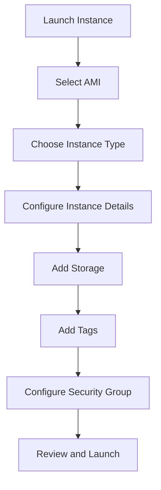
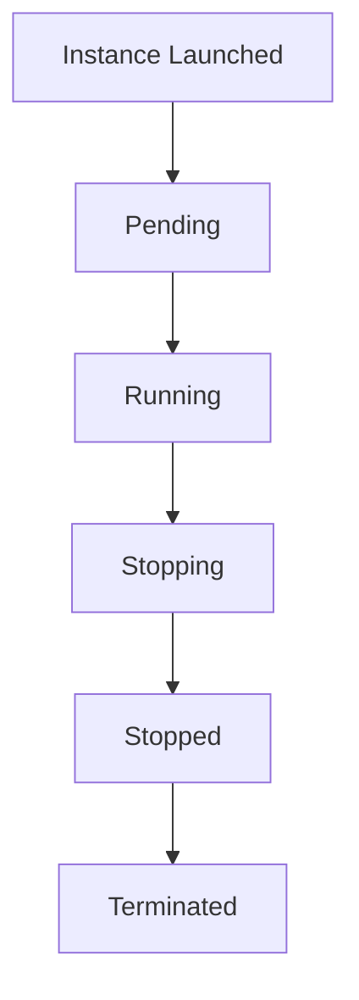
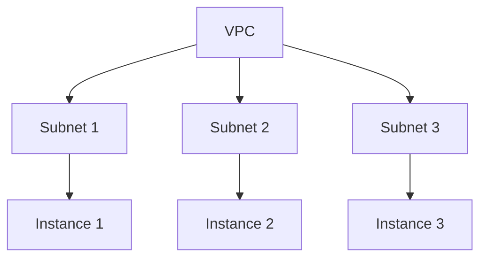
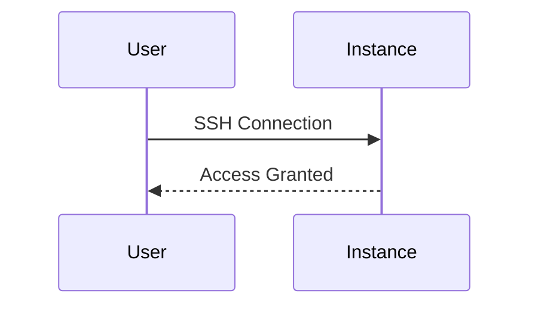

## Introduction to EC2 Instances

Amazon Elastic Compute Cloud (EC2) is a web service that provides resizable compute capacity in the cloud. EC2 allows users to launch virtual servers called instances, which can run applications and services. In this section, we will cover the process of launching an EC2 instance and the various configurations involved.

### Launching an EC2 Instance

To launch an EC2 instance, follow these steps:

1. **Navigate to the EC2 Dashboard**: Open the Amazon Management Console and navigate to the EC2 dashboard.
2. **Launch an Instance**: Click on the "Launch Instance" button to start the process.

#### Understanding the Launch Overview

The launch overview provides a summary of the instance configuration. This includes the AMI (Amazon Machine Image), instance type, key pair, security group, and storage options.



### EC2 Instance States

Once the instance is launched, it enters a series of states. The primary states are:

- **Pending**: The instance is being prepared for launch.
- **Running**: The instance is operational and ready to accept connections.
- **Stopping**: The instance is in the process of shutting down.
- **Stopped**: The instance is shut down but retains its data.
- **Terminated**: The instance is permanently deleted.

#### Monitoring Instance Status

After launching the instance, you can monitor its status from the EC2 dashboard. Refresh the page to check the current state of your instance.



### Detailed Information About the Instance

Clicking on the instance in the list provides detailed information about it. Key details include:

- **Instance ID**: A unique identifier for the instance.
- **State**: Current state of the instance (e.g., Running).
- **Subnet**: The subnet into which the instance was launched.
- **IP Addresses**: Internal and public IP addresses.

#### Subnet Configuration

A subnet is a range of IP addresses within a VPC (Virtual Private Cloud). By default, EC2 randomly selects one of the available subnets. However, you can specify a particular subnet during the launch process.



### IP Addresses

An EC2 instance has two types of IP addresses:

- **Internal IP Address**: Used for communication within the VPC.
- **Public IP Address**: Used for external communication, such as SSH and browser access.

#### Public IP Address

The public IP address is crucial for accessing the instance from outside the VPC. This IP address is used to establish SSH connections and to access web applications hosted on the instance.



### SSH Access

SSH (Secure Shell) is a protocol used to securely access remote servers. To SSH into the instance, you need the public IP address and the private key associated with the instance.

#### SSH Command Example

```bash
ssh -i path/to/private/key.pem ec2-user@public-ip-address
```

### Web Application Access

Once the instance is running, you can access the web application hosted on it using the public IP address in a browser.

#### Full HTTP Request and Response Example

```http
GET / HTTP/1.1
Host: public-ip-address
User-Agent: Mozilla/5.0 (Windows NT 10.0; Win64; x64) AppleWebKit/537.36 (KHTML, like Gecko) Chrome/91.0.4472.124 Safari/537.36
Accept: text/html,application/xhtml+xml,application/xml;q=0.9,image/webp,*/*;q=0.8
Accept-Language: en-US,en;q=0.5
Accept-Encoding: gzip, deflate
Connection: keep-alive

HTTP/1.1 200 OK
Date: Mon, 20 Jun 2023 12:00:00 GMT
Server: Apache/2.4.41 (Ubuntu)
Content-Type: text/html; charset=UTF-8
Content-Length: 1234
Connection: close

<!DOCTYPE html>
<html>
<head>
    <title>Welcome</title>
</head>
<body>
    <h1>Hello, World!</h1>
</body>
</html>
```

### Security Considerations

#### Vulnerabilities and Mitigations

One common vulnerability is exposing sensitive services to the internet without proper security measures. For example, leaving SSH accessible to the world can lead to unauthorized access.

##### Secure Coding Fixes

**Vulnerable Code:**

```yaml
Resources:
  MySecurityGroup:
    Type: AWS::EC2::SecurityGroup
    Properties:
      GroupName: my-security-group
      VpcId: !Ref MyVPC
      SecurityGroupIngress:
        - IpProtocol: tcp
          FromPort: 22
          ToPort: 22
          CidrIp: 0.0.0.0/0
```

**Fixed Code:**

```yaml
Resources:
  MySecurityGroup:
    Type: AWS::EC2::SecurityGroup
    Properties:
      GroupName: my-security-group
      VpcId: !Ref MyVPC
      SecurityGroupIngress:
        - IpProtocol: tcp
          FromPort: 22
          ToPort: 22
          CidrIp: 192.168.1.0/24
```

#### Detection and Prevention

Use tools like AWS Trusted Advisor to detect and mitigate security risks. Regularly review security groups and network access controls to ensure they are properly configured.

### Hands-On Labs

For practical experience, consider the following labs:

- **CloudGoat**: A hands-on lab for learning AWS security best practices.
- **flaws.cloud**: A platform for practicing cloud security skills.

These labs provide real-world scenarios and challenges to enhance your understanding and skills in deploying and securing EC2 instances.

### Conclusion

Deploying web applications using EC2 instances involves several steps, including selecting an AMI, configuring instance details, and managing security settings. Understanding these processes and their implications is crucial for effective deployment and maintenance of web applications in the cloud.

---
<!-- nav -->
[[01-Introduction to Deploying Web Applications Using EC2 Instances|Introduction to Deploying Web Applications Using EC2 Instances]] | [[DevOps/DevOps Bootcamp/04-Cloud Computing (AWS & DigitalOcean)/15-Deploying Web Applications Using EC2 Instances/00-Overview|Overview]] | [[03-Introduction to EC2 Service|Introduction to EC2 Service]]
