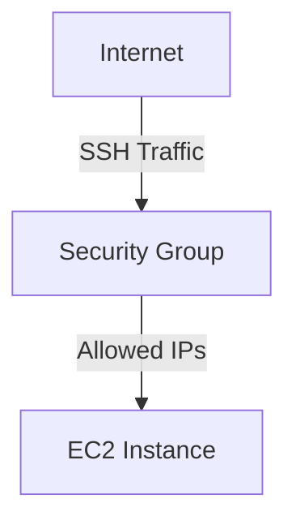
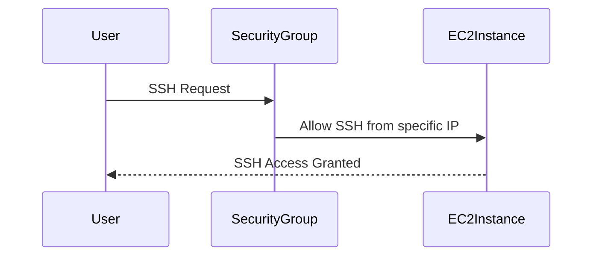

## Introduction to Security Groups in AWS EC2

Security groups are a fundamental component of Amazon Elastic Compute Cloud (EC2) instances, providing a layer of security for your instances by controlling inbound and outbound traffic. They act as virtual firewalls that control the traffic for one or more instances. Each security group acts as a firewall for associated instances, controlling both inbound and outbound traffic. You define rules that specify permitted traffic and apply the rules to the security group; the rules are automatically applied to all instances associated with that security group.

### What Are Security Groups?

A security group is essentially a set of firewall rules that control network access to your EC2 instances. Each security group consists of:

- **Inbound Rules**: These determine which incoming traffic is allowed to reach your instances.
- **Outbound Rules**: These determine which outgoing traffic is allowed from your instances.

Each rule specifies a protocol (TCP, UDP, ICMP), a port range, and a source or destination (IP address or another security group).

### Why Use Security Groups?

Security groups are crucial for several reasons:

1. **Isolation**: They help isolate your instances from unauthorized access by specifying which traffic is allowed to reach them.
2. **Flexibility**: You can modify the rules of a security group at any time, and the changes are automatically applied to all instances associated with that group.
3. **Granularity**: You can define specific rules for different types of traffic, allowing fine-grained control over network access.

### How Security Groups Work

When you launch an EC2 instance, you can associate it with one or more security groups. The security groups then enforce the rules defined within them. Here’s a step-by-step breakdown of how security groups work:

1. **Instance Launch**: When you launch an EC2 instance, you can specify one or more security groups to which the instance should belong.
2. **Rule Application**: The rules defined in these security groups are automatically applied to the instance.
3. **Traffic Filtering**: All incoming and outgoing traffic to and from the instance is filtered based on the rules in the associated security groups.

### Default Security Group

By default, each VPC (Virtual Private Cloud) has a default security group. This default security group has the following characteristics:

- **Inbound Rules**: By default, it allows all inbound traffic from other instances in the same security group.
- **Outbound Rules**: By default, it allows all outbound traffic.

However, it is generally recommended to create custom security groups with more restrictive rules to enhance security.

### Creating a Custom Security Group

To create a custom security group, follow these steps:

1. **Navigate to EC2 Dashboard**: Open the AWS Management Console and navigate to the EC2 dashboard.
2. **Create Security Group**: Click on "Security Groups" in the left-hand menu and then click on "Create Security Group".
3. **Configure Security Group**: Provide a name and description for the security group. Select the VPC to which the security group belongs.
4. **Add Inbound Rules**: Add inbound rules to specify which traffic is allowed to reach the instances associated with this security group. Common rules include:
   - **SSH Access**: Allow SSH traffic on port 22 from specific IP addresses.
   - **HTTP/HTTPS Access**: Allow HTTP (port 80) and HTTPS (port 443) traffic from the internet.
5. **Add Outbound Rules**: Add outbound rules to specify which traffic is allowed to leave the instances associated with this security group. By default, outbound traffic is typically unrestricted.

### Example: Configuring SSH Access

Let's walk through an example of configuring SSH access using a custom security group.

#### Step-by-Step Configuration

1. **Create Security Group**:
    - Name: `my-ssh-security-group`
    - Description: `Custom security group for SSH access`
    - VPC: `Select your VPC`

2. **Add Inbound Rule for SSH**:
    - Type: `SSH`
    - Protocol: `TCP`
    - Port Range: `22`
    - Source: `Your IP Address` (e.g., `192.168.1.1/32`)

3. **Review and Create**:
    - Review the settings and click on "Create Security Group".

#### Full Raw HTTP Request and Response

Here is an example of how you might configure this via the AWS CLI:

```bash
aws ec2 create-security-group --group-name my-ssh-security-group --description "Custom security group for SSH access" --vpc-id vpc-1234567890abcdef
aws ec2 authorize-security-group-ingress --group-name my-ssh-security-group --protocol tcp --port 22 --cidr 192.168.1.1/32
```

### Potential Pitfalls and Best Practices

#### Pitfall: Allowing SSH Access from Any IP Address

One common pitfall is allowing SSH access from any IP address, which can expose your instances to unauthorized access. This is often done inadvertently by setting the source to `0.0.0.0/0`, which matches all IP addresses.

#### Best Practice: Restrict SSH Access to Specific IP Addresses

To mitigate this risk, you should restrict SSH access to specific IP addresses or ranges. This can be done by specifying the source IP address or range in the inbound rule.

### Real-World Example: CVE-2021-20225

CVE-2021-20225 is a real-world example where misconfigured security groups led to unauthorized access to EC2 instances. In this case, a security group was configured to allow SSH access from any IP address, leading to potential exploitation by malicious actors.

### How to Prevent / Defend

#### Detection

To detect misconfigured security groups, you can use AWS Trusted Advisor or third-party tools like AWS Security Hub. These tools can identify security groups that allow unrestricted access.

#### Prevention

To prevent unauthorized access, follow these best practices:

1. **Restrict SSH Access**: Only allow SSH access from specific IP addresses or ranges.
2. **Use Key-Based Authentication**: Instead of using passwords, use key-based authentication for SSH access.
3. **Regular Audits**: Regularly audit your security groups to ensure they are properly configured.

#### Secure-Coding Fixes

Here is an example of a vulnerable configuration versus a secure configuration:

**Vulnerable Configuration:**

```bash
aws ec2 authorize-security-group-ingress --group-name my-ssh-security-group --protocol tcp --port 22 --cidr 0.0.0.0/0
```

**Secure Configuration:**

```bash
aws ec2 authorize-security-group-ingress --group-name my-ssh-security-group --protocol tcp --port 22 --cidr 192.168.1.1/32
```

### Mermaid Diagrams

#### Security Group Architecture



#### Sequence Diagram



### Conclusion

Security groups are a critical component of securing your EC2 instances. By carefully configuring inbound and outbound rules, you can control network access and protect your instances from unauthorized access. Always follow best practices to ensure your security groups are properly configured and regularly audited.

### Hands-On Labs

For hands-on practice with deploying web applications using EC2 instances and configuring security groups, consider the following labs:

- **PortSwigger Web Security Academy**: Offers interactive labs to practice securing web applications.
- **OWASP Juice Shop**: A deliberately insecure web application for practicing security skills.
- **AWS Official Workshops**: Provides guided workshops to learn about deploying and securing EC2 instances.

These labs will provide practical experience in configuring and managing security groups in AWS EC2.

---
<!-- nav -->
[[03-Introduction to EC2 Service|Introduction to EC2 Service]] | [[DevOps/DevOps Bootcamp/04-Cloud Computing (AWS & DigitalOcean)/15-Deploying Web Applications Using EC2 Instances/00-Overview|Overview]] | [[05-Overview of EC2 Instances and Networking|Overview of EC2 Instances and Networking]]
