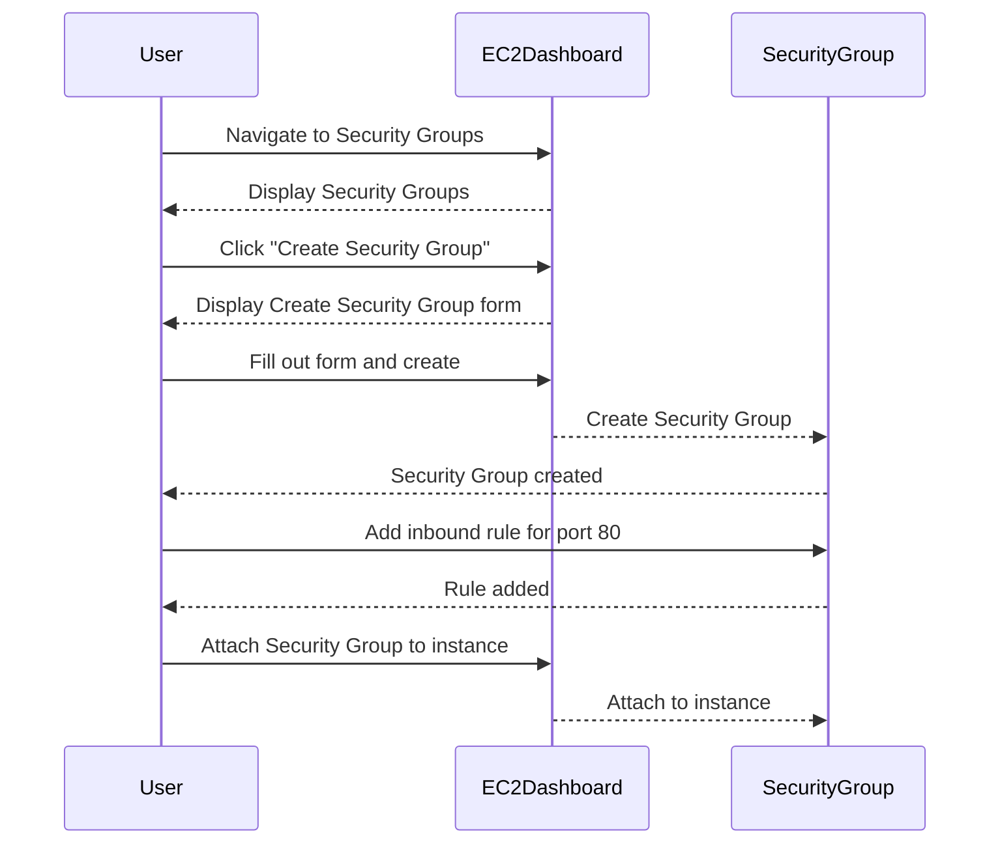

## Configuring EC2 Firewall

### What is a Security Group?

A security group acts as a virtual firewall for your EC2 instance. It controls inbound and outbound traffic to and from the instance. Each security group consists of a set of rules that define which traffic is allowed.

### How to Configure Security Group

To configure a security group for your EC2 instance, follow these steps:

1. **Create a Security Group**:
   - In the EC2 dashboard, navigate to "Security Groups" and click "Create Security Group".
   - Provide a name and description for the security group.

2. **Add Inbound Rules**:
   - Add inbound rules to allow traffic on specific ports. For example, to allow HTTP traffic, add a rule for port 80.

3. **Attach Security Group to Instance**:
   - Attach the security group to your EC2 instance.

### Complete Example

Here is a complete example of configuring a security group for an EC2 instance:

---
<!-- nav -->
[[07-Accessing the Application from the Browser|Accessing the Application from the Browser]] | [[DevOps/DevOps Bootcamp/04-Cloud Computing (AWS & DigitalOcean)/15-Deploying Web Applications Using EC2 Instances/00-Overview|Overview]] | [[09-Connecting to the EC2 Instance via SSH|Connecting to the EC2 Instance via SSH]]
