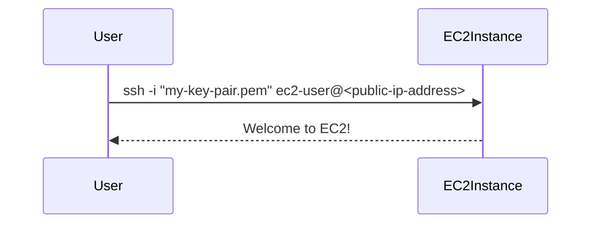

## Connecting to the EC2 Instance via SSH

### What is SSH?

SSH (Secure Shell) is a cryptographic network protocol for operating network services securely over an unsecured network. It provides a secure channel over an insecure network in a client-server architecture, connecting an SSH client application with an SSH server.

### How to Connect via SSH

To connect to your EC2 instance via SSH, you need to use the private key associated with the instance. Here’s how to do it:

1. **Download the Private Key**:
   - When launching the instance, you were prompted to download a `.pem` file. This file contains the private key needed to authenticate to the instance.

2. **Set Permissions**:
   - Ensure the permissions on the `.pem` file are set correctly. Run the following command:
     ```bash
     chmod 400 my-key-pair.pem
     ```

3. **Connect to the Instance**:
   - Use the `ssh` command to connect to the instance. Replace `ec2-user` with the appropriate username for your AMI (e.g., `ubuntu` for Ubuntu-based AMIs).
     ```bash
     ssh -i "my-key-pair.pem" ec2-user@<public-ip-address>
     ```

### Complete Example

Here is a complete example of connecting to an EC2 instance via SSH:



---
<!-- nav -->
[[08-Configuring EC2 Firewall|Configuring EC2 Firewall]] | [[DevOps/DevOps Bootcamp/04-Cloud Computing (AWS & DigitalOcean)/15-Deploying Web Applications Using EC2 Instances/00-Overview|Overview]] | [[10-Creating an EC2 Instance|Creating an EC2 Instance]]
