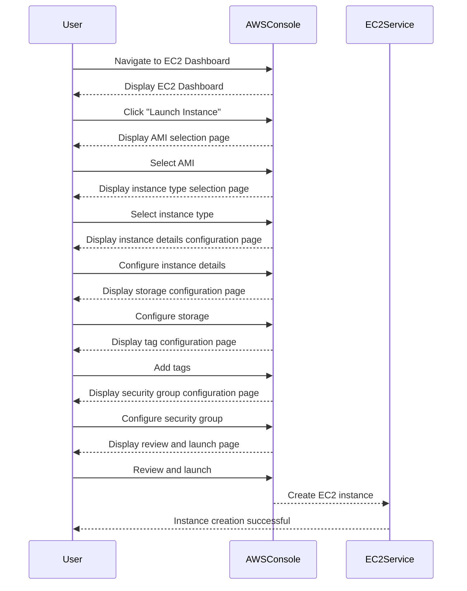

## Creating an EC2 Instance

### Step-by-Step Guide

To create an EC2 instance, follow these steps:

1. **Navigate to the EC2 Dashboard**:
   - Log in to your AWS Management Console.
   - Click on the "Services" menu and select "EC2".

2. **Launch an Instance**:
   - On the EC2 dashboard, click on "Launch Instance".
   - Choose an Amazon Machine Image (AMI). An AMI is a template that contains a software configuration (an operating system, application server, and applications) used to launch an instance.
   - Select an instance type based on your requirements. Common choices include `t2.micro` for basic tasks or `m5.large` for more demanding applications.

3. **Configure Instance Details**:
   - Specify the number of instances to launch.
   - Choose a network and subnet.
   - Set up the auto-assign public IP option to ensure your instance has a public IP address.

4. **Add Storage**:
   - Configure the storage volumes for your instance. By default, an EBS (Elastic Block Store) volume is created for the root device.

5. **Add Tags**:
   - Add tags to help identify and organize your instances. For example, you might tag an instance with `Name=WebAppServer`.

6. **Configure Security Group**:
   - A security group acts as a virtual firewall for your instance. Define rules to allow inbound traffic on specific ports (e.g., port 80 for HTTP).

7. **Review and Launch**:
   - Review your settings and then click "Launch". You will be prompted to select or create a key pair. This key pair is used to securely connect to your instance via SSH.

### Complete Example

Here is a complete example of creating an EC2 instance using the AWS Management Console:

---
<!-- nav -->
[[09-Connecting to the EC2 Instance via SSH|Connecting to the EC2 Instance via SSH]] | [[DevOps/DevOps Bootcamp/04-Cloud Computing (AWS & DigitalOcean)/15-Deploying Web Applications Using EC2 Instances/00-Overview|Overview]] | [[11-Deploying Web Applications Using EC2 Instances|Deploying Web Applications Using EC2 Instances]]
