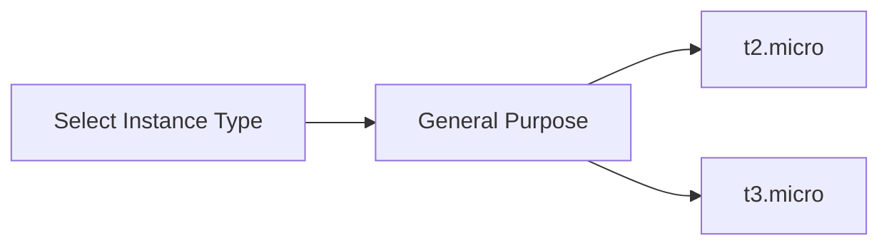
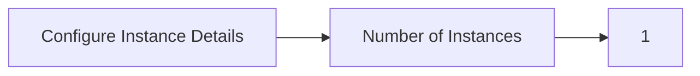
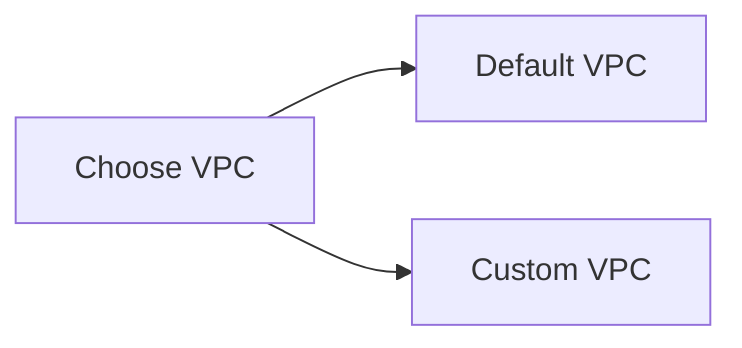
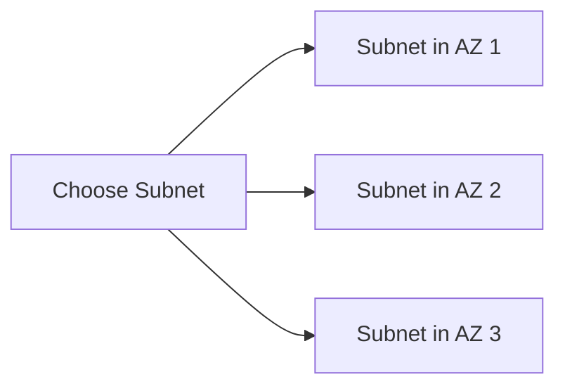
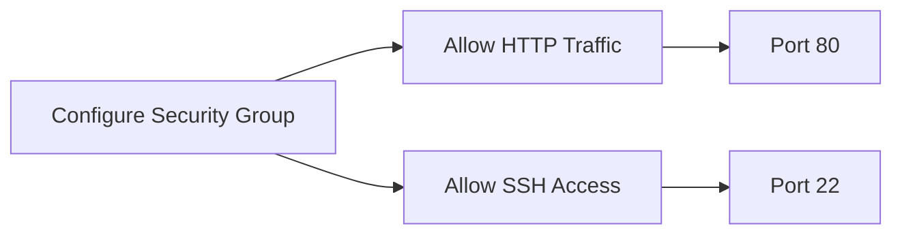

## Deploying Web Applications Using EC2 Instances

### Introduction to EC2 Instances

Amazon Elastic Compute Cloud (EC2) is a web service that provides resizable compute capacity in the cloud. EC2 allows you to launch and manage virtual servers called instances. These instances can run various operating systems and applications, including web servers, databases, and custom applications.

When deploying a web application using EC2 instances, you need to consider several factors, including the type of instance, network configuration, and security settings. This chapter will guide you through the process of deploying a web application using EC2 instances, covering all the necessary steps and concepts.

### Instance Types and Selection

#### What Are EC2 Instance Types?

EC2 offers a variety of instance types, each designed for specific workloads. Instance types are categorized based on their CPU, memory, storage, and networking capabilities. Some common instance types include:

- **General Purpose**: Suitable for a wide range of applications, including web servers, development environments, and small databases.
- **Compute Optimized**: Designed for compute-intensive workloads like high-performance computing (HPC), machine learning, and scientific modeling.
- **Memory Optimized**: Ideal for applications that require large amounts of memory, such as in-memory databases, distributed caches, and real-time processing.
- **Storage Optimized**: Best for workloads that require high sequential read/write performance, such as big data analytics, data warehousing, and log processing.
- **Accelerated Computing**: Equipped with hardware accelerators like GPUs, FPGAs, and AWS Inferentia chips, suitable for machine learning, video rendering, and other compute-intensive tasks.

#### Selecting an Instance Type

For deploying a web application, a general-purpose instance type is usually sufficient. The `t2.micro` or `t3.micro` instance types are commonly used for small-scale applications due to their low cost and adequate performance. These instances provide 1 vCPU and 1 GB of RAM, which should be enough for running a Docker container with a web server image.



### Configuring Instance Details

#### Network Configuration

Once you have selected the instance type, the next step is to configure the instance details, particularly the network settings. This includes specifying the number of instances, choosing the VPC, and selecting the subnet.

##### Number of Instances

The number of instances determines how many virtual servers you will launch. For a simple web application, one instance is typically sufficient. However, for more complex applications, you might need multiple instances for load balancing and redundancy.



##### Virtual Private Cloud (VPC)

A VPC is a virtual network dedicated to your AWS account. It allows you to create a logically isolated section of the AWS Cloud where you can launch resources in a virtual network that you define. Each region has a default VPC, which is pre-configured with a set of subnets and route tables.

Using the default VPC simplifies the setup process, especially for small-scale applications. However, for more complex deployments, you might want to create a custom VPC with specific configurations.



##### Subnets

Subnets are segments of your VPC IP address range. They allow you to further divide your VPC into smaller networks. Each subnet is associated with a specific availability zone, providing fault tolerance and high availability.

In the Paris region, there are three availability zones, each with its own subnet. You can choose the subnet where your instance will be launched. The choice of subnet depends on your network requirements, such as firewall rules and routing policies.



### Real-World Example: Deploying a Web Application

Let's walk through a complete example of deploying a web application using EC2 instances. We will use a `t2.micro` instance and the default VPC in the Paris region.

#### Step 1: Launch an EC2 Instance

1. **Select the Instance Type**: Choose `t2.micro`.
2. **Configure Instance Details**:
   - Set the number of instances to 1.
   - Choose the default VPC.
   - Select a subnet in one of the availability zones (e.g., `subnet-xxxxxx`).

#### Step 2: Configure Security Groups

Security groups act as virtual firewalls that control inbound and outbound traffic to your instances. You need to configure a security group to allow HTTP traffic (port 80) and SSH access (port 22).



#### Step 3: Launch the Instance

After configuring the instance details and security groups, you can launch the instance. Once the instance is running, you can connect to it via SSH and deploy your web application.

#### Step 4: Deploy the Web Application

1. **Connect to the Instance**: Use SSH to connect to the instance.
   ```sh
   ssh -i <path-to-key-pair> ec2-user@<public-ip-address>
   ```

2. **Install Docker**: Install Docker on the instance.
   ```sh
   sudo yum update -y
   sudo amazon-linux-extras install docker
   sudo service docker start
   sudo usermod -a -G docker ec2-user
   ```

3. **Run a Docker Container**: Pull a web server image (e.g., Nginx) and run it.
   ```sh
   sudo docker pull nginx
   sudo docker run -d -p 80:80 --name my-web-server nginx
   ```

#### Step 5: Verify the Deployment

Open a web browser and navigate to the public IP address of the instance. You should see the default Nginx welcome page.

### Pitfalls and Common Mistakes

#### Incorrect Instance Type

Choosing an instance type that does not match your workload can lead to performance issues. For example, using a `t2.micro` instance for a resource-intensive application can result in slow response times and high CPU usage.

#### Misconfigured Security Groups

Failing to properly configure security groups can expose your instances to unauthorized access. Ensure that you only open ports that are necessary for your application.

#### Insufficient Network Configuration

Incorrectly configuring subnets and route tables can lead to connectivity issues. Always verify that your instances are correctly placed in the appropriate subnets and that the route tables are configured to allow traffic to and from the internet.

### How to Prevent / Defend

#### Detection

Regularly monitor your instances for unusual activity using AWS CloudWatch and CloudTrail. Set up alerts for high CPU usage, unexpected network traffic, and unauthorized access attempts.

#### Prevention

1. **Use IAM Roles**: Assign IAM roles to your instances to control access to other AWS services.
2. **Enable Encryption**: Enable encryption for your EBS volumes to protect data at rest.
3. **Use Auto Scaling**: Implement auto scaling to automatically adjust the number of instances based on demand.
4. **Secure SSH Access**: Restrict SSH access to specific IP addresses and use key-based authentication instead of passwords.

#### Secure Coding Fixes

Compare the insecure and secure versions of the deployment process:

**Insecure Version**
```sh
# Insecure SSH connection
ssh -i <path-to-key-pair> ec2-user@<public-ip-address>

# Insecure Docker run command
sudo docker run -d -p 80:80 --name my-web-server nginx
```

**Secure Version**
```sh
# Secure SSH connection
ssh -i <path-to-key-pair> -o "StrictHostKeyChecking=no" ec2-user@<public-ip-address>

# Secure Docker run command
sudo docker run -d -p 80:80 --name my-web-server --restart=always nginx
```

### Hands-On Labs

To practice deploying web applications using EC2 instances, you can use the following labs:

- **PortSwigger Web Security Academy**: Offers hands-on labs for web application security.
- **OWASP Juice Shop**: A deliberately insecure web application for practicing web security skills.
- **DVWA (Damn Vulnerable Web Application)**: A PHP/MySQL web application that is riddled with vulnerabilities.

### Conclusion

Deploying a web application using EC2 instances involves selecting the appropriate instance type, configuring the network settings, and securing the environment. By following the steps outlined in this chapter, you can successfully deploy a web application on AWS EC2 and ensure its security and performance.

---
<!-- nav -->
[[10-Creating an EC2 Instance|Creating an EC2 Instance]] | [[DevOps/DevOps Bootcamp/04-Cloud Computing (AWS & DigitalOcean)/15-Deploying Web Applications Using EC2 Instances/00-Overview|Overview]] | [[12-Installing Docker on EC2 Instance|Installing Docker on EC2 Instance]]
