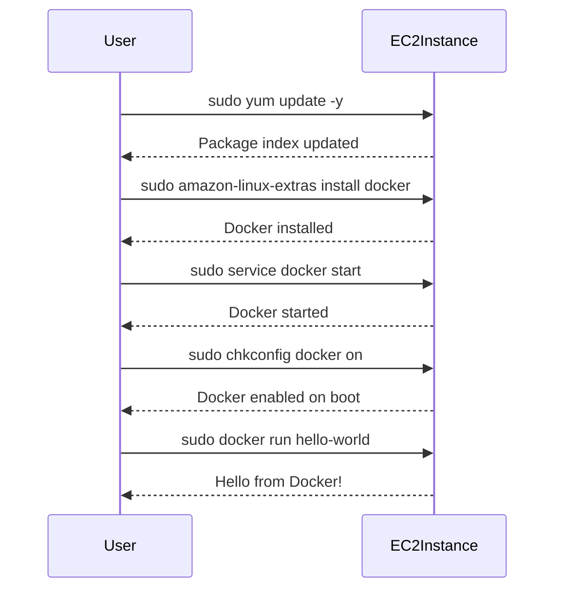

## Installing Docker on EC2 Instance

### What is Docker?

Docker is a platform that uses OS-level virtualization to deliver software in packages called containers. Containers are lightweight and portable, making them ideal for developing, shipping, and running applications.

### How to Install Docker

To install Docker on your EC2 instance, follow these steps:

1. **Update Package Index**:
   - Run the following command to update the package index:
     ```bash
     sudo yum update -y
     ```

2. **Install Docker**:
   - Install Docker using the following command:
     ```bash
     sudo amazon-linux-extras install docker
     ```

3. **Start Docker Service**:
   - Start the Docker service and enable it to start on boot:
     ```bash
     sudo service docker start
     sudo chkconfig docker on
     ```

4. **Verify Installation**:
   - Verify that Docker is installed correctly by running the following command:
     ```bash
     sudo docker run hello-world
     ```

### Complete Example

Here is a complete example of installing Docker on an EC2 instance:



---
<!-- nav -->
[[11-Deploying Web Applications Using EC2 Instances|Deploying Web Applications Using EC2 Instances]] | [[DevOps/DevOps Bootcamp/04-Cloud Computing (AWS & DigitalOcean)/15-Deploying Web Applications Using EC2 Instances/00-Overview|Overview]] | [[13-Key Pairs in AWS EC2|Key Pairs in AWS EC2]]
