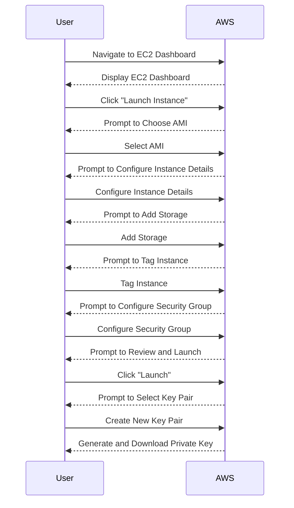

## Key Pairs in AWS EC2

### Introduction to Key Pairs

In the context of deploying web applications using Amazon Elastic Compute Cloud (EC2) instances, key pairs play a crucial role in securing access to your instances. A key pair consists of a private key and a public key. The private key is kept locally on your machine, while the public key is stored by AWS. This setup ensures that only someone with the corresponding private key can gain access to the EC2 instance via Secure Shell (SSH).

#### What Are Key Pairs?

Key pairs are cryptographic keys used for authentication purposes. They are based on asymmetric cryptography, which means that the encryption and decryption processes use two different keys: a public key and a private key. The public key is used to encrypt data, and the private key is used to decrypt it. In the context of AWS EC2, the public key is associated with the EC2 instance, and the private key is used to authenticate SSH connections.

#### Why Use Key Pairs?

Using key pairs enhances the security of your EC2 instances by ensuring that only authorized users can access them. Without key pairs, anyone with the IP address of your EC2 instance could potentially try to brute-force their way in, leading to unauthorized access and potential security breaches.

### Creating Key Pairs in AWS

When creating an EC2 instance, you have the option to either create a new key pair or use an existing one. Here’s a detailed walkthrough of both scenarios:

#### Creating a New Key Pair

1. **Navigate to the EC2 Dashboard**: Log in to the AWS Management Console and navigate to the EC2 dashboard.
2. **Launch an Instance**: Click on the "Launch Instance" button.
3. **Choose an AMI**: Select the appropriate Amazon Machine Image (AMI) for your application.
4. **Configure Instance Details**: Configure the instance details such as instance type, network, and storage settings.
5. **Add Storage**: Specify the storage requirements for your instance.
6. **Tag Instance**: Add tags to help identify and manage your instance.
7. **Configure Security Group**: Set up the security group rules to control inbound and outbound traffic.
8. **Review and Launch**: Review your instance configuration and click on "Launch".

At this point, you will be prompted to select a key pair. If you choose to create a new key pair, follow these steps:

1. **Create Key Pair**: Click on "Create a new key pair".
2. **Name the Key Pair**: Enter a name for your key pair, such as `DockerServer`.
3. **Download the Private Key**: Before launching the instance, you must download the private key. AWS will generate a `.pem` file containing the private key. Save this file in a secure location on your local machine.



#### Using an Existing Key Pair

If you already have a key pair stored in your AWS account, you can reuse it for a new instance. This approach is useful if you want to maintain consistency across multiple instances.

1. **Select Existing Key Pair**: During the instance creation process, instead of creating a new key pair, select an existing one from the dropdown menu.
2. **Proceed with Launch**: Continue with the instance launch process.

### Storing and Securing the Private Key

The private key is a sensitive file that should be stored securely. Losing the private key means losing access to your EC2 instance. Here are some best practices for storing and securing the private key:

1. **Secure Location**: Store the `.pem` file in a secure location on your local machine. Avoid storing it on shared drives or cloud storage services.
2. **File Permissions**: Ensure that the file permissions are set correctly. The private key file should only be readable by the user who owns it.

```bash
chmod 400 DockerServer.pem
```

3. **Backup**: Make a backup of the private key file and store it in a secure, off-site location. This ensures that you can recover access to your EC2 instance in case the original file is lost or corrupted.

### SSH Access Using Key Pairs

Once the key pair is set up, you can use SSH to access your EC2 instance. Here’s how to do it:

1. **SSH Command**: Use the following SSH command to connect to your EC2 instance. Replace `<public-ip>` with the actual public IP address of your instance and `ec2-user` with the appropriate username for your AMI.

```bash
ssh -i DockerServer.pem ec2-user@<public-ip>
```

2. **Verify Connection**: Once connected, verify that you have access to the instance by running basic commands like `ls` or `pwd`.

### Real-World Examples and Security Implications

#### Recent Breaches and CVEs

Several high-profile breaches have occurred due to misconfigured or poorly managed key pairs. For example, in 2021, a misconfigured AWS S3 bucket led to the exposure of private keys, allowing attackers to gain unauthorized access to EC2 instances.

#### How to Prevent / Defend

1. **Secure Key Storage**: Always store private keys securely and restrict access to them.
2. **IAM Policies**: Use AWS Identity and Access Management (IAM) policies to control who can create and manage key pairs.
3. **Monitoring**: Enable AWS CloudTrail to monitor API calls related to key pair management.
4. **Regular Audits**: Regularly audit your key pairs to ensure they are still needed and properly secured.

### Complete Example

Here’s a complete example of creating an EC2 instance with a new key pair and accessing it via SSH:

1. **Create Key Pair**:
   - Navigate to the EC2 dashboard.
   - Click on "Launch Instance".
   - Follow the prompts to configure the instance.
   - When prompted to select a key pair, create a new one named `DockerServer`.
   - Download the private key file (`DockerServer.pem`).

2. **Launch Instance**:
   - Complete the instance launch process.
   - Note the public IP address of the instance.

3. **SSH Access**:
   - Use the following command to SSH into the instance:

```bash
ssh -i DockerServer.pem ec2-user@<public-ip>
```

### Pitfalls and Common Mistakes

1. **Forgetting to Download the Private Key**: If you forget to download the private key before launching the instance, you will lose access to it.
2. **Incorrect File Permissions**: Incorrect file permissions can lead to access issues or security vulnerabilities.
3. **Misconfigured Security Groups**: Misconfigured security groups can expose your instance to unauthorized access.

### Conclusion

Key pairs are essential for securing access to your EC2 instances. By following best practices for creating, storing, and managing key pairs, you can significantly enhance the security of your deployments. Always ensure that your private keys are stored securely and that you regularly audit your key pair usage.

### Practice Labs

To gain hands-on experience with deploying web applications using EC2 instances and managing key pairs, consider the following practice labs:

- **CloudGoat**: A hands-on lab for learning about AWS security best practices.
- **flaws.cloud**: A platform for practicing cloud security skills, including EC2 instance management.
- **AWS Official Workshops**: Official AWS workshops provide guided tutorials for various AWS services, including EC2.

By completing these labs, you can reinforce your understanding of key pair management and secure deployment practices in AWS.

---
<!-- nav -->
[[12-Installing Docker on EC2 Instance|Installing Docker on EC2 Instance]] | [[DevOps/DevOps Bootcamp/04-Cloud Computing (AWS & DigitalOcean)/15-Deploying Web Applications Using EC2 Instances/00-Overview|Overview]] | [[14-Pitfalls and Best Practices|Pitfalls and Best Practices]]
