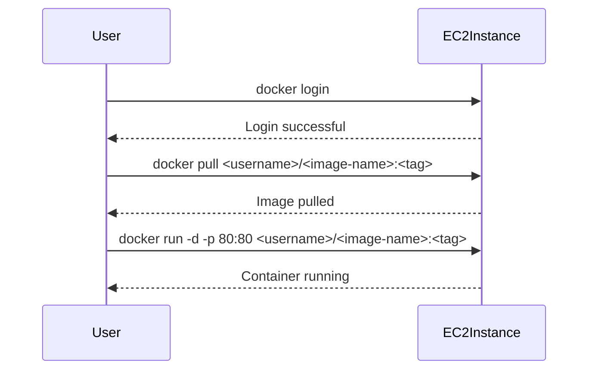

## Running a Docker Container from a Private Repository

### What is a Docker Repository?

A Docker repository is a collection of Docker images. Docker Hub is a popular registry where developers can store and share their Docker images. You can also use private repositories to store your own images.

### How to Run a Docker Container

To run a Docker container from a private repository, follow these steps:

1. **Authenticate to Docker Hub**:
   - Log in to Docker Hub using the following command:
     ```bash
     docker login
     ```

2. **Pull the Docker Image**:
   - Pull the Docker image from the private repository:
     ```bash
     docker pull <username>/<image-name>:<tag>
     ```

3. **Run the Docker Container**:
   - Run the Docker container using the following command:
     ```bash
     docker run -d -p 80:80 <username>/<image-name>:<tag>
     ```

### Complete Example

Here is a complete example of running a Docker container from a private repository:



---
<!-- nav -->
[[15-Practice Labs|Practice Labs]] | [[DevOps/DevOps Bootcamp/04-Cloud Computing (AWS & DigitalOcean)/15-Deploying Web Applications Using EC2 Instances/00-Overview|Overview]] | [[DevOps/DevOps Bootcamp/04-Cloud Computing (AWS & DigitalOcean)/15-Deploying Web Applications Using EC2 Instances/17-Practice Questions & Answers|Practice Questions & Answers]]
