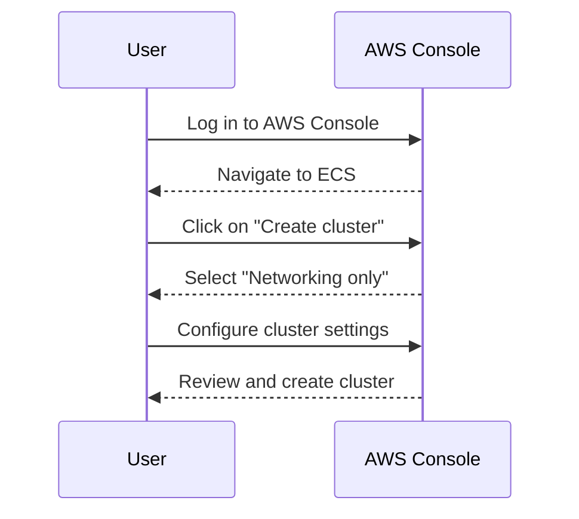
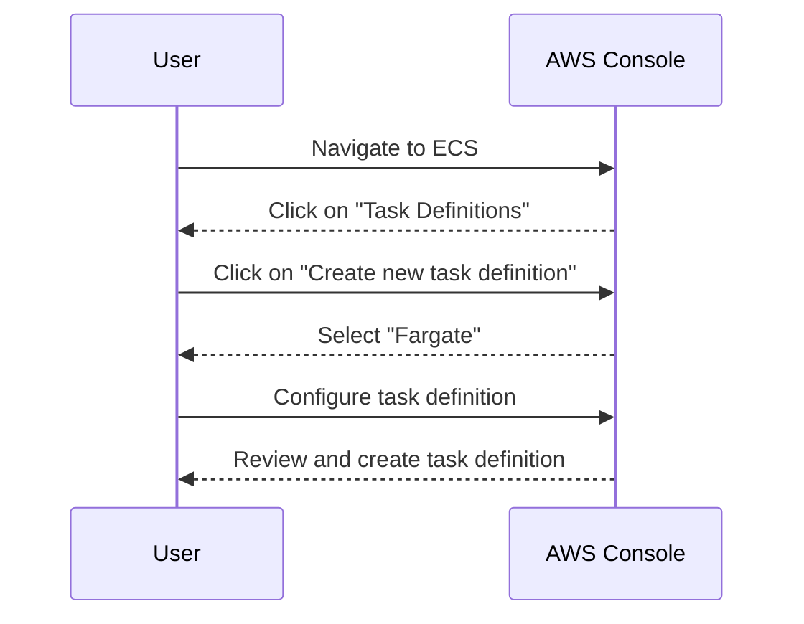
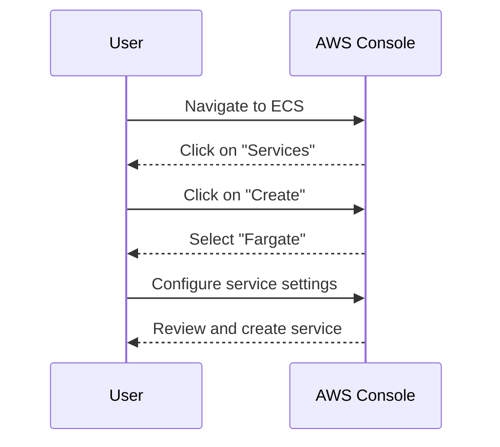

## Introduction to ECS Cluster Management with Fargate

In the context of DevOps and container orchestration, Amazon Elastic Container Service (ECS) provides a highly scalable, high-performance service for running Docker containers. ECS supports two primary deployment models: EC2 and Fargate. While the EC2 model requires you to manage your own EC2 instances, Fargate abstracts away the underlying infrastructure, allowing you to focus solely on your applications.

### Background Theory

Before diving into the specifics of Fargate, it's essential to understand the broader landscape of container orchestration and the challenges it addresses.

#### Container Orchestration Overview

Container orchestration is the automated management and coordination of containerized applications across multiple hosts. This includes tasks such as scheduling, scaling, load balancing, and health checking. Popular container orchestration tools include Kubernetes, Docker Swarm, and Amazon ECS.

#### Challenges in Container Orchestration

1. **Resource Management**: Efficiently allocating and managing resources across multiple hosts.
2. **Scalability**: Ensuring applications can scale up or down based on demand.
3. **Fault Tolerance**: Handling failures gracefully and ensuring high availability.
4. **Security**: Protecting the environment from unauthorized access and malicious activities.

### ECS Deployment Models

Amazon ECS supports two main deployment models:

1. **EC2 Model**: You manage your own EC2 instances, which run the ECS agent to communicate with the ECS service.
2. **Fargate Model**: AWS manages the underlying infrastructure, providing a serverless experience for running containers.

### Understanding Fargate

Fargate is a compute engine for AWS services like ECS and EKS that allows you to run containers without having to manage servers or clusters. It abstracts away the underlying infrastructure, making it easier to focus on your applications.

#### Key Features of Fargate

1. **Serverless Experience**: You don't need to provision, patch, or manage servers.
2. **Automatic Scaling**: Fargate automatically scales your applications based on demand.
3. **High Availability**: Fargate ensures high availability by running your containers across multiple Availability Zones.
4. **Security**: Fargate provides built-in security features, including VPC isolation and IAM roles for tasks.

### Comparison with EC2 Model

While both EC2 and Fargate models allow you to run containers on ECS, they differ significantly in terms of management and flexibility.

#### EC2 Model

- **Management**: You are responsible for managing EC2 instances, including provisioning, patching, and scaling.
- **Flexibility**: You have more control over the underlying infrastructure, allowing for custom configurations and optimizations.
- **Use Case**: Suitable for scenarios where you require fine-grained control over the infrastructure.

#### Fargate Model

- **Management**: AWS manages the underlying infrastructure, abstracting away the need for you to manage servers.
- **Flexibility**: Less flexible compared to EC2, as you cannot customize the underlying infrastructure.
- **Use Case**: Ideal for scenarios where you want to focus solely on your applications and not worry about the underlying infrastructure.

### Virtual Machine Provisioning in Fargate

One of the key differences between Fargate and EC2 is how virtual machines are provisioned.

#### Fargate

- **Provisioning**: Fargate provisions its own virtual machines for each pod.
- **Resource Allocation**: Each pod runs in its own isolated environment, ensuring resource isolation and security.
- **Limitations**: Due to the one-to-one relationship between pods and virtual machines, Fargate may have limitations in terms of resource efficiency compared to EC2.

#### EC2

- **Provisioning**: Multiple pods can run on a single EC2 instance.
- **Resource Allocation**: More efficient resource allocation, as multiple pods share the same underlying infrastructure.
- **Flexibility**: Greater flexibility in terms of resource management and customization.

### Real-World Examples

To better understand the practical implications of using Fargate, let's look at some real-world examples and recent CVEs.

#### Example: Netflix

Netflix uses ECS with Fargate to manage their containerized applications. By leveraging Fargate, Netflix can focus on their core business logic without worrying about the underlying infrastructure.

#### CVE Example: CVE-2021-21287

CVE-2021-21287 is a vulnerability in the AWS ECS agent that could allow an attacker to execute arbitrary code on the host machine. This highlights the importance of keeping your ECS agents up to date and using Fargate to avoid managing the underlying infrastructure.

### Hands-On Lab: Setting Up an ECS Cluster with Fargate

To get hands-on experience with ECS and Fargate, you can use the following labs:

- **PortSwigger Web Security Academy**: Focuses on web application security but can be adapted to learn about container orchestration.
- **OWASP Juice Shop**: A deliberately insecure web application for learning about web security.
- **DVWA (Damn Vulnerable Web Application)**: Another web application for learning about web security.

### Detailed Steps to Set Up an ECS Cluster with Fargate

#### Step 1: Create an ECS Cluster



#### Step 2: Create a Task Definition



#### Step 3: Create a Service



### Common Pitfalls and How to Avoid Them

#### Pitfall 1: Resource Overprovisioning

**Problem**: Overprovisioning resources can lead to unnecessary costs and inefficiencies.

**Solution**: Monitor your application's resource usage and adjust your task definitions accordingly.

#### Pitfall 2: Security Vulnerabilities

**Problem**: Running outdated ECS agents can expose your environment to vulnerabilities.

**Solution**: Keep your ECS agents up to date and use Fargate to avoid managing the underlying infrastructure.

### Detection and Prevention

#### Detection

- **Monitoring**: Use AWS CloudWatch to monitor your ECS cluster and services.
- **Logging**: Enable logging for your ECS tasks to track any suspicious activity.

#### Prevention

- **IAM Roles**: Use IAM roles for tasks to ensure least privilege access.
- **Network Isolation**: Use VPCs to isolate your ECS cluster from the internet.

### Secure Coding Practices

#### Vulnerable Code Example

```yaml
# Vulnerable Task Definition
taskDefinition:
  containerDefinitions:
    - name: my-container
      image: my-image
      cpu: 1024
      memory: 2048
      portMappings:
        - containerPort: 80
          hostPort: 80
```

#### Secure Code Example

```yaml
# Secure Task Definition
taskDefinition:
  containerDefinitions:
    - name: my-container
      image: my-image
      cpu: 1024
      memory: 2048
      portMappings:
        - containerPort: 80
          hostPort: 80
      executionRoleArn: arn:aws:iam::123456789012:role/my-execution-role
```

### Conclusion

In conclusion, ECS with Fargate provides a powerful and flexible way to manage containerized applications. By understanding the key differences between Fargate and EC2 models, you can make informed decisions about which approach is best suited for your use case. Additionally, by following best practices for security and monitoring, you can ensure that your ECS cluster remains robust and secure.

---
<!-- nav -->
[[DevOps/DevOps Bootcamp/04-Cloud Computing (AWS & DigitalOcean)/16-ECS Cluster Management With Fargate/00-Overview|Overview]] | [[02-ECS Cluster Management With Fargate|ECS Cluster Management With Fargate]]
