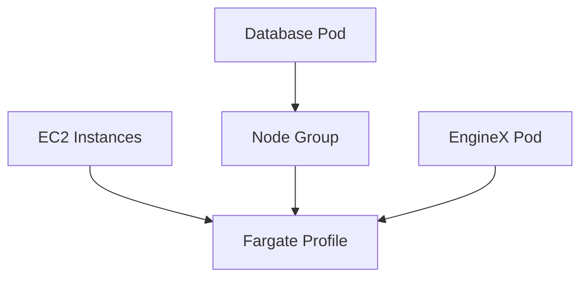

## ECS Cluster Management With Fargate

### Introduction to ECS and Fargate

Amazon Elastic Container Service (ECS) is a fully managed container orchestration service that allows you to run Docker containers at scale. ECS supports two launch types: EC2 and Fargate. While EC2 requires you to manage your own infrastructure, Fargate abstracts away the underlying infrastructure, allowing you to focus solely on deploying and managing your applications.

Fargate is particularly useful for stateless applications, such as web servers, microservices, and other services that do not require persistent storage. However, it does not support stateful applications, such as databases, or daemon sets for logging, like FluentD.

### Daemon Sets and Stateful Applications

Daemon sets are a type of Kubernetes resource that ensures a copy of a pod runs on every node in a cluster or on a specified set of nodes. This is often used for logging and monitoring purposes. For example, FluentD is a popular logging agent that can be deployed as a daemon set to collect logs from all nodes in a cluster.

Stateful applications, on the other hand, require persistent storage. Databases are a prime example of stateful applications, as they need to maintain their data across restarts and failures.

#### Why Fargate Does Not Support Daemon Sets and Stateful Applications

Fargate is designed to be stateless and ephemeral. Each task in Fargate runs in an isolated environment and does not persist any data. This makes it unsuitable for applications that require persistent storage or need to run on every node in the cluster.

### Mixed Setup with Node Groups and Fargate Profiles

Given the limitations of Fargate, it is often necessary to use a mixed setup where stateful applications and daemon sets are deployed on EC2 instances managed by a node group, while stateless applications are deployed using Fargate profiles.

#### Example Configuration

Let's walk through an example configuration where we define a role, subnets, and rules for our ECS cluster. We also define a namespace selector for `dev` and label matching for the Fargate profile.

```yaml
# Example ECS Cluster Configuration
{
  "role": "arn:aws:iam::123456789012:role/ecsTaskExecutionRole",
  "subnets": ["subnet-0123456789abcdef0", "subnet-0123456789abcdef1"],
  "rules": {
    "namespaceSelector": {
      "matchLabels": {
        "environment": "dev"
      }
    },
    "labels": {
      "profile": "Fargate"
    }
  }
}
```

#### Creating the Fargate Profile

Once the configuration is defined, we can create the Fargate profile. This process may take a few minutes, but once it is active, we can start deploying our stateless applications.

```bash
# Create Fargate Profile
aws ecs create-fargate-profile \
  --cluster my-cluster \
  --profile-name my-fargate-profile \
  --pod-execution-role-arn arn:aws:iam::123456789012:role/ecsTaskExecutionRole \
  --selectors '[{"namespace": "dev", "labels": {"profile": "Fargate"}}]' \
  --subnets subnet-0123456789abcdef0 subnet-0123456789abcdef1
```

### Deploying Applications

With the Fargate profile active, we can now deploy our first pod through Fargate. Let's assume we have a simple application called EngineX that we want to deploy.

#### EngineX Deployment Configuration

Here is an example of the EngineX deployment configuration:

```yaml
# EngineX Deployment Configuration
apiVersion: apps/v1
kind: Deployment
metadata:
  name: engine-x-deployment
spec:
  replicas: 1
  selector:
    matchLabels:
      app: engine-x
  template:
    metadata:
      labels:
        app: engine-x
    spec:
      containers:
      - name: engine-x
        image: my-repo/engine-x:latest
        ports:
        - containerPort: 80
```

#### Applying the Configuration

To apply the configuration, we use the `kubectl apply` command:

```bash
# Apply EngineX Deployment Configuration
kubectl apply -f engine-x-deployment.yaml
```

### Checking Pod Status

After applying the configuration, we can check the status of our pods to ensure they are running correctly.

```bash
# Check Pod Status
kubectl get pods
```

#### Expected Output

```plaintext
NAME                            READY   STATUS    RESTARTS   AGE
engine-x-deployment-5b6c7b4b4   1/1     Running   0          1m
```

### Current Status

In our current setup, we have one EngineX pod running on an EC2 instance managed by a node group. We have not yet created any pods through Fargate, and we only have the default namespace in addition to the master process namespaces.

### How to Prevent / Defend

#### Detection

To detect whether your stateful applications or daemon sets are running on the correct infrastructure, you can use tools like AWS CloudWatch and Kubernetes Dashboard. These tools provide detailed insights into the status and performance of your applications.

#### Prevention

To prevent misconfigurations, ensure that you have proper role-based access control (RBAC) policies in place. This includes defining roles and permissions for different users and services.

#### Secure Coding Fixes

When deploying stateful applications, ensure that you use persistent storage solutions provided by AWS, such as Amazon EBS or Amazon EFS. Here is an example of how to configure persistent storage for a database:

```yaml
# Persistent Storage Configuration for Database
apiVersion: v1
kind: PersistentVolumeClaim
metadata:
  name: db-pvc
spec:
  accessModes:
    - ReadWriteOnce
  resources:
    requests:
      storage: 10Gi
---
apiVersion: apps/v1
kind: Deployment
metadata:
  name: db-deployment
spec:
  replicas: 1
  selector:
    matchLabels:
      app: db
  template:
    metadata:
      labels:
        app: db
    spec:
      containers:
      - name: db
        image: my-repo/db:latest
        volumeMounts:
        - name: db-storage
          mountPath: /var/lib/mysql
      volumes:
      - name: db-storage
        persistentVolumeClaim:
          claimName: db-pvc
```

#### Hardening

To harden your ECS cluster, ensure that you follow best practices for securing your infrastructure. This includes enabling encryption for your data, using secure communication protocols, and regularly auditing your configurations.

### Real-World Examples

#### Recent CVEs and Breaches

One notable breach involving container orchestration was the compromise of a Kubernetes cluster due to misconfigured RBAC policies. In this case, an attacker gained unauthorized access to sensitive data stored in the cluster. To prevent such incidents, it is crucial to implement strict access controls and regularly audit your configurations.

### Diagrams

#### ECS Cluster Topology



### Conclusion

In conclusion, managing an ECS cluster with a mixed setup of node groups and Fargate profiles allows you to leverage the strengths of both approaches. By understanding the limitations and best practices for deploying stateless and stateful applications, you can ensure a robust and secure infrastructure.

---
<!-- nav -->
[[01-Introduction to ECS Cluster Management with Fargate|Introduction to ECS Cluster Management with Fargate]] | [[DevOps/DevOps Bootcamp/04-Cloud Computing (AWS & DigitalOcean)/16-ECS Cluster Management With Fargate/00-Overview|Overview]] | [[03-ECS Cluster Management with Fargate|ECS Cluster Management with Fargate]]
