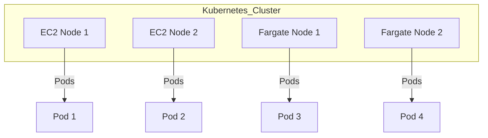

## Namespace Creation in Kubernetes

In Kubernetes, namespaces are used to divide cluster resources between multiple users or projects. A namespace provides a scope for names within the cluster. Names must be unique within a namespace but not across namespaces. This allows multiple teams to use the same cluster without naming conflicts.

### Why Use Namespaces?

Namespaces are particularly useful in multi-tenant environments where different teams or applications may share the same cluster. By isolating resources into separate namespaces, you can:

- **Manage Resource Quotas**: Set limits on CPU, memory, and other resources per namespace.
- **Control Access**: Apply role-based access control (RBAC) policies at the namespace level.
- **Organize Resources**: Group related resources together for easier management.

### Creating a Namespace

To create a namespace, you can use the `kubectl` command-line tool. Here’s an example of creating a namespace named `dev`:

```bash
kubectl create namespace dev
```

This command creates a new namespace named `dev`. You can verify the creation using:

```bash
kubectl get namespaces
```

### Applying Configurations in a Namespace

Once the namespace is created, you can deploy resources into it. For example, you might want to deploy an NGINX server in the `dev` namespace. Here’s how you can do it:

1. **Create an NGINX Deployment Configuration File**:

    ```yaml
    apiVersion: apps/v1
    kind: Deployment
    metadata:
      name: nginx-deployment
      namespace: dev
    spec:
      replicas: 3
      selector:
        matchLabels:
          app: nginx
      template:
        metadata:
          labels:
            app: nginx
        spec:
          containers:
          - name: nginx
            image: nginx:1.14.2
            ports:
            - containerPort: 80
    ```

2. **Apply the Configuration**:

    ```bash
    kubectl apply -f nginx-deployment.yaml
    ```

### Checking Pod Status

After deploying the NGINX server, you can check the status of the pods in the `dev` namespace using:

```bash
kubectl get pods --namespace=dev
```

This command will list all the pods running in the `dev` namespace.

### Understanding Nodes in Kubernetes

Nodes are the worker machines in a Kubernetes cluster. They can be physical or virtual machines. Each node runs the following components:

- **Kubelet**: An agent that ensures containers are running in a pod.
- **Kube Proxy**: A network proxy that reflects services as defined in the Kubernetes API.
- **Container Runtime**: Software responsible for running containers.

### EC2 Instances as Nodes

In Amazon Elastic Container Service (ECS), EC2 instances can serve as nodes. These instances run the necessary components to host Kubernetes pods.

#### Example: EC2 Instance Running in AWS Account

Consider an EC2 instance running in your AWS account. You can view this instance in the AWS Management Console under the EC2 service. This instance is part of the ECS node group and is responsible for running pods.

### Fargate as a Node

Fargate is a compute engine for Amazon ECS that allows you to run tasks and services without having to manage servers or clusters. Fargate provisions virtual machines outside your AWS account, providing a serverless experience.

#### Fargate IP Prefix

When using Fargate, the IP addresses assigned to the nodes are part of the VPC IP range you define. This ensures that communication between nodes remains within the same network.

### Example: Viewing Nodes in Kubernetes

To view the nodes in your Kubernetes cluster, you can use the following command:

```bash
kubectl get nodes
```

This command lists all the nodes in the cluster, including both EC2 instances and Fargate nodes.

### Diagram: Kubernetes Cluster with EC2 and Fargate Nodes



### Pitfalls and Best Practices

#### Common Mistakes

- **Incorrect Namespace Usage**: Forgetting to specify the correct namespace can lead to unexpected behavior.
- **Resource Overutilization**: Not setting resource quotas can result in one namespace consuming too many resources.
- **Security Risks**: Failing to apply proper RBAC policies can expose sensitive data.

#### How to Prevent / Defend

##### Detection

- **Monitor Resource Utilization**: Use tools like Prometheus and Grafana to monitor resource usage.
- **Audit Logs**: Enable audit logging to track changes and access patterns.

##### Prevention

- **Set Resource Quotas**: Define resource quotas for each namespace to limit resource consumption.
- **Apply RBAC Policies**: Implement role-based access control to restrict access based on roles.

##### Secure Code Fix

**Vulnerable Configuration**:

```yaml
apiVersion: v1
kind: Namespace
metadata:
  name: dev
```

**Secure Configuration**:

```yaml
apiVersion: v1
kind: Namespace
metadata:
  name: dev
spec:
  finalizers:
  - kubernetes
---
apiVersion: v1
kind: ResourceQuota
metadata:
  name: dev-quota
  namespace: dev
spec:
  hard:
    cpu: "2"
    memory: 4Gi
    pods: "10"
```

### Real-World Examples

#### Recent Breaches

- **CVE-2021-25741**: A vulnerability in Kubernetes allowed unauthorized access to the API server. Ensuring proper RBAC policies and monitoring can help mitigate such risks.

#### Real-World Use Case

- **Netflix**: Netflix uses Kubernetes and Fargate to manage their microservices architecture. By leveraging Fargate, they can focus on application development rather than infrastructure management.

### Practice Labs

For hands-on practice with Kubernetes and Fargate, consider the following labs:

- **PortSwigger Web Security Academy**: Offers a comprehensive set of labs covering various aspects of web security, including Kubernetes configurations.
- **AWS Official Workshops**: Provides detailed workshops on using ECS with Fargate, including setup and management.

By following these steps and best practices, you can effectively manage your Kubernetes cluster with Fargate, ensuring optimal performance and security.

---
<!-- nav -->
[[03-ECS Cluster Management with Fargate|ECS Cluster Management with Fargate]] | [[DevOps/DevOps Bootcamp/04-Cloud Computing (AWS & DigitalOcean)/16-ECS Cluster Management With Fargate/00-Overview|Overview]] | [[DevOps/DevOps Bootcamp/04-Cloud Computing (AWS & DigitalOcean)/16-ECS Cluster Management With Fargate/05-Practice Questions & Answers|Practice Questions & Answers]]
