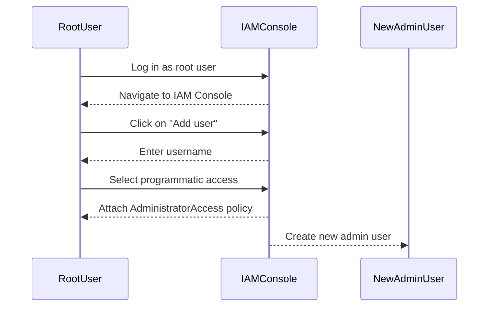
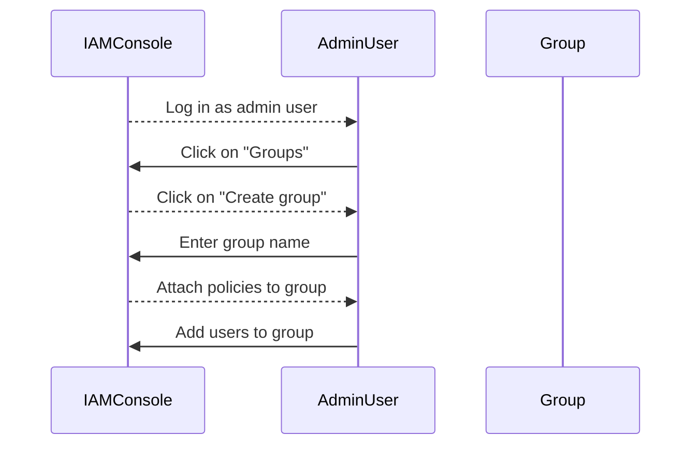

## Introduction to IAM User Management on AWS

Identity and Access Management (IAM) is a crucial service provided by Amazon Web Services (AWS) that allows you to securely control access to your AWS resources. IAM enables you to manage who can access your AWS resources, what actions they can perform, and under what conditions. This is essential for maintaining the security and integrity of your AWS environment.

### What is IAM?

IAM stands for Identity and Access Management. It is a web service that helps you securely control access to AWS resources. With IAM, you can:

- **Control access**: Define who can access your AWS resources and what actions they can perform.
- **Manage users and groups**: Create and manage users and groups within your AWS account.
- **Assign permissions**: Grant specific permissions to users and groups based on their roles and responsibilities.

### Why IAM Matters

IAM is critical because it ensures that only authorized individuals can access and modify your AWS resources. Without proper IAM management, unauthorized access could lead to data breaches, unauthorized changes to your infrastructure, and even financial losses due to unauthorized usage.

### How IAM Works Under the Hood

IAM operates using a set of core components:

- **Users**: Individual accounts that can log in to AWS and perform actions.
- **Groups**: Collections of users that share similar permissions.
- **Roles**: Permissions that can be assumed by entities (users, services, etc.) to perform specific actions.
- **Policies**: Documents that define permissions for users, groups, and roles.

When a user attempts to perform an action, IAM checks the policies associated with the user to determine whether the action is allowed. This process ensures that only authorized actions are performed.

### Default Root User

When you create an AWS account, a root user is automatically created. The root user has full administrative access to all AWS services and resources within the account. This includes the ability to:

- Manage billing information.
- Modify account settings.
- Create and manage IAM users and roles.
- Perform any action on any resource.

#### Risks of Using the Root User

Using the root user for day-to-day operations poses several risks:

- **Increased risk of unauthorized access**: If the root user credentials are compromised, an attacker would have full access to all resources.
- **Difficulty in auditing**: It is challenging to track who performed specific actions when using the root user.
- **Potential for accidental changes**: The root user can make significant changes to the account, which could inadvertently affect the entire infrastructure.

### Best Practices for IAM User Management

To mitigate these risks, AWS recommends creating an admin user with limited privileges instead of using the root user for regular tasks. This approach follows the principle of least privilege, ensuring that users have only the permissions necessary to perform their job functions.

#### Creating an Admin User

The first step in securing your AWS account is to create an admin user with limited privileges. Here’s how you can do it:

1. **Log in as the root user**.
2. **Navigate to the IAM console**.
3. **Create a new user**:
    - Provide a username.
    - Select programmatic access (if needed).
    - Attach the `AdministratorAccess` policy to grant full administrative access.



#### Assigning Permissions

Once the admin user is created, you can assign specific permissions to limit the user's access to only the necessary resources. This can be done by creating custom policies or using managed policies provided by AWS.

##### Custom Policy Example

Here’s an example of a custom policy that grants permissions to create and manage EC2 instances:

```json
{
    "Version": "2012-10-17",
    "Statement": [
        {
            "Effect": "Allow",
            "Action": [
                "ec2:*"
            ],
            "Resource": "*"
        }
    ]
}
```

This policy allows the user to perform any action related to EC2 instances.

##### Managed Policy Example

AWS provides managed policies that can be attached to users, groups, or roles. For example, the `AmazonEC2FullAccess` managed policy grants full access to EC2 resources.

```json
{
    "Version": "2012-10-17",
    "Statement": [
        {
            "Effect": "Allow",
            "Action": [
                "ec2:*"
            ],
            "Resource": "*"
        }
    ]
}
```

#### Creating Groups

Groups allow you to manage permissions for multiple users at once. You can create a group and attach policies to it, then add users to the group.



### Real-World Examples and Breaches

Several high-profile breaches have occurred due to improper IAM management. For example, in 2021, a breach involving the exposure of sensitive data was traced back to misconfigured IAM permissions. In this case, an attacker gained access to an S3 bucket containing sensitive information due to overly permissive IAM policies.

#### CVE Example: CVE-2021-20225

CVE-2021-20225 is a vulnerability that affects AWS IAM. This vulnerability allows an attacker to escalate their privileges by manipulating IAM roles and policies. The vulnerability was exploited in a real-world scenario where an attacker gained unauthorized access to sensitive resources.

### How to Prevent / Defend

#### Detection

To detect potential IAM-related issues, you can use AWS CloudTrail and AWS Config:

- **CloudTrail**: Logs API calls made to your AWS account, allowing you to monitor and audit IAM activity.
- **Config**: Tracks changes to your AWS resources, including IAM policies and roles.

#### Prevention

To prevent IAM-related issues, follow these best practices:

- **Use the principle of least privilege**: Grant users only the permissions they need to perform their job functions.
- **Regularly review IAM policies**: Ensure that policies are up-to-date and do not grant unnecessary permissions.
- **Enable multi-factor authentication (MFA)**: Require MFA for all IAM users to add an additional layer of security.
- **Use IAM roles for services**: Instead of granting permissions directly to users, use IAM roles to grant permissions to services.

#### Secure Coding Fixes

Here’s an example of a vulnerable IAM policy and its secure counterpart:

**Vulnerable Policy:**

```json
{
    "Version": "2012-10-17",
    "Statement": [
        {
            "Effect": "Allow",
            "Action": "*",
            "Resource": "*"
        }
    ]
}
```

**Secure Policy:**

```json
{
    "Version": "2012-10-17",
    "Statement": [
        {
            "Effect": "Allow",
            "Action": [
                "ec2:*"
            ],
            "Resource": "*"
        }
    ]
}
```

### Configuration Hardening

To harden your IAM configuration, consider the following steps:

- **Disable root user access**: Disable root user access to prevent unauthorized access.
- **Enable IAM access advisor**: Use IAM Access Advisor to identify unused permissions and remove them.
- **Audit IAM policies regularly**: Regularly review and audit IAM policies to ensure they are up-to-date and secure.

### Hands-On Labs

For hands-on practice with IAM user management, consider the following labs:

- **PortSwigger Web Security Academy**: Offers interactive labs on IAM management and security.
- **OWASP Juice Shop**: Provides a web application with various security vulnerabilities, including IAM-related issues.
- **CloudGoat**: A cloud security training platform that includes IAM management exercises.

By following these best practices and using the recommended tools and labs, you can effectively manage IAM users and ensure the security of your AWS environment.

---
<!-- nav -->
[[DevOps/DevOps Bootcamp/04-Cloud Computing (AWS & DigitalOcean)/17-IAM User Management Best Practices On AWS/00-Overview|Overview]] | [[02-IAM User Management Best Practices on AWS|IAM User Management Best Practices on AWS]]
