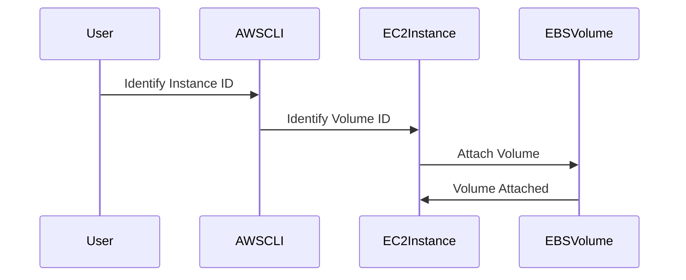

## Attaching the New Volume to an EC2 Instance

After creating a new volume from a snapshot, the next step is to attach it to an EC2 instance. This process involves identifying the instance and attaching the volume to it.

### Steps to Attach a Volume to an EC2 Instance

1. **Identify the Instance:** Determine the EC2 instance to which you want to attach the volume.
2. **Attach the Volume:** Use the AWS CLI to attach the volume to the specified instance.

### Example Code: Attaching a Volume to an EC2 Instance

Here’s an example of how to attach a volume to an EC2 instance using the AWS CLI:

```bash
# Identify the instance ID
INSTANCE_ID=i-0123456789abcdef0

# Identify the volume ID
VOLUME_ID=$(aws ec2 describe-volumes --filters Name=snapshot-id,Values=snap-0123456789abcdef0 --query 'Volumes[0].VolumeId' --output text)

# Attach the volume to the instance
aws ec2 attach-volume --instance-id $INSTANCE_ID --volume-id $VOLUME_ID --device /dev/sdf
```

### Explanation of the Code

- **Step 1:** Identify the instance ID (`i-0123456789abcdef0`).
- **Step 2:** Identify the volume ID by querying the snapshot.
- **Step 3:** Attach the volume to the specified instance and mount it at `/dev/sdf`.

### Mermaid Diagram: Volume Attachment Process



### Common Pitfalls

- **Incorrect Instance ID:** Ensure that the instance ID is correct and matches the desired EC2 instance.
- **Device Conflict:** Verify that the device name does not conflict with existing devices on the instance.

### How to Prevent / Defend

- **Validate Instance ID:** Double-check the instance ID to ensure it matches the desired EC2 instance.
- **Check Device Names:** Verify that the device name does not conflict with existing devices on the instance.

---
<!-- nav -->
[[03-Adding Tags to Resources|Adding Tags to Resources]] | [[DevOps/DevOps Bootcamp/04-Cloud Computing (AWS & DigitalOcean)/18-Recovering EC2 Instances Using Volume Snapshots/00-Overview|Overview]] | [[05-Creating a New Volume from a Snapshot|Creating a New Volume from a Snapshot]]
