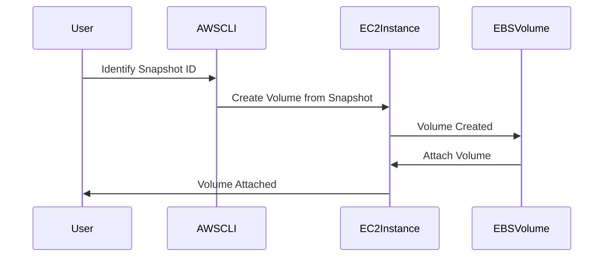

## Creating a New Volume from a Snapshot

Creating a new volume from a snapshot is a crucial step in recovering data from an EC2 instance. This process involves several steps, including creating the volume, attaching it to an instance, and configuring the necessary settings.

### Steps to Create a New Volume from a Snapshot

1. **Identify the Snapshot:** First, you need to identify the snapshot from which you want to create the new volume.
2. **Create the Volume:** Use the snapshot to create a new EBS volume.
3. **Attach the Volume:** Attach the new volume to the desired EC2 instance.
4. **Configure the Volume:** Format and mount the volume on the EC2 instance.

### Example Code: Creating a New Volume from a Snapshot

Here’s an example of how to create a new volume from a snapshot using the AWS CLI:

```bash
# Step 1: Identify the snapshot ID
SNAPSHOT_ID=snap-0123456789abcdef0

# Step 2: Create the volume
aws ec2 create-volume --availability-zone us-west-2a --size 10 --volume-type gp2 --snapshot-id $SNAPSHOT_ID

# Step 3: Attach the volume to an instance
INSTANCE_ID=i-0123456789abcdef0
VOLUME_ID=$(aws ec2 describe-volumes --filters Name=snapshot-id,Values=$SNAPSHOT_ID --query 'Volumes[0].VolumeId' --output text)
aws ec2 attach-volume --instance-id $INSTANCE_ID --volume-id $VOLUME_ID --device /dev/sdf
```

### Explanation of the Code

- **Step 1:** Identify the snapshot ID (`snap-0123456789abcdef0`).
- **Step 2:** Create a new volume from the snapshot. The volume is created in the `us-west-2a` availability zone with a size of 10 GB and type `gp2`.
- **Step 3:** Attach the newly created volume to the specified EC2 instance (`i--0123456789abcdef0`) and mount it at `/dev/sdf`.

### Mermaid Diagram: Volume Creation and Attachment Process



### Common Pitfalls

- **Incorrect Availability Zone:** Ensure that the availability zone specified matches the one where the EC2 instance is located.
- **Device Naming:** Verify that the device name (`/dev/sdf`) is correct and does not conflict with existing devices on the instance.

### How to Prevent / Defend

- **Validate Availability Zone:** Double-check the availability zone to ensure it matches the EC2 instance.
- **Check Device Names:** Verify that the device name does not conflict with existing devices on the instance.

---
<!-- nav -->
[[04-Attaching the New Volume to an EC2 Instance|Attaching the New Volume to an EC2 Instance]] | [[DevOps/DevOps Bootcamp/04-Cloud Computing (AWS & DigitalOcean)/18-Recovering EC2 Instances Using Volume Snapshots/00-Overview|Overview]] | [[06-Recovering EC2 Instances Using Volume Snapshots|Recovering EC2 Instances Using Volume Snapshots]]
