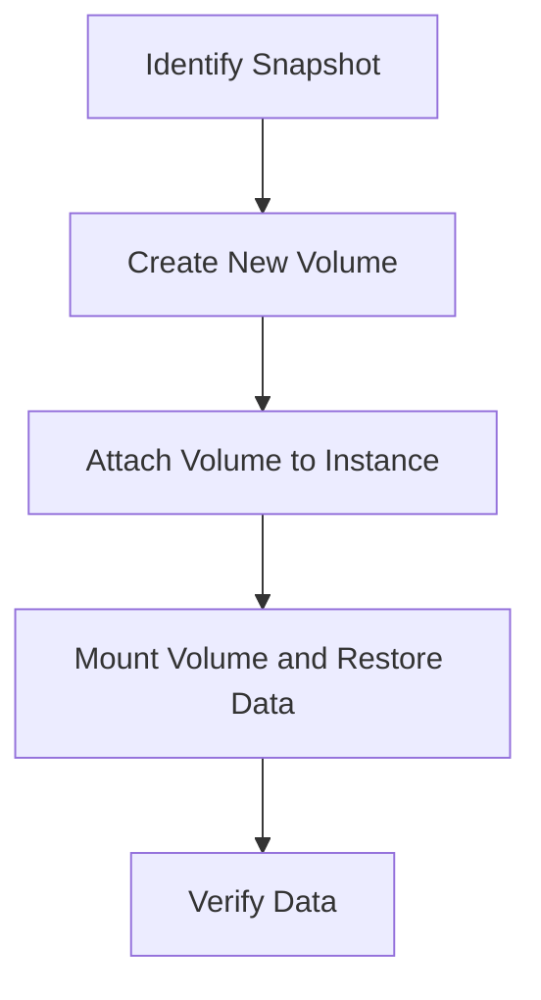

## Scenario: Data Corruption on an EC2 Instance

Let's consider a scenario where an EC2 instance running a production application experiences data corruption. The corruption could be due to various reasons, such as a software bug, a failed update, or even a cyberattack. As a result, the instance becomes unresponsive, and the application stops functioning correctly.

### Identifying the Issue

The first step in addressing the issue is to identify the root cause of the data corruption. This might involve checking logs, monitoring tools, and performing diagnostics on the instance. Once the problem is identified, the next step is to determine the best course of action to recover the instance.

### Using Snapshots for Recovery

To recover the instance, you can use a snapshot of the EBS volume that was taken prior to the corruption. Here’s a step-by-step guide on how to achieve this:

#### Step 1: Identify the Snapshot

First, you need to identify the most recent snapshot that predates the corruption. You can do this through the AWS Management Console or using the AWS CLI.

```bash
aws ec2 describe-snapshots --filters "Name=volume-id,Values=<your-volume-id>"
```

This command lists all snapshots associated with the specified volume ID. You should choose the most recent snapshot that was taken before the corruption occurred.

#### Step 2: Create a New Volume from the Snapshot

Once you have identified the appropriate snapshot, you can create a new EBS volume from it. This new volume will contain the data from the snapshot, effectively reverting the volume to its previous state.

```bash
aws ec2 create-volume --availability-zone <your-availability-zone> --size <your-volume-size> --snapshot-id <your-snapshot-id>
```

Replace `<your-availability-zone>` with the availability zone where your instance is located, `<your-volume-size>` with the size of the volume, and `<your-snapshot-id>` with the ID of the snapshot you identified.

#### Step 3: Attach the New Volume to the Instance

After creating the new volume, you need to attach it to the EC2 instance. This can be done through the AWS Management Console or using the AWS CLI.

```bash
aws ec2 attach-volume --volume-id <new-volume-id> --instance-id <your-instance-id> --device /dev/sdf
```

Replace `<new-volume-id>` with the ID of the newly created volume, `<your-instance-id>` with the ID of your EC2 instance, and `/dev/sdf` with the device name where you want to attach the volume.

#### Step 4: Mount the Volume and Restore Data

Once the volume is attached, you need to mount it on the instance and copy the data to the appropriate location. This might involve formatting the volume and mounting it to a specific directory.

```bash
sudo mkfs -t ext4 /dev/xvdf
sudo mkdir /mnt/newdata
sudo mount /dev/xvdf /mnt/newdata
```

Replace `/dev/xvdf` with the actual device name of the attached volume.

#### Step 5: Verify the Data

Finally, verify that the data has been successfully restored and that the application is functioning correctly. This might involve running tests or checking the application's logs.

### Example: Real-World Scenario

Consider a real-world scenario where a company experienced data corruption due to a software bug in their application. The corruption affected the production database, causing the application to crash. To recover, the company used a snapshot of the EBS volume that contained the database. They followed the steps outlined above to create a new volume from the snapshot, attach it to the instance, and restore the data.

### Mermaid Diagram: Recovery Process

Here is a mermaid diagram illustrating the recovery process:



### Common Pitfalls and Best Practices

#### Pitfall 1: Incorrect Snapshot Selection

One common pitfall is selecting the wrong snapshot. Always ensure that the snapshot you choose predates the corruption. You can use tags and descriptions to help identify the correct snapshot.

#### Pitfall 2: Data Loss Due to Overwriting

When restoring data from a snapshot, be cautious about overwriting existing data. Always make backups of the current data before proceeding with the restoration process.

#### Best Practice 1: Regular Backups

Regularly taking snapshots ensures that you have frequent backups to fall back on in case of data corruption. Consider setting up automated backups using AWS Backup or Lambda functions.

#### Best Practice 2: Monitoring and Alerts

Implement monitoring and alerting mechanisms to quickly identify issues. Tools like Amazon CloudWatch can help you monitor the health of your instances and receive alerts when problems arise.

### How to Prevent / Defend

#### Detection

Use monitoring tools like Amazon CloudWatch to detect anomalies in your instance's behavior. Set up alarms to notify you when certain thresholds are exceeded, indicating potential issues.

#### Prevention

1. **Automated Backups**: Use AWS Backup or Lambda functions to automate the creation of snapshots at regular intervals.
2. **Secure Coding Practices**: Implement secure coding practices to minimize the risk of software bugs causing data corruption.
3. **Regular Audits**: Conduct regular audits of your infrastructure to identify and mitigate potential vulnerabilities.

#### Secure-Coding Fixes

Compare the vulnerable code with the secure code:

**Vulnerable Code:**
```python
def update_database(data):
    # Update the database with the provided data
    db.execute("UPDATE table SET column = %s", (data,))
```

**Secure Code:**
```python
def update_database(data):
    # Validate input data before updating the database
    if validate_input(data):
        db.execute("UPDATE table SET column = %s", (data,))
    else:
        raise ValueError("Invalid input data")
```

#### Configuration Hardening

Ensure that your EBS volumes are configured securely:

```json
{
  "Version": "2012-10-17",
  "Statement": [
    {
      "Sid": "AllowVolumeCreationFromSnapshot",
      "Effect": "Allow",
      "Action": [
        "ec2:CreateVolume"
      ],
      "Resource": "*",
      "Condition": {
        "StringEquals": {
          "ec2:SourceSnapshotId": "<your-snapshot-id>"
        }
      }
    }
  ]
}
```

### Hands-On Lab Suggestions

For hands-on practice, consider the following labs:

- **PortSwigger Web Security Academy**: Focuses on web application security but also covers cloud security concepts.
- **OWASP Juice Shop**: A deliberately insecure web application for practicing security testing.
- **CloudGoat**: A set of labs designed to teach cloud security concepts, including EC2 and EBS management.

By following these steps and best practices, you can effectively recover your EC2 instances using volume snapshots, ensuring minimal downtime and data loss.

---
<!-- nav -->
[[06-Recovering EC2 Instances Using Volume Snapshots|Recovering EC2 Instances Using Volume Snapshots]] | [[DevOps/DevOps Bootcamp/04-Cloud Computing (AWS & DigitalOcean)/18-Recovering EC2 Instances Using Volume Snapshots/00-Overview|Overview]] | [[08-Understanding EC2 Instance Recovery Using Volume Snapshots|Understanding EC2 Instance Recovery Using Volume Snapshots]]
