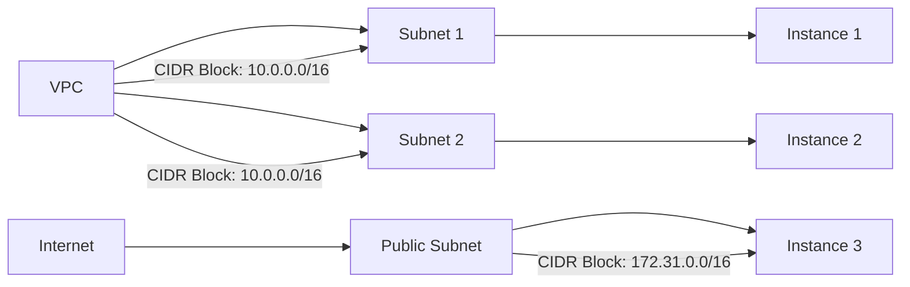

## Understanding CIDR Blocks in AWS VPC Configuration

Throughout the AWS ecosystem, you will frequently encounter something called a CIDR block. This term is particularly prevalent when configuring Virtual Private Clouds (VPCs), subnets, and security groups. A CIDR block is a notation used to specify a range of IP addresses. It consists of an IP address followed by a slash and a number, such as `10.0.0.0/16`. Let's delve into the details of what CIDR blocks are, how they work, and how to effectively use them in AWS VPC configurations.

### What is a CIDR Block?

A CIDR (Classless Inter-Domain Routing) block is a notation used to describe a range of IP addresses. The format of a CIDR block is an IP address followed by a slash and a number, which represents the number of bits used for the network portion of the address. For example, `10.0.0.0/16` indicates that the first 16 bits of the IP address are used for the network portion, and the remaining 16 bits are used for the host portion.

#### Explanation of the Notation

- **IP Address**: The IP address is the base address from which the range of addresses is derived. For instance, in `10.0.0.0/16`, `10.0.0.0` is the base address.
- **Slash and Number**: The number following the slash (e.g., `/16`) specifies the number of bits used for the network portion. The higher the number, the smaller the range of IP addresses covered by the CIDR block.

### How CIDR Blocks Work

To understand how CIDR blocks work, let's break down the example `10.0.0.0/16`.

- **Base IP Address**: `10.0.0.0`
- **CIDR Notation**: `/16`

The `/16` indicates that the first 16 bits of the IP address are used for the network portion. This leaves the remaining 16 bits for the host portion. 

In binary, the IP address `10.0.0.0` can be represented as:

```
10.0.0.0 = 00001010.00000000.00000000.00000000
```

With `/16`, the first 16 bits (`00001010.00000000`) are used for the network portion, and the remaining 16 bits (`00000000.00000000`) are used for the host portion. This means the range of IP addresses covered by `10.0.0.0/16` is from `10.0.0.0` to `10.0.255.255`.

### Choosing Your Own CIDR Blocks

When creating VPCs and subnets in AWS, you need to choose appropriate CIDR blocks. The choice depends on the number of IP addresses required for your network.

#### Example: Choosing a CIDR Block

Let's consider an example where you want to create a VPC with a subnet that requires 65,536 IP addresses. You can use the CIDR block `10.0.0.0/16`.

- **Network Portion**: `10.0.0.0` (first 16 bits)
- **Host Portion**: Remaining 16 bits

This gives you a range of IP addresses from `10.0.0.0` to `10.0.255.255`.

### Calculating the Range of IP Addresses

To determine the range of IP addresses covered by a CIDR block, you can use a CIDR calculator. These calculators help you understand the exact range of IP addresses based on the CIDR notation.

#### Example Calculation

Using a CIDR calculator, let's calculate the range for `10.0.0.0/16`:

- **Base IP Address**: `10.0.0.0`
- **CIDR Notation**: `/16`

The calculator shows that the range of IP addresses is from `10.0.0.0` to `10.0.255.255`.

### Real-World Examples and Recent Breaches

Understanding CIDR blocks is crucial for securing your network infrastructure. Misconfigurations in CIDR blocks can lead to security vulnerabilities. Here are some recent examples of breaches related to misconfigured CIDR blocks:

#### Example: CVE-2021-38642

In 2021, a misconfiguration in the CIDR block settings of a VPC led to unauthorized access to sensitive data. The issue was caused by an overly broad CIDR block that allowed external access to internal resources.

**Impact**: Unauthorized access to sensitive data.

**Mitigation**: Ensure that CIDR blocks are appropriately scoped to minimize exposure to external networks.

### Common Pitfalls and Best Practices

When working with CIDR blocks, there are several common pitfalls to avoid:

1. **Overly Broad CIDR Blocks**: Using overly broad CIDR blocks can expose your network to unnecessary risks. Always scope your CIDR blocks to the minimum necessary range.
2. **Overlap Between CIDR Blocks**: Overlapping CIDR blocks can cause routing issues and conflicts. Ensure that your CIDR blocks do not overlap.
3. **Misconfigured Security Groups**: Misconfigured security groups can allow unauthorized access to your network. Always ensure that security groups are properly configured to restrict access based on CIDR blocks.

### How to Prevent / Defend

#### Detection

To detect misconfigurations in CIDR blocks, you can use tools like AWS Trusted Advisor and third-party security scanners. These tools can identify overly broad CIDR blocks and other potential issues.

#### Prevention

To prevent misconfigurations, follow these best practices:

1. **Scope CIDR Blocks Appropriately**: Always scope your CIDR blocks to the minimum necessary range.
2. **Use Security Groups**: Use security groups to restrict access based on CIDR blocks.
3. **Regular Audits**: Regularly audit your CIDR block configurations to ensure they remain secure.

#### Secure Coding Fixes

Here is an example of a vulnerable configuration and its secure counterpart:

**Vulnerable Configuration**:
```json
{
  "IpPermissions": [
    {
      "IpProtocol": "-1",
      "UserIdGroupPairs": [],
      "IpRanges": [
        {
          "CidrIp": "0.0.0.0/0"
        }
      ]
    }
  ]
}
```

**Secure Configuration**:
```json
{
  "IpPermissions": [
    {
      "IpProtocol": "-1",
      "UserIdGroupPairs": [],
      "IpRanges": [
        {
          "CidrIp": "10.0.0.0/16"
        }
      ]
    }
  ]
}
```

### Network Topology Diagram

To visualize the network topology, consider the following `mermaid` diagram:



### Conclusion

Understanding CIDR blocks is essential for effective network configuration in AWS. By choosing appropriate CIDR blocks and following best practices, you can ensure the security and efficiency of your network infrastructure. Regular audits and the use of security tools can help detect and prevent misconfigurations.

---
<!-- nav -->
[[DevOps/DevOps Bootcamp/04-Cloud Computing (AWS & DigitalOcean)/19-Understanding CIDR Blocks in AWS VPC Configuration/00-Overview|Overview]] | [[DevOps/DevOps Bootcamp/04-Cloud Computing (AWS & DigitalOcean)/19-Understanding CIDR Blocks in AWS VPC Configuration/02-Practice Questions & Answers|Practice Questions & Answers]]
