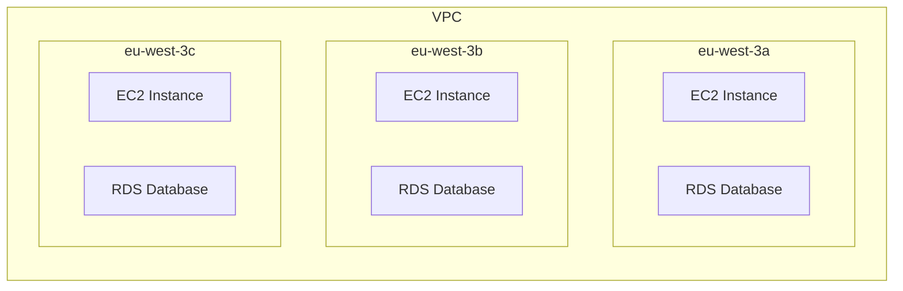
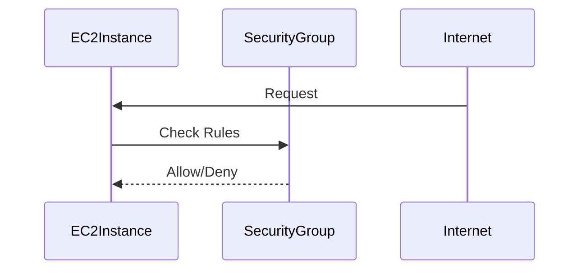
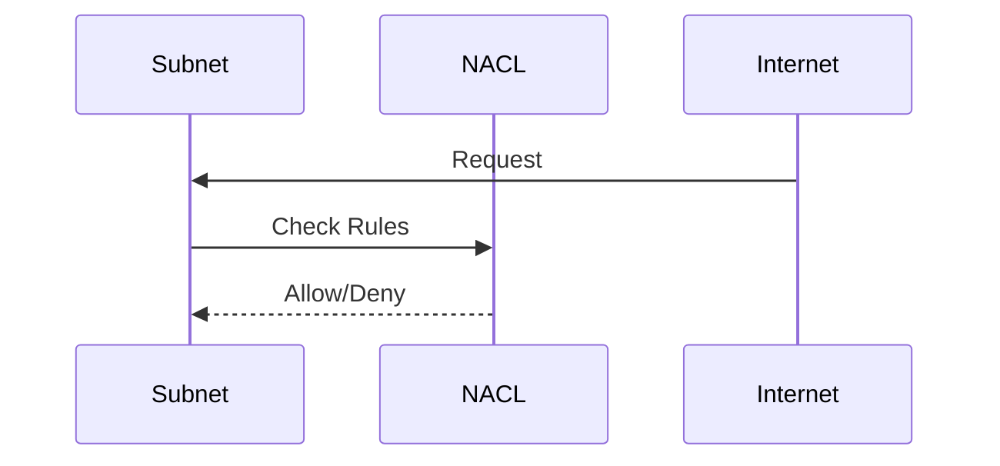
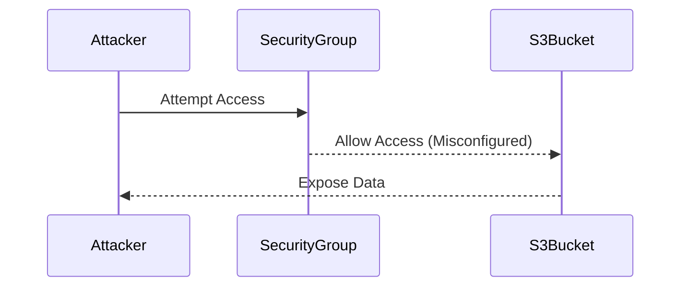
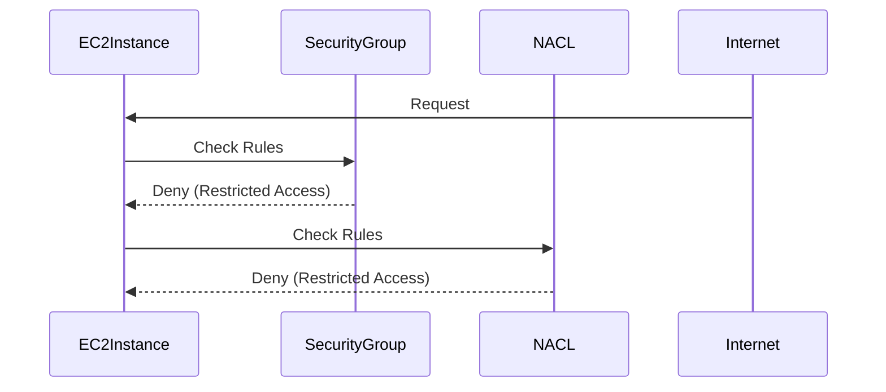

## Understanding VPC Span Across Regions

### Introduction to VPC

A Virtual Private Cloud (VPC) is a logically isolated section of a cloud provider's infrastructure that allows you to launch cloud resources in a virtual network that you define. Think of a VPC as your own private network within the cloud, providing a secure and isolated environment for your applications and services. Each VPC is associated with a specific region, and within that region, it spans across all the Availability Zones (AZs).

### What is a VPC?

A VPC is a fundamental component of cloud infrastructure, particularly in services like Amazon Web Services (AWS). When you create an AWS account, a default VPC is automatically created in each region. This default VPC comes with predefined settings and configurations, making it easy to get started quickly.

#### Key Components of a VPC

1. **Subnets**: A subnet is a range of IP addresses in your VPC. You can create public subnets (with access to the internet) and private subnets (without direct internet access).
2. **Internet Gateway**: An Internet Gateway allows resources in your VPC to communicate with the internet.
3. **Route Tables**: Route tables determine where network traffic is directed. They contain routes that specify the target for traffic destined to a particular CIDR block.
4. **Network Access Control Lists (NACLs)**: NACLs are stateless firewall rules that control inbound and outbound traffic at the subnet level.
5. **Security Groups**: Security groups are stateful firewall rules that control inbound and outbound traffic at the instance level.

### Default VPC Configuration

When you create an AWS account, a default VPC is created in each region. This default VPC includes:

- Subnets in each AZ within the region.
- An Internet Gateway.
- Route tables that route traffic to the Internet Gateway.
- Security groups and NACLs configured to allow basic communication.

For example, if you are in the Frankfurt region (`eu-central-1`), you will see a default VPC with subnets in each AZ (e.g., `eu-central-1a`, `eu-central-1b`, `eu-central-1c`). Similarly, if you switch to the Paris region (`eu-west-3`), you will see another default VPC with subnets in each AZ (e.g., `eu-west-3a`, `eu-west-3b`, `eu-west-3c`).

### VPC Span Across Availability Zones

A VPC spans all the Availability Zones within a region. This means that resources such as EC2 instances, RDS databases, and other services can be deployed across multiple AZs within the same VPC. This provides high availability and fault tolerance, as resources can be distributed across multiple AZs, reducing the risk of a single point of failure.

#### Example: VPC in Paris Region

Let's consider the Paris region (`eu-west-3`) with three AZs (`eu-west-3a`, `eu-west-3b`, `eu-west-3c`). The default VPC in this region will span all three AZs, allowing you to deploy resources across these AZs.



### Isolation and Security

The primary purpose of a VPC is to provide isolation and security for your resources. By default, resources in a VPC are isolated from other resources in the same data center, even if they are running on the same physical machine. This isolation is achieved through the use of security groups, NACLs, and other network controls.

#### Security Groups

Security groups are stateful firewall rules that control inbound and outbound traffic at the instance level. They are attached to EC2 instances and other resources, allowing you to specify which traffic is allowed to reach those resources.



#### Network Access Control Lists (NACLs)

NACLs are stateless firewall rules that control inbound and outbound traffic at the subnet level. Unlike security groups, NACLs apply to all traffic entering or leaving a subnet, regardless of the instance.



### Real-World Examples and Breaches

Understanding the importance of VPCs and their isolation capabilities is crucial, especially in light of recent breaches and vulnerabilities. One notable example is the Capital One breach in 2019, where an attacker gained unauthorized access to sensitive customer data stored in an AWS S3 bucket due to misconfigured security groups and NACLs.

#### CVE-2019-11477: Capital One Data Breach

In July 2019, Capital One disclosed a data breach that exposed sensitive information of approximately 100 million customers. The breach occurred due to a misconfiguration in the security group settings, which allowed unauthorized access to the S3 bucket containing the data.



### How to Prevent / Defend

To prevent such breaches and ensure the security of your VPC, follow these best practices:

1. **Use Security Groups and NACLs**: Ensure that security groups and NACLs are properly configured to restrict access to your resources.
2. **Enable VPC Flow Logs**: Enable VPC flow logs to monitor network traffic and detect any unauthorized access attempts.
3. **Use IAM Policies**: Implement strict IAM policies to control access to your VPC and other resources.
4. **Regular Audits**: Regularly audit your VPC configurations to identify and remediate any misconfigurations.

#### Secure Configuration Example

Here is an example of a secure configuration using security groups and NACLs:



### Complete Example: Creating a VPC

To create a VPC, you can use the AWS Management Console, AWS CLI, or AWS SDKs. Here is an example using the AWS CLI:

```bash
# Create a VPC
aws ec2 create-vpc --cidr-block 10.0.0.0/16

# Create a subnet in each AZ
aws ec2 create-subnet --vpc-id vpc-12345678 --cidr-block 10.0.1.0/24 --availability-zone eu-west-3a
aws ec2 create-subnet --vpc-id vpc-11122233 --cidr-block 10.0.2.0/24 --availability-zone eu-west-3b
aws ec2 create-subnet --vpc-id vpc-44455566 --cidr-block 10.0.3.0/24 --availability-zone eu-west-3c

# Create an Internet Gateway
aws ec2 create-internet-gateway

# Attach the Internet Gateway to the VPC
aws ec2 attach-internet-gateway --internet-gateway-id igw-12345678 --vpc-id vpc-12345678

# Create a route table
aws ec2 create-route-table --vpc-id vpc-12345678

# Add a route to the Internet Gateway
aws ec2 create-route --route-table-id rtb-12345678 --destination-cidr-block 0.0.0.0/0 --gateway-id igw-12345678

# Associate the route table with the subnets
aws ec2 associate-route-table --route-table-id rtb-12345678 --subnet-id subnet-12345678
aws ec2 associate-route-table --route-table-id rtb-12345678 --subnet-id subnet-11122233
aws ec2 associate-route-table --route-table-id rtb-12345678 --subnet-id subnet-44455566
```

### Conclusion

Understanding the span of a VPC across regions and AZs is crucial for designing and deploying secure and scalable cloud infrastructures. By leveraging the isolation and security features provided by VPCs, you can protect your resources from unauthorized access and ensure the integrity of your data.

### Practice Labs

To gain hands-on experience with VPCs, consider the following practice labs:

- **PortSwigger Web Security Academy**: Offers a comprehensive set of labs covering various aspects of web security, including VPC configurations.
- **OWASP Juice Shop**: A deliberately insecure web application for security training purposes, which can be deployed in a VPC to understand its security implications.
- **DVWA (Damn Vulnerable Web Application)**: Another popular web application for security training, which can be deployed in a VPC to understand its security implications.

By completing these labs, you can deepen your understanding of VPCs and their role in securing cloud infrastructures.

---
<!-- nav -->
[[DevOps/DevOps Bootcamp/04-Cloud Computing (AWS & DigitalOcean)/20-Understanding VPC Span Across Regions/00-Overview|Overview]] | [[DevOps/DevOps Bootcamp/04-Cloud Computing (AWS & DigitalOcean)/20-Understanding VPC Span Across Regions/02-Practice Questions & Answers|Practice Questions & Answers]]
