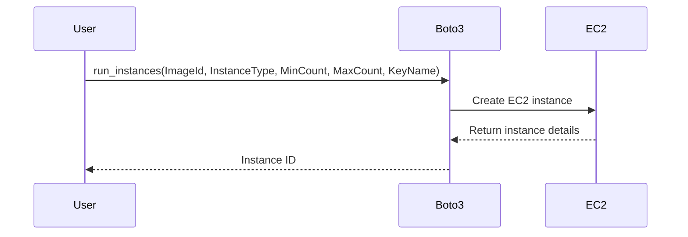

## Introduction to Boto3 and AWS Resource Management

Boto3 is the Amazon Web Services (AWS) Software Development Kit (SDK) for Python, which allows Python developers to write software that makes use of services like Amazon S3 and Amazon EC2. Boto3 provides an easy-to-use interface to interact with AWS services, enabling developers to manage resources efficiently and securely.

### What is Boto3?

Boto3 is a Python library that provides an interface to AWS services. It allows you to create, configure, and manage AWS resources programmatically. This includes services such as EC2 (Elastic Compute Cloud), S3 (Simple Storage Service), RDS (Relational Database Service), and many others.

### Why Use Boto3?

Using Boto3 offers several advantages:

1. **Automation**: Automate the creation and management of AWS resources.
2. **Consistency**: Ensure consistent configurations across multiple environments.
3. **Security**: Implement security best practices through programmatic controls.
4. **Scalability**: Scale resources dynamically based on demand.
5. **Integration**: Integrate AWS services with existing applications and workflows.

### How Does Boto3 Work?

Boto3 works by providing a set of Python classes and methods that correspond to AWS services. You can use these classes and methods to perform operations such as creating instances, uploading files, and managing databases.

#### Example: Creating an EC2 Instance

Here’s a simple example of creating an EC2 instance using Boto3:

```python
import boto3

# Create an EC2 client
ec2 = boto3.client('ec2')

# Define the instance parameters
instance_params = {
    'ImageId': 'ami-0c55b159cbfafe1f0',  # Example AMI ID
    'InstanceType': 't2.micro',
    'MinCount': 1,
    'MaxCount': 1,
    'KeyName': 'my-key-pair'
}

# Create the instance
response = ec2.run_instances(**instance_params)

# Print the instance ID
print(response['Instances'][0]['InstanceId'])
```

### Named Parameters in Boto3

In the context of Boto3, named parameters are used to specify the values of function arguments explicitly. This is particularly useful when dealing with functions that accept multiple optional parameters.

#### What Are Named Parameters?

Named parameters allow you to specify the value of a function argument by name rather than by position. This is especially useful when a function has many optional parameters, and you only want to specify a subset of them.

#### Why Use Named Parameters?

Consider a function that accepts multiple optional parameters. Without named parameters, you would need to provide values for all preceding parameters even if you only care about a few specific ones. Named parameters solve this problem by allowing you to specify exactly which parameters you are setting.

#### Example: Using Named Parameters

Let’s look at an example where we use named parameters to specify only the `hostname` and `passphrase` parameters:

```python
def connect_to_server(hostname=None, port=None, username=None, password=None, passphrase=None):
    print(f"Connecting to {hostname} with port {port}, username {username}, password {password}, and passphrase {passphrase}")

connect_to_server(hostname="example.com", passphrase="my-secret-passphrase")
```

Output:
```
Connecting to example.com with port None, username None, password None, and passphrase my-secret-passphrase
```

### Managing Resources Across Regions

When working with AWS resources, it’s often necessary to manage resources across different regions. Boto3 allows you to specify the region in which you want to operate.

#### Specifying Region in Boto3

To specify a region in Boto3, you can pass the `region_name` parameter when creating a client or resource object.

```python
import boto3

# Create an EC2 client for a specific region
ec2 = boto3.client('ec2', region_name='us-west-2')

# List VPCs in the specified region
vpcs = ec2.describe_vpcs()
for vpc in vpcs['Vpcs']:
    print(vpc)
```

### Handling Default VPCs

A default VPC is automatically created in each region when you first launch an instance or create a VPC. It contains a set of default subnets and route tables.

#### Identifying Default VPCs

To identify whether a VPC is a default VPC, you can check the `IsDefault` attribute in the VPC description.

```python
import boto3

# Create an EC2 client
ec2 = boto3.client('ec2')

# Describe VPCs
vpcs = ec2.describe_vpcs()

# Check if the VPC is a default VPC
for vpc in vpcs['Vpcs']:
    if vpc['IsDefault']:
        print(f"Default VPC found: {vpc['VpcId']}")
```

### Handling Multiple Optional Parameters

When a function accepts multiple optional parameters, named parameters become essential. Let’s consider a function that accepts 10 optional parameters but you only want to provide values for two of them.

#### Example Function with Multiple Optional Parameters

```python
def configure_server(hostname=None, port=None, username=None, password=None, passphrase=None, key=None, cert=None, ca_cert=None, timeout=None, retries=None):
    print(f"Configuring server with hostname {hostname}, port {port}, username {username}, password {password}, passphrase {passphrase}, key {key}, cert {cert}, ca_cert {ca_cert}, timeout {timeout}, retries {retries}")

configure_server(hostname="example.com", passphrase="my-secret-passphrase")
```

Output:
```
Configuring server with hostname example.com, port None, username None, password None, passphrase my-secret-passphrase, key None, cert None, ca_cert None, timeout None, retries None
```

### Mermaid Diagrams for Understanding Connections

Mermaid diagrams can help visualize the connections and flows involved in managing AWS resources.

#### Sequence Diagram for Creating an EC2 Instance



### Common Pitfalls and Best Practices

#### Common Pitfalls

1. **Incorrect Region Specification**: Always ensure you are specifying the correct region when creating clients or resources.
2. **Default VPC Confusion**: Be aware of default VPCs and their implications on your network setup.
3. **Incomplete Parameter Specification**: Ensure you provide all required parameters when calling functions.

#### Best Practices

1. **Use Named Parameters**: Explicitly specify the parameters you are setting to avoid confusion.
2. **Check for Default VPCs**: Verify whether a VPC is a default VPC before making changes.
3. **Document Your Code**: Clearly document the purpose and usage of your Boto3 scripts.

### Real-World Examples and CVEs

#### Example: CVE-2021-3504

CVE-2021-3504 was a vulnerability in AWS Elastic Load Balancing (ELB) that allowed unauthorized access to internal resources. This highlights the importance of proper configuration and validation of AWS resources.

#### Secure Configuration Example

```python
import boto3

# Create an ELB client
elb = boto3.client('elb')

# Configure security groups for the load balancer
security_groups = ['sg-0123456789abcdef0']
elb.create_load_balancer(
    LoadBalancerName='secure-elb',
    Listeners=[{'Protocol': 'HTTP', 'LoadBalancerPort': 80, 'InstanceProtocol': 'HTTP', 'InstancePort': 80}],
    AvailabilityZones=['us-west-2a'],
    SecurityGroups=security_groups
)
```

### How to Prevent / Defend

#### Detection

1. **Audit Logs**: Regularly review AWS CloudTrail logs to detect unauthorized access attempts.
2. **Security Groups**: Ensure security groups are properly configured to restrict access.

#### Prevention

1. **IAM Policies**: Use IAM policies to restrict access to AWS resources.
2. **Network ACLs**: Configure Network Access Control Lists (NACLs) to further restrict traffic.

#### Secure Coding Fixes

##### Vulnerable Code

```python
import boto3

# Create an ELB client
elb = boto3.client('elb')

# Create a load balancer without security groups
elb.create_load_balancer(
    LoadBalancerName='insecure-elb',
    Listeners=[{'Protocol': 'HTTP', 'LoadBalancerPort': 80, 'InstanceProtocol': 'HTTP', 'InstancePort': 80}],
    AvailabilityZones=['us-west-2a']
)
```

##### Secure Code

```python
import boto3

# Create an ELB client
elb = boto3.client('elb')

# Configure security groups for the load balancer
security_groups = ['sg-0123456789abcdef0']
elb.create_load_balancer(
    LoadBalancerName='secure-elb',
    Listeners=[{'Protocol': 'HTTP', 'LoadBalancerPort':  80, 'InstanceProtocol': 'HTTP', 'InstancePort': 80}],
    AvailabilityZones=['us-west-2a'],
    SecurityGroups=security_groups
)
```

### Hands-On Labs

For hands-on practice with Boto3 and AWS resource management, consider the following labs:

- **PortSwigger Web Security Academy**: Focuses on web application security but also covers AWS security basics.
- **OWASP Juice Shop**: A deliberately insecure web application for practicing security skills.
- **DVWA (Damn Vulnerable Web Application)**: Another web application for learning security concepts.
- **CloudGoat**: A cloud security training platform that covers various AWS services and security practices.

By following these detailed explanations and examples, you can gain a comprehensive understanding of how to effectively use Boto3 for managing AWS resources.

---
<!-- nav -->
[[02-Introduction to Boto3 and AWS Integration|Introduction to Boto3 and AWS Integration]] | [[DevOps/DevOps Bootcamp/04-Cloud Computing (AWS & DigitalOcean)/21-Working With Boto3 Documentation For Aws Tasks/00-Overview|Overview]] | [[04-Introduction to Boto3 and AWS Resources|Introduction to Boto3 and AWS Resources]]
