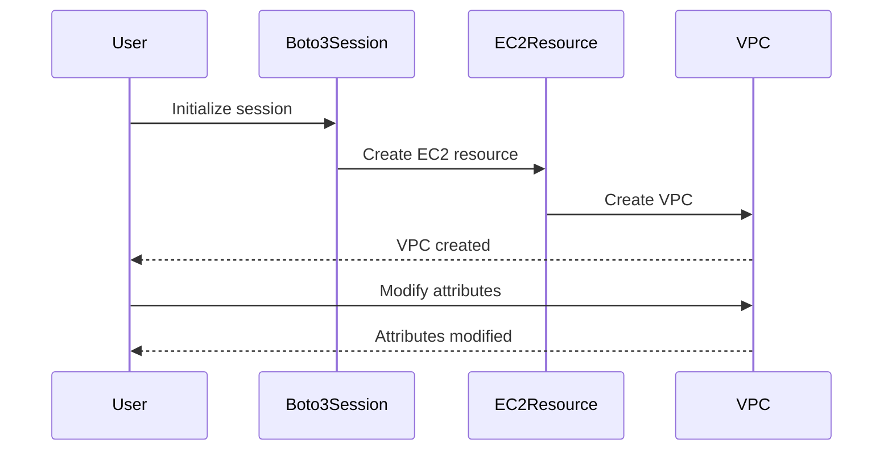

## Introduction to Boto3 and AWS Resources

Boto3 is the Amazon Web Services (AWS) Software Development Kit (SDK) for Python, which allows Python developers to write software that makes use of services like Amazon S3 and Amazon EC2. Boto3 provides an easy-to-use interface to interact with AWS services, enabling developers to manage and automate their AWS resources efficiently.

### Understanding Boto3 Resources and Clients

In Boto3, there are two primary ways to interact with AWS services: **resources** and **clients**. Both provide access to AWS services, but they differ in their level of abstraction and convenience.

#### Resource Objects

Resource objects are higher-level abstractions that wrap around clients. They provide a more object-oriented approach to working with AWS services. Resource objects handle many of the details for you, such as managing connections and handling pagination.

For example, consider the `EC2` resource:

```python
import boto3

# Create an EC2 resource object
ec2 = boto3.resource('ec2')
```

This `ec2` object represents the EC2 service and provides methods to interact with EC2 resources, such as instances, volumes, and snapshots.

#### Client Objects

Client objects are lower-level interfaces that provide direct access to the AWS API. They offer more control and flexibility but require more manual management.

For example, consider the `EC2` client:

```python
import boto3

# Create an EC2 client object
ec2_client = boto3.client('ec2')
```

This `ec2_client` object provides methods to interact with the EC2 service directly through the AWS API.

### Resource vs. Client: Usage and Convenience

While both resources and clients can perform the same tasks, resources are generally more convenient for everyday use due to their higher-level abstractions. However, clients offer more granular control and are useful for complex operations that require detailed management.

For instance, the `create_vpc` method is available on both the `EC2` resource and the `EC2` client, but using the resource is often simpler:

```python
# Using EC2 resource to create a VPC
vpc = ec2.create_vpc(CidrBlock='10.0.0.0/16')

# Using EC2 client to create a VPC
response = ec2_client.create_vpc(CidrBlock='10.0.0.0/16')
```

### Creating a VPC Using Boto3

Let's walk through the process of creating a Virtual Private Cloud (VPC) using Boto3. A VPC is a logically isolated section of the AWS Cloud where you can launch AWS resources in a virtual network that you define.

#### Step-by-Step Guide

1. **Initialize the Boto3 Session**: First, initialize a session to manage your AWS credentials and region settings.

    ```python
    import boto3

    # Initialize a session using your credentials
    session = boto3.Session(
        aws_access_key_id='YOUR_ACCESS_KEY',
        aws_secret_access_key='YOUR_SECRET_KEY',
        region_name='us-west-2'
    )
    ```

2. **Create an EC2 Resource Object**: Next, create an EC2 resource object using the session.

    ```python
    # Create an EC2 resource object
    ec2 = session.resource('ec2')
    ```

3. **Create a VPC**: Use the `create_vpc` method to create a new VPC.

    ```python
    # Create a VPC with a specific CIDR block
    vpc = ec2.create_vpc(CidrBlock='10.0.0.0/16')
    ```

4. **Configure the VPC**: After creating the VPC, you may want to configure additional settings such as enabling DNS support and hostnames.

    ```python
    # Enable DNS support and hostnames
    vpc.modify_attribute(EnableDnsSupport={'Value': True})
    vpc.modify_attribute(EnableDnsHostnames={'Value': True})
    ```

### Full Example Code

Here is the complete code to create and configure a VPC using Boto3:

```python
import boto3

# Initialize a session using your credentials
session = boto3.Session(
    aws_access_key_id='YOUR_ACCESS_KEY',
    aws_secret_access_key='YOUR_SECRET_KEY',
    region_name='us-west-2'
)

# Create an EC2 resource object
ec2 = session.resource('ec2')

# Create a VPC with a specific CIDR block
vpc = ec2.create_vpc(CidrBlock='10.0.0.0/16')

# Enable DNS support and hostnames
vpc.modify_attribute(EnableDnsSupport={'Value': True})
vpc.modify_attribute(EnableDnsHostnames={'Value':[True]})
```

### Diagramming the Process

To visualize the process, we can use a Mermaid diagram:



### Common Pitfalls and Best Practices

#### Common Pitfalls

1. **Incorrect Region Configuration**: Ensure that the correct region is specified in the session initialization.
2. **Insufficient Permissions**: Verify that the AWS credentials have the necessary permissions to create and modify VPCs.
3. **Invalid CIDR Block**: Ensure that the CIDR block used for the VPC is valid and does not overlap with existing networks.

#### Best Practices

1. **Use IAM Roles**: Instead of hardcoding credentials, use IAM roles to grant permissions to your application.
2. **Automate with CloudFormation**: Consider using AWS CloudFormation to automate the creation and management of VPCs.
3. **Monitor and Audit**: Regularly monitor and audit your VPC configurations to ensure compliance and security.

### How to Prevent / Defend

#### Detection

1. **CloudTrail**: Use AWS CloudTrail to log and monitor API calls made to your AWS account.
2. **Config Rules**: Implement AWS Config rules to automatically check for compliance with best practices.

#### Prevention

1. **IAM Policies**: Define strict IAM policies to limit permissions to only necessary actions.
2. **Security Groups**: Configure security groups to restrict inbound and outbound traffic to your VPC.

#### Secure Coding Fixes

##### Vulnerable Code

```python
import boto3

# Initialize a session using your credentials
session = boto3.Session(
    aws_access_key_id='YOUR_ACCESS_KEY',
    aws_secret_access_key='YOUR_SECRET_KEY',
    region_name='us-west-2'
)

# Create an EC2 resource object
ec2 = session.resource('ec2')

# Create a VPC with a specific CIDR block
vpc = ec2.create_vpc(CidrBlock='10.0.0.0/16')
```

##### Secure Code

```python
import boto3

# Initialize a session using IAM role
session = boto3.Session()

# Create an EC2 resource object
ec2 = session.resource('ec2')

# Create a VPC with a specific CIDR block
vpc = ec2.create_vpc(CidrBlock='10.0.0.0/16')

# Enable DNS support and hostnames
vpc.modify_attribute(EnableDnsSupport={'Value': True})
vpc.modify_attribute(EnableDnsHostnames={'Value': True})
```

### Real-World Examples and Recent Breaches

#### Example: AWS Security Group Misconfiguration

A recent breach involved misconfigured security groups that allowed unrestricted access to internal resources. This highlights the importance of properly configuring and monitoring security groups.

#### Example: Hardcoded Credentials

Another breach occurred due to hardcoded AWS credentials in source code. This emphasizes the need to use IAM roles and avoid hardcoding credentials.

### Hands-On Labs

For hands-on practice with Boto3 and AWS resources, consider the following labs:

- **PortSwigger Web Security Academy**: Offers exercises on AWS security and Boto3.
- **OWASP Juice Shop**: Provides a web application with various security vulnerabilities, including AWS-related ones.
- **DVWA (Damn Vulnerable Web Application)**: Useful for practicing web application security, including interactions with AWS services.

By thoroughly understanding and practicing these concepts, you can effectively manage and secure your AWS resources using Boto3.

---
<!-- nav -->
[[03-Introduction to Boto3 and AWS Resource Management|Introduction to Boto3 and AWS Resource Management]] | [[DevOps/DevOps Bootcamp/04-Cloud Computing (AWS & DigitalOcean)/21-Working With Boto3 Documentation For Aws Tasks/00-Overview|Overview]] | [[05-Introduction to Boto3 and AWS SDKs|Introduction to Boto3 and AWS SDKs]]
