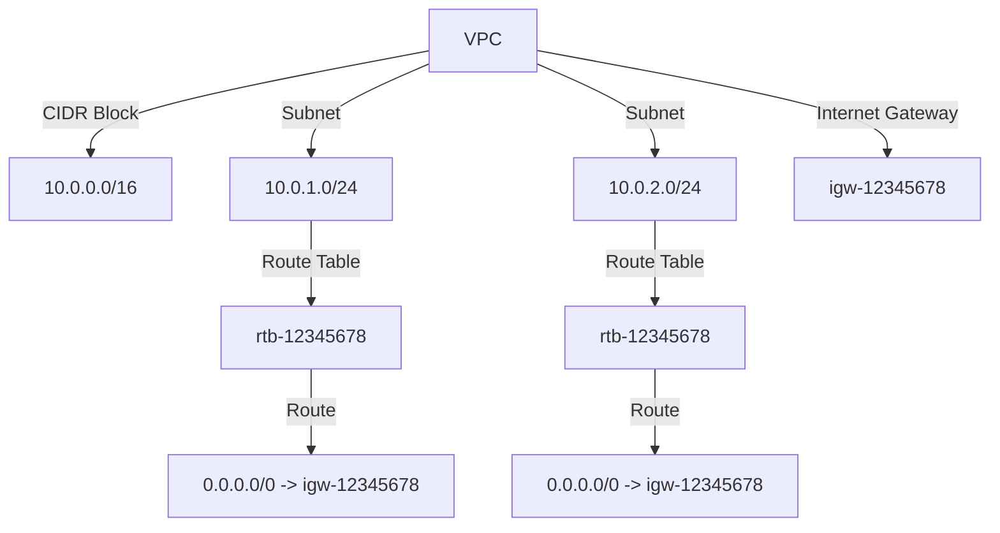
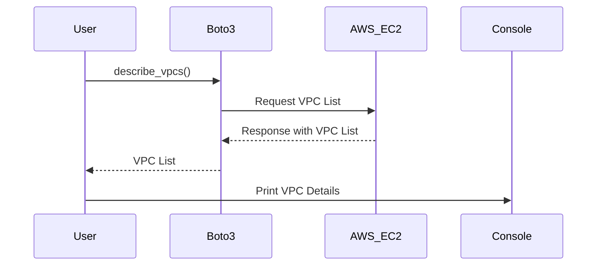

## Introduction to Boto3 and AWS VPC Management

In this section, we delve into the intricacies of managing Amazon Virtual Private Cloud (VPC) resources using Boto3, the Amazon Web Services (AWS) Software Development Kit (SDK) for Python. Boto3 provides a comprehensive set of tools to interact with AWS services programmatically, making it an essential component for DevOps engineers and developers working with AWS infrastructure.

### What is Boto3?

Boto3 is the Amazon Web Services (AWS) Software Development Kit (SDK) for Python. It allows Python developers to write software that makes use of services like Amazon S3, Amazon EC2, and others. Boto3 provides an easy-to-use interface to interact with AWS services, enabling developers to manage their AWS resources efficiently.

### Why Use Boto3?

Using Boto3 offers several advantages:

1. **Automation**: Automate repetitive tasks such as creating, modifying, and deleting AWS resources.
2. **Integration**: Integrate AWS services into existing Python applications.
3. **Flexibility**: Leverage the power of Python to create complex workflows and scripts.
4. **Consistency**: Ensure consistency across different environments by using the same codebase for development, testing, and production.

### Basic Concepts

Before diving into the specifics of managing VPCs with Boto3, it's important to understand some basic concepts related to VPCs and Boto3.

#### Amazon VPC

Amazon VPC allows you to launch AWS resources into a virtual network that you define. This virtual network closely resembles a traditional network that you might operate in your own data center, with the benefits of using the scalable infrastructure of the AWS cloud.

Key components of a VPC include:

- **Subnets**: A range of IP addresses within a VPC.
- **Internet Gateway**: A gateway that enables communication between instances in a VPC and the internet.
- **Route Tables**: Define routes for traffic leaving a subnet.
- **Security Groups**: Control inbound and outbound traffic to instances.

#### Boto3 SDK

Boto3 is organized around services, which are collections of related functions. Each service corresponds to an AWS service, such as EC2, S3, or VPC. To interact with a service, you first create a client object for that service.

```python
import boto3

# Create a Boto3 client for EC2
ec2_client = boto3.client('ec2')
```

### Managing VPCs with Boto3

Now, let's explore how to manage VPCs using Boto3. We'll start by retrieving a list of VPCs and then extract specific information from that list.

#### Retrieving a List of VPCs

To retrieve a list of VPCs, we use the `describe_vpcs` method provided by the EC2 client.

```python
import boto3

# Create a Boto3 client for EC2
ec2_client = boto3.client('ec2')

# Retrieve a list of VPCs
response = ec2_client.describe_vpcs()

# Print the response
print(response)
```

The `describe_vpcs` method returns a dictionary containing information about the VPCs. The structure of the response looks something like this:

```json
{
    "Vpcs": [
        {
            "VpcId": "vpc-12345678",
            "CidrBlock": "10.0.0.0/16",
            "State": "available",
            "IsDefault": false,
            "Tags": [
                {
                    "Key": "Name",
                    "Value": "My-VPC"
                }
            ]
        },
        {
            "VpcId": "vpc-87654321",
            "CidrBlock": "192.168.0.0/16",
            "State": "available",
            "IsDefault": false,
            "Tags": [
                {
                    "Key": "Name",
                    "Value": "Another-VPC"
                }
            ]
        }
    ],
    "ResponseMetadata": {
        "RequestId": "abcd1234-abcd-1234-abcd-1234567890ab",
        "HTTPStatusCode": 200,
        "HTTPHeaders": {
            "content-type": "text/xml;charset=UTF-8",
            "date": "Tue, 20 Mar 2023 12:00:00 GMT",
            "transfer-encoding": "chunked",
            "vary": "Accept-Encoding",
            "server": "AmazonEC2"
        },
        "RetryAttempts": 0
    }
}
```

### Extracting Specific Information from the VPC List

Once we have the list of VPCs, we often need to extract specific information such as the VPC IDs and their states. This is where loops come into play.

#### Using a Loop to Iterate Through VPCs

Let's iterate through the list of VPCs and extract the VPC IDs and their states.

```python
import boto3

# Create a Boto3 client for EC2
ec2_client = boto3.client('ec2')

# Retrieve a list of VPCs
response = ec2_client.describe_vpcs()

# Extract the VPCs from the response
vpcs = response['Vpcs']

# Iterate through the VPCs
for vpc in vpcs:
    vpc_id = vpc['VpcId']
    state = vpc['State']
    print(f"VPC ID: {vpc_id}, State: {state}")
```

### Handling Edge Cases

It's important to handle edge cases, such as when there are no VPCs in the list. We can add a check to ensure our code handles this gracefully.

```python
import boto3

# Create a Boto3 client for EC2
ec2_client = boto3.client('ec2')

# Retrieve a list of VPCs
response = ec2_client.describe_vpcs()

# Extract the VPCs from the response
vpcs = response['Vpcs']

# Check if there are any VPCs
if vpcs:
    # Iterate through the VPCs
    for vpc in vpcs:
        vpc_id = vpc['VpcId']
        state = vpc['State']
        print(f"VPC ID: {vpc_id}, State: {state}")
else:
    print("No VPCs found.")
```

### Real-World Example: CVE-2021-3504

CVE-2021-3504 is a critical vulnerability in the AWS VPC CNI (Container Network Interface) plugin used by Kubernetes clusters. This vulnerability allowed unauthorized access to the underlying VPC network, potentially leading to data exfiltration or denial of service attacks.

**Impact**: Unauthorized access to VPC resources, leading to potential data breaches or service disruptions.

**Mitigation**: Ensure that the VPC CNI plugin is up to date and apply the necessary security patches. Additionally, implement strict network policies and monitor network traffic for unusual activity.

### How to Prevent / Defend

#### Detection

To detect potential issues with VPC management, you can use AWS CloudTrail to log API calls made to your VPC. This helps in identifying unauthorized changes or suspicious activities.

```python
import boto3

# Create a Boto3 client for CloudTrail
cloudtrail_client = boto3.client('cloudtrail')

# Describe the CloudTrail trails
response = cloudtrail_client.describe_trails()

# Print the response
print(response)
```

#### Prevention

1. **IAM Policies**: Restrict access to VPC-related actions using IAM policies.
2. **Network ACLs**: Configure Network Access Control Lists (ACLs) to control traffic to and from subnets.
3. **Security Groups**: Use security groups to control inbound and outbound traffic to instances.
4. **Regular Audits**: Regularly audit your VPC configurations to ensure compliance with security policies.

#### Secure Coding Practices

Here’s an example of how to securely retrieve and process VPC information using Boto3:

```python
import boto3

# Create a Boto3 client for EC2
ec2_client = boto3.client('ec2')

# Retrieve a list of VPCs
response = ec2_client.describe_vpcs()

# Extract the VPCs from the response
vpcs = response.get('Vpcs', [])

# Check if there are any VPCs
if vpcs:
    # Iterate through the VPCs
    for vpc in vpcs:
        vpc_id = vpc.get('VpcId', 'N/A')
        state = vpc.get('State', 'Unknown')
        print(f"VPC ID: {vpc_id}, State: {state}")
else:
    print("No VPCs found.")
```

### Mermaid Diagrams

#### VPC Architecture Diagram



#### Sequence Diagram for VPC Management



### Conclusion

Managing VPCs with Boto3 is a powerful way to automate and integrate AWS services into your Python applications. By understanding the basics of VPCs and Boto3, you can effectively retrieve and process VPC information, handle edge cases, and implement secure coding practices to protect your AWS resources.

### Practice Labs

For hands-on practice with Boto3 and VPC management, consider the following labs:

- **PortSwigger Web Security Academy**: Offers a variety of labs focused on web application security, including some that touch on AWS services.
- **OWASP Juice Shop**: A deliberately insecure web application for security training purposes.
- **DVWA (Damn Vulnerable Web Application)**: Another popular web application for learning web security.
- **WebGoat**: An interactive web application designed to teach web application security lessons.

These labs provide practical experience in managing AWS resources and applying security best practices.

---
<!-- nav -->
[[06-Introduction to Boto3 and AWS Task Management|Introduction to Boto3 and AWS Task Management]] | [[DevOps/DevOps Bootcamp/04-Cloud Computing (AWS & DigitalOcean)/21-Working With Boto3 Documentation For Aws Tasks/00-Overview|Overview]] | [[08-Introduction to Boto3 and AWS VPC Tagging|Introduction to Boto3 and AWS VPC Tagging]]
