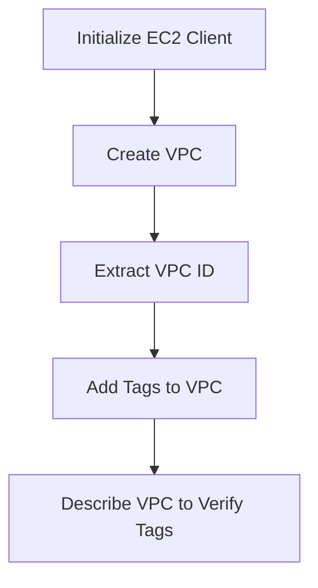

## Step-by-Step Guide to Adding Tags to a VPC

### Step 1: Setting Up Your Environment

Before we start, ensure you have the necessary setup:

1. **Install Boto3**: If you haven't already, install Boto3 using pip:
    ```bash
    pip install boto3
    ```

2. **Configure AWS CLI**: Ensure your AWS CLI is configured with the appropriate credentials and default region:
    ```bash
    aws configure
    ```
    Provide your AWS Access Key ID, Secret Access Key, and default region (e.g., `eu-central-1`).

### Step 2: Creating a New VPC

First, we need to create a new VPC. Here’s how you can do it using Boto3:

```python
import boto3

# Initialize the EC2 client
ec2 = boto3.client('ec2')

# Create a new VPC
response = ec2.create_vpc(
    CidrBlock='10.0.0.0/16',
    TagSpecifications=[
        {
            'ResourceType': 'vpc',
            'Tags': [
                {
                    'Key': 'Name',
                    'Value': 'My VPC'
                },
            ]
        },
    ]
)

# Extract the VPC ID from the response
vpc_id = response['Vpc']['VpcId']
print(f"Created VPC with ID: {vpc_id}")
```

### Step 3: Adding Tags to an Existing VPC

If you already have a VPC and want to add tags to it, you can use the `create_tags` method:

```python
# Add a Name tag to an existing VPC
ec2.create_tags(
    Resources=[vpc_id],
    Tags=[
        {
            'Key': 'Name',
            'Value': 'My VPC'
        },
    ]
)
```

### Step 4: Fetching and Displaying VPC Information

To verify that the VPC was created and tagged correctly, you can fetch and display the VPC information:

```python
# Describe the VPC to verify the tags
response = ec2.describe_vpcs(VpcIds=[vpc_id])
vpc_info = response['Vpcs'][0]
print(f"VPC ID: {vpc_info['VpcId']}, Tags: {vpc_info['Tags']}")
```

### Full Code Example

Here’s the complete code to create a VPC, add a tag, and display the VPC information:

```python
import boto3

# Initialize the EC2 client
ec2 = boto3.client('ec2')

# Create a new VPC
response = ec2.create_vpc(
    CidrBlock='10.0.0.0/16',
    TagSpecifications=[
        {
            'ResourceType': 'vpc',
            'Tags': [
                {
                    'Key': 'Name',
                    'Value': 'My VPC'
                },
            ]
        },
    ]
)

# Extract the VPC ID from the response
vpc_id = response['Vpc']['VpcId']
print(f"Created VPC with ID: {vpc_id}")

# Add a Name tag to the VPC
ec2.create_tags(
    Resources=[vpc_id],
    Tags=[
        {
            'Key': 'Name',
            'Value': 'My VPC'
        },
    ]
)

# Describe the VPC to verify the tags
response = ec2.describe_vpcs(VpcIds=[vpc_id])
vpc_info = response['Vpcs'][0]
print(f"VPC ID: {vpc_info['VpcId']}, Tags: {vpc_info['Tags']}")
```

### Mermaid Diagram: VPC Creation and Tagging Process



### Pitfalls and Common Mistakes

1. **Incorrect Region Configuration**: Ensure that the AWS CLI is configured with the correct region. Using the wrong region can lead to unexpected behavior.
2. **Insufficient Permissions**: Ensure that the IAM user or role has the necessary permissions to create VPCs and add tags.
3. **Tag Limitations**: Be aware of the limitations on the number of tags you can apply to a resource. AWS imposes limits on the number of tags per resource and per account.

### How to Prevent / Defend

#### Detection

1. **Monitor API Calls**: Use AWS CloudTrail to monitor API calls related to VPC creation and tagging. This helps in detecting unauthorized activities.
2. **Audit Logs**: Regularly audit logs to ensure that only authorized users are creating VPCs and adding tags.

#### Prevention

1. **IAM Policies**: Implement strict IAM policies to limit the actions that users can perform. For example, restrict the ability to create VPCs and add tags to specific roles.
2. **Tag Compliance**: Enforce tag compliance using AWS Config rules. This ensures that all VPCs are properly tagged according to organizational standards.

#### Secure Coding Fixes

**Vulnerable Code**:
```python
ec2.create_vpc(CidrBlock='10.0.0.0/16')
```

**Secure Code**:
```python
ec2.create_vpc(
    CidrBlock='10.0.0.0/16',
    TagSpecifications=[
        {
            'ResourceType': 'vpc',
            'Tags': [
                {
                    'Key': 'Name',
                    'Value': 'My VPC'
                },
            ]
        },
    ]
)
```

### Real-World Examples and Breaches

#### Example: CVE-2021-20225

In 2021, a vulnerability (CVE-2021-20225) was discovered in AWS IAM policies. This vulnerability allowed attackers to escalate their privileges and gain unauthorized access to resources. Proper tagging and IAM policies can mitigate such risks.

#### Example: Capital One Data Breach (2019)

The Capital One data breach in 2019 highlighted the importance of proper resource management and tagging. The attacker exploited misconfigured IAM roles and permissions, leading to unauthorized access to sensitive data. Ensuring that VPCs and other resources are properly tagged and managed can prevent such breaches.

### Hands-On Labs

For practical experience, consider the following labs:

- **PortSwigger Web Security Academy**: Focuses on web application security but includes sections on AWS security.
- **OWASP Juice Shop**: While primarily a web application security lab, it includes scenarios involving AWS and cloud security.
- **CloudGoat**: A lab specifically designed to teach AWS security best practices, including VPC management and tagging.

By following these steps and best practices, you can effectively manage and secure your AWS VPCs using Boto3.

---
<!-- nav -->
[[08-Introduction to Boto3 and AWS VPC Tagging|Introduction to Boto3 and AWS VPC Tagging]] | [[DevOps/DevOps Bootcamp/04-Cloud Computing (AWS & DigitalOcean)/21-Working With Boto3 Documentation For Aws Tasks/00-Overview|Overview]] | [[DevOps/DevOps Bootcamp/04-Cloud Computing (AWS & DigitalOcean)/21-Working With Boto3 Documentation For Aws Tasks/10-Practice Questions & Answers|Practice Questions & Answers]]
