## Introduction to AWS Container Services

When deploying containerized applications on AWS, several services are available to meet diverse application requirements. This section provides an in-depth overview of the key container services offered by AWS, including ECS (Elastic Container Service), EKS (Elastic Kubernetes Service), EC2 (Elastic Compute Cloud), AWS Fargate, and ECR (Elastic Container Registry).

### ECS (Elastic Container Service)

ECS is a fully managed container orchestration service provided by AWS. It allows you to run and scale containerized applications without having to manage the underlying infrastructure. ECS supports both Docker and Firecracker-based containers.

#### What is ECS?

ECS is designed to simplify the deployment and management of containerized applications. It abstracts away the complexities of managing container orchestration, allowing developers to focus on writing and deploying their applications.

#### Why Use ECS?

ECS offers several benefits:

- **Scalability**: Easily scale your applications based on demand.
- **Management**: Simplified management of containerized applications.
- **Integration**: Seamless integration with other AWS services like VPC, IAM, and CloudWatch.
- **Cost-Effective**: Pay only for the resources you use.

#### How Does ECS Work?

ECS operates using a client-server architecture. The client interacts with the ECS API to submit tasks and services. The ECS agent runs on the EC2 instances and manages the execution of tasks and services.

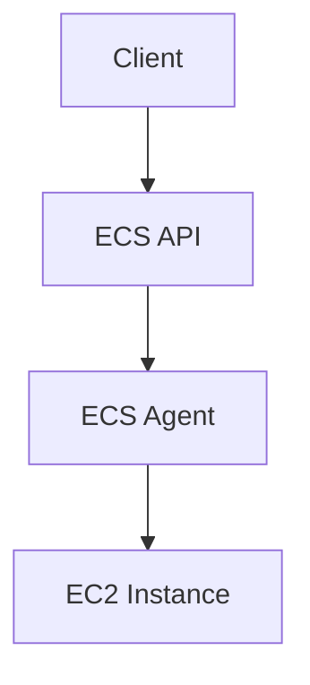

#### Example Scenario

Consider a microservice application with 10 microservices and 5 additional containers for third-party services. These containers can be deployed on EC2 instances with Docker installed.

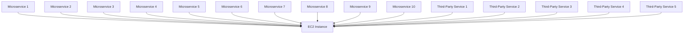

#### Managing Containers with ECS

Once the containers are deployed, ECS provides tools to manage them. This includes scaling, monitoring, and logging.

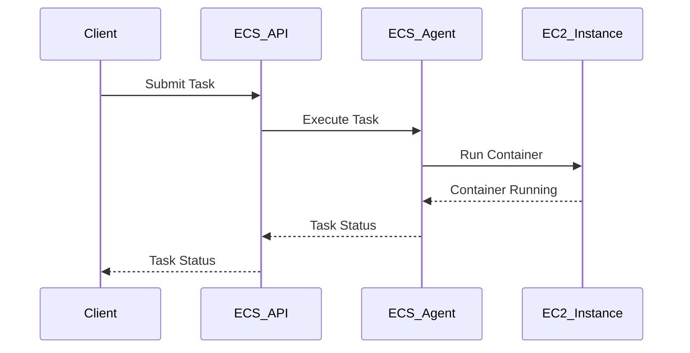

#### Common Pitfalls

- **Over-provisioning Resources**: Ensure that you provision the correct amount of resources to avoid unnecessary costs.
- **Security**: Secure your ECS clusters and tasks using IAM roles and policies.

#### How to Prevent / Defend

- **IAM Roles and Policies**: Use IAM roles and policies to control access to ECS resources.
- **Network Security**: Use VPCs and security groups to control network access.

### EKS (Elastic Kubernetes Service)

EKS is a managed Kubernetes service provided by AWS. It simplifies the deployment, scaling, and operations of Kubernetes clusters.

#### What is EKS?

EKS is designed to make it easy to run Kubernetes on AWS. It handles the provisioning, patching, and scaling of Kubernetes control plane nodes.

#### Why Use EKS?

EKS offers several benefits:

- **Managed Control Plane**: AWS manages the Kubernetes control plane.
- **Integration**: Seamless integration with other AWS services.
- **Scalability**: Easily scale your Kubernetes clusters.

#### How Does EKS Work?

EKS operates using a client-server architecture similar to ECS. The client interacts with the EKS API to submit tasks and services. The EKS control plane manages the execution of tasks and services.

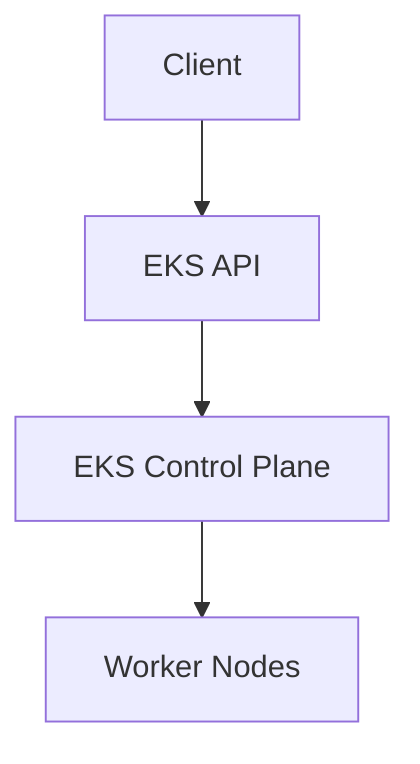

#### Example Scenario

Consider a microservice application with 10 microservices and 5 additional containers for third-party services. These containers can be deployed on EKS worker nodes.

#### Managing Containers with EKS

Once the containers are deployed, EKS provides tools to manage them. This includes scaling, monitoring, and logging.

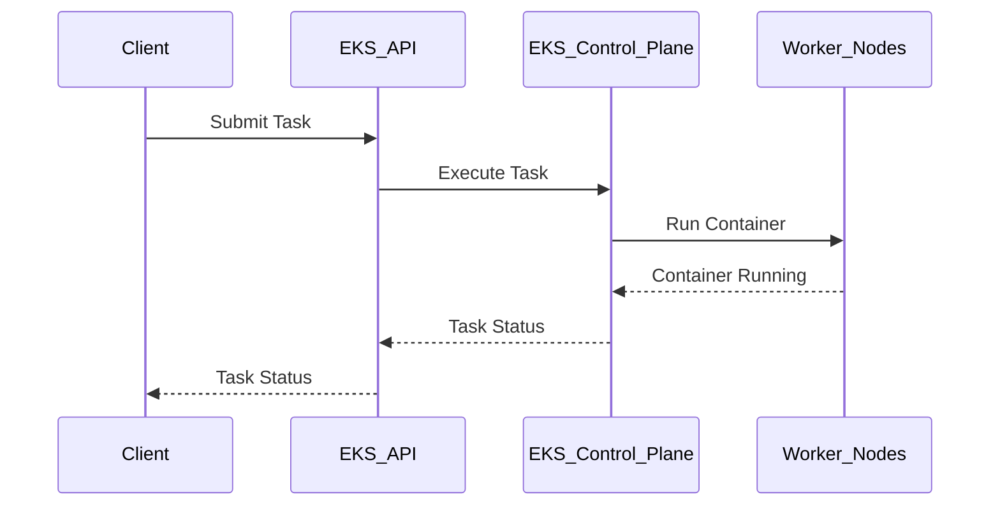

#### Common Pitfalls

- **Over-provisioning Resources**: Ensure that you provision the correct amount of resources to avoid unnecessary costs.
- **Security**: Secure your EKS clusters and tasks using IAM roles and policies.

#### How to Prevent / Defend

- **IAM Roles and Policies**: Use IAM roles and policies to control access to EKS resources.
- **Network Security**: Use VPCs and security groups to control network access.

### EC2 (Elastic Compute Cloud)

EC2 is a scalable computing capacity provided by AWS. It allows you to launch and manage virtual servers called instances.

#### What is EC2?

EC2 is designed to provide scalable computing capacity. It allows you to launch and manage virtual servers called instances.

#### Why Use EC2?

EC2 offers several benefits:

- **Scalability**: Easily scale your computing capacity based on demand.
- **Flexibility**: Choose from a variety of instance types and sizes.
- **Integration**: Seamless integration with other AWS services.

#### How Does EC2 Work?

EC2 operates using a client-server architecture. The client interacts with the EC2 API to launch and manage instances. The EC2 instances run on the AWS infrastructure.

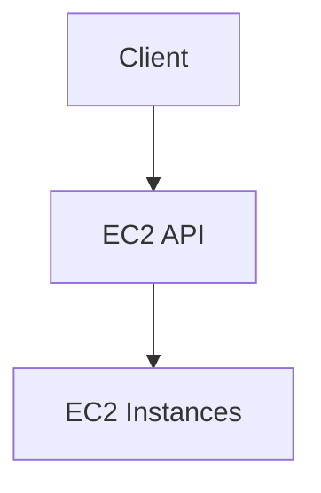

#### Example Scenario

Consider a microservice application with 10 microservices and 5 additional containers for third-party services. These containers can be deployed on EC2 instances with Docker installed.

#### Managing Containers with EC2

Once the containers are deployed, EC2 provides tools to manage them. This includes scaling, monitoring, and logging.

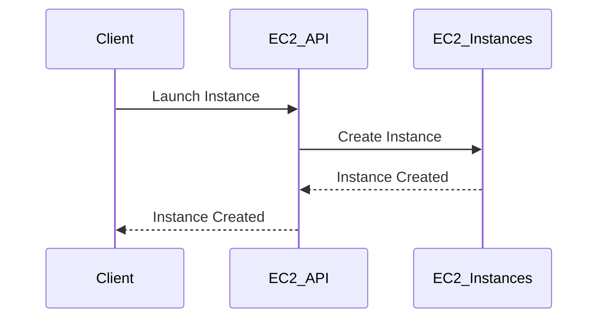

#### Common Pitfalls

- **Over-provisioning Resources**: Ensure that you provision the correct amount of resources to avoid unnecessary costs.
- **Security**: Secure your EC2 instances using IAM roles and policies.

#### How to Prevent / Defend

- **IAM Roles and Policies**: Use IAM roles and policies to control access to EC2 resources.
- **Network Security**: Use VPCs and security groups to control network access.

### AWS Fargate

AWS Fargate is a serverless compute engine for containers. It allows you to run containers without having to manage the underlying infrastructure.

#### What is AWS Fargate?

Fargate is designed to simplify the deployment and management of containerized applications. It abstracts away the complexities of managing container orchestration, allowing developers to focus on writing and deploying their applications.

#### Why Use AWS Fargate?

Fargate offers several benefits:

- **Serverless**: No need to manage the underlying infrastructure.
- **Scalability**: Easily scale your applications based on demand.
- **Integration**: Seamless integration with other AWS services.

#### How Does AWS Fargate Work?

Fargate operates using a client-server architecture. The client interacts with the Fargate API to submit tasks and services. The Fargate engine manages the execution of tasks and services.

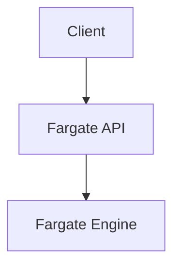

#### Example Scenario

Consider a microservice application with 10 microservices and 5 additional containers for third-party services. These containers can be deployed on Fargate.

#### Managing Containers with AWS Fargate

Once the containers are deployed, Fargate provides tools to manage them. This includes scaling, monitoring, and logging.

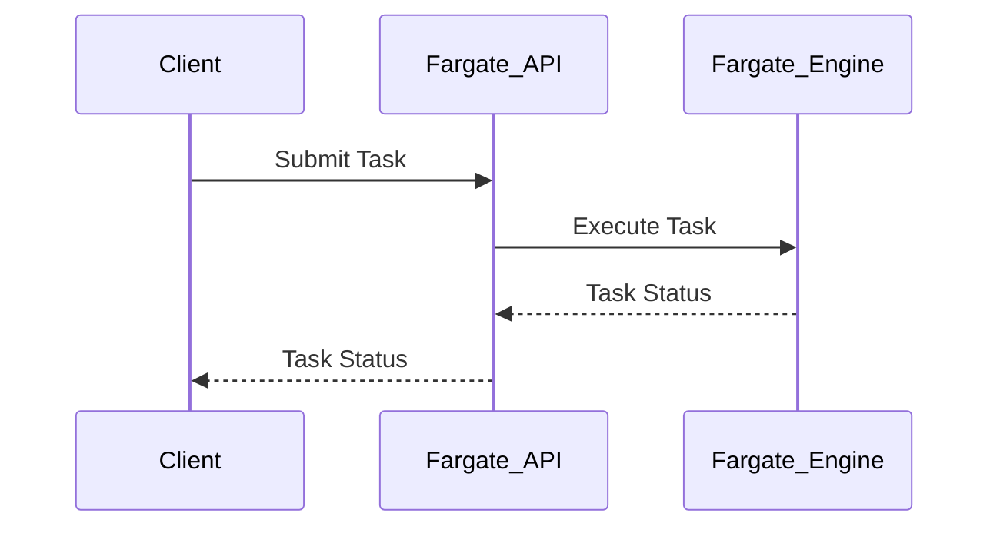

#### Common Pitfalls

- **Over-provisioning Resources**: Ensure that you provision the correct amount of resources to avoid unnecessary costs.
- **Security**: Secure your Fargate tasks using IAM roles and policies.

#### How to Prevent / Defend

- **IAM Roles and Policies**: Use IAM roles and policies to control access to Fargate resources.
- **Network Security**: Use VPCs and security groups to control network access.

### ECR (Elastic Container Registry)

ECR is a fully managed Docker container registry provided by AWS. It allows you to store, manage, and deploy Docker container images.

#### What is ECR?

ECR is designed to simplify the storage and management of Docker container images. It integrates seamlessly with other AWS services, making it easy to deploy and manage containerized applications.

#### Why Use ECR?

ECR offers several benefits:

- **Fully Managed**: AWS manages the registry, so you don't have to worry about maintenance.
- **Integration**: Seamless integration with other AWS services.
- **Security**: Secure your container images using IAM roles and policies.

#### How Does ECR Work?

ECR operates using a client-server architecture. The client interacts with the ECR API to push and pull container images. The ECR registry stores and manages the container images.

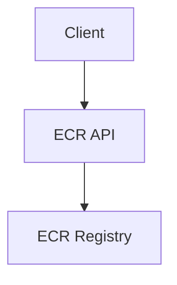

#### Example Scenario

Consider a microservice application with 10 microservices and 5 additional containers for third-party services. These container images can be stored in ECR.

```mermaid
graph TB
    A[Microservice 1 Image] --> B[ECR Registry]
    C[Microservice 2 Image] --> B
    D[Microservice 3 Image] --> B
    E[Microservice 4 Image] --> B
    F[Microservice 5 Image] --> B
    G[Microservice 6 Image] --> B
    H[Microservice 7 Image] --> B
    I[Microservice 8 Image] --> B
    J[Microservice 9 Image] --> B
    K[Microservice 10 Image] --> B
    L[Third-Party Service 1 Image] --> B
    M[Third-Party Service 2 Image] --> B
    N[Third-Party Service 3 Image] --> B
    O[Third-Party Service 4 Image] --> B
    P[Third-Party Service 5 Image] --> B
```

#### Managing Container Images with ECR

Once the container images are stored in ECR, you can manage them using the ECR API.

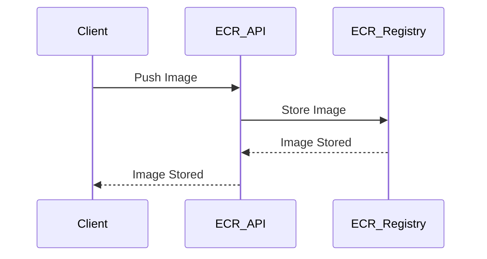

#### Common Pitfalls

- **Over-provisioning Storage**: Ensure that you provision the correct amount of storage to avoid unnecessary costs.
- **Security**: Secure your container images using IAM roles and policies.

#### How to Prevent / Defend

- **IAM Roles and Policies**: Use IAM roles and policies to control access to ECR resources.
- **Network Security**: Use VPCs and security groups to control network access.

### Conclusion

AWS provides several container services to meet diverse application requirements. ECS, EKS, EC2, AWS Fargate, and ECR offer different levels of abstraction and management capabilities. Understanding the strengths and weaknesses of each service will help you choose the right one for your application.

### Practice Labs

For hands-on experience with AWS container services, consider the following labs:

- **PortSwigger Web Security Academy**: Focuses on web application security but also covers container security.
- **OWASP Juice Shop**: A deliberately insecure web application for practicing web security.
- **DVWA (Damn Vulnerable Web Application)**: Another web application for practicing web security.
- **WebGoat**: An interactive web security training application.
- **CloudGoat**: A set of vulnerable AWS environments for practicing cloud security.
- **flaws.cloud**: A platform for practicing cloud security.
- **flaws2.cloud**: Another platform for practicing cloud security.
- **AWS Official Workshops**: Provides guided labs for various AWS services.
- **Pacu**: A framework for automating AWS security assessments.
- **Kubernetes Goat**: A set of vulnerable Kubernetes environments for practicing Kubernetes security.
- **OWASP WrongSecrets**: A set of challenges for practicing secure coding.
- **kube-hunter**: A tool for discovering and exploiting misconfigurations in Kubernetes clusters.

These labs will help you gain practical experience with AWS container services and improve your skills in deploying and managing containerized applications.

---
<!-- nav -->
[[01-AWS Container Services Overview|AWS Container Services Overview]] | [[DevOps/DevOps Bootcamp/05-Containerization (Docker)/01-AWS Container Services Overview (2)/00-Overview|Overview]] | [[03-Introduction to AWS Elastic Kubernetes Service (EKS)|Introduction to AWS Elastic Kubernetes Service (EKS)]]
