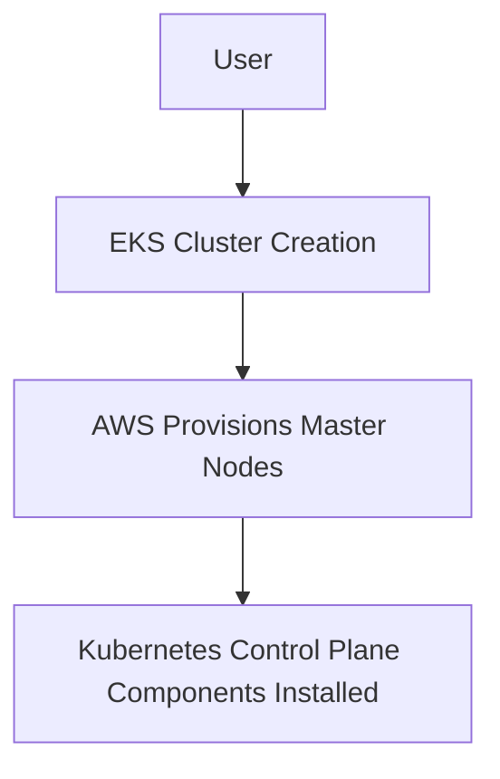
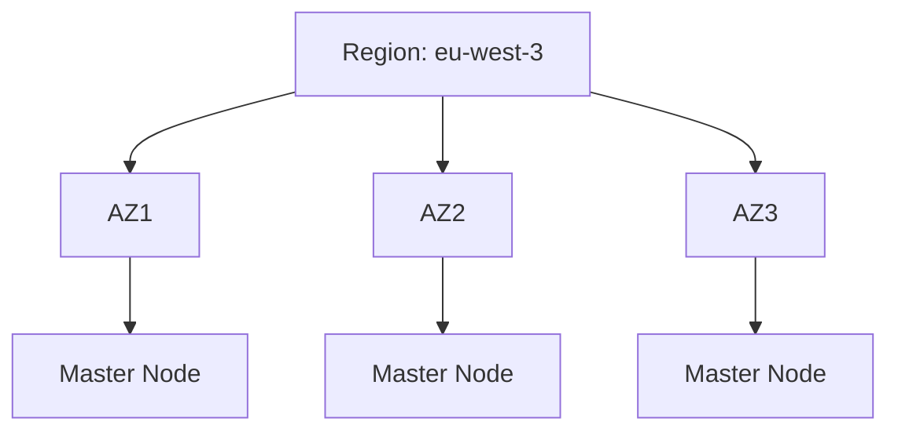
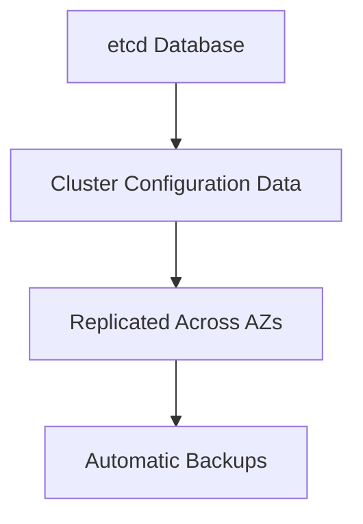
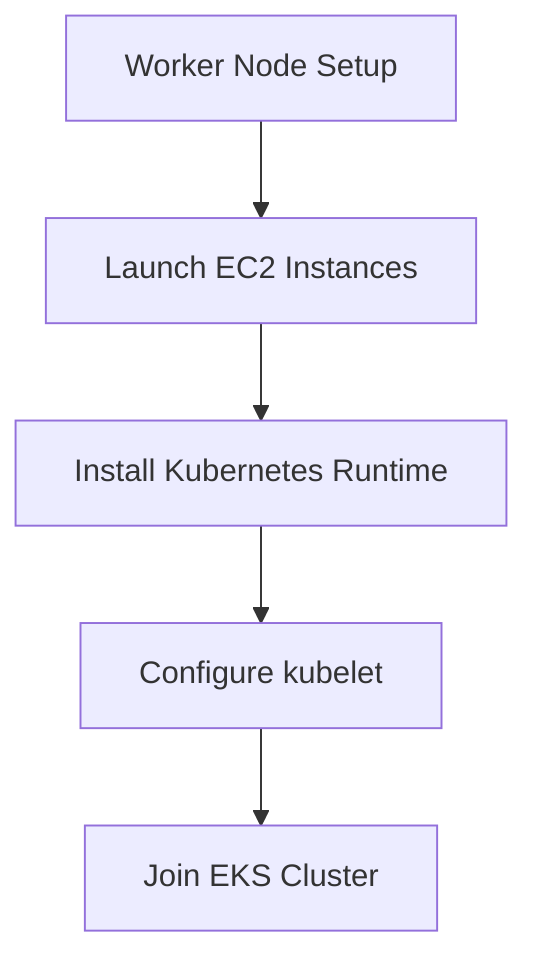
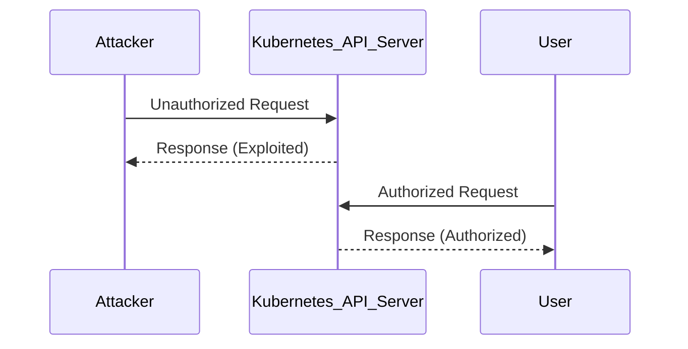

## Introduction to AWS Elastic Kubernetes Service (EKS)

AWS Elastic Kubernetes Service (EKS) is a managed service that makes it easy to run Kubernetes on AWS without needing to stand up or maintain your own Kubernetes control plane. Kubernetes is an open-source system for automating deployment, scaling, and management of containerized applications. EKS simplifies the process of deploying and managing Kubernetes clusters by handling the underlying infrastructure and operations.

### Control Plane in Kubernetes

In Kubernetes, the control plane is the core component responsible for managing the cluster. It consists of several key components:

- **API Server**: Acts as the front-end for the Kubernetes control plane, handling all REST operations and providing the API interface.
- **etcd**: A distributed key-value store used to store the configuration data of the cluster.
- **Scheduler**: Responsible for assigning pods to nodes based on resource requirements and policies.
- **Controller Manager**: Runs controllers that watch the state of the cluster and make changes to move the current state towards the desired state.

#### Master Nodes in Kubernetes

Master nodes are the servers that run the control plane components. These nodes are critical for the operation of the cluster and must be highly available to ensure the stability of the cluster. Traditionally, setting up and maintaining these nodes requires significant expertise and resources.

### EKS Control Plane Management

When you create an EKS cluster, AWS provisions the master nodes in the background. These master nodes come pre-configured with all the necessary Kubernetes services installed. This means you do not have to worry about setting up and maintaining the master nodes yourself.



#### Automatic Replication Across Availability Zones

One of the key benefits of using EKS is the automatic replication of master nodes across multiple availability zones (AZs). This ensures high availability and fault tolerance. For example, if you create an EKS cluster in the `eu-west-3` region, which has three availability zones, AWS will automatically replicate the master nodes across all three AZs.



### Storage in Kubernetes

The etcd database is a crucial component of the Kubernetes control plane. It stores the entire configuration of the cluster, including the current state of all resources such as pods, services, and deployments. Losing the data in etcd would result in losing the entire cluster configuration.

#### Managed Storage with EKS

With EKS, AWS manages the storage and replication of the etcd database. This includes automatic backups and replication to ensure data durability and availability. This offloads the responsibility of managing storage from the user, making it easier to maintain a stable and reliable Kubernetes cluster.



### Worker Nodes in Kubernetes

While the control plane is managed by AWS in EKS, the worker nodes are still required to run the actual workloads. Worker nodes are the servers that run the pods and containers. They are responsible for executing the tasks defined in the Kubernetes manifests.

#### Setting Up Worker Nodes

To set up worker nodes in an EKS cluster, you typically launch EC2 instances and configure them to join the cluster. This involves installing the Kubernetes runtime (such as Docker or containerd) and the Kubernetes node agent (kubelet).



### Example: Creating an EKS Cluster

Let's walk through an example of creating an EKS cluster using the AWS CLI.

#### Step 1: Create an EKS Cluster

First, you need to create an EKS cluster using the `eksctl` tool, which is a command-line interface for Amazon EKS.

```bash
eksctl create cluster --name my-cluster --region us-west-2 --version 1.21 --node-type t3.medium --nodes 3 --nodes-min 2 --nodes-max 4
```

This command creates an EKS cluster named `my-cluster` in the `us-west-2` region with Kubernetes version `1.21`. It also sets up three worker nodes with the `t3.medium` instance type, and scales the number of nodes between 2 and 4 based on demand.

#### Step 2: Verify the Cluster

Once the cluster is created, you can verify its status using the following command:

```bash
kubectl get nodes
```

This command lists all the nodes in the cluster, confirming that the worker nodes are correctly joined to the cluster.

### Real-World Examples and CVEs

#### CVE-2021-25741: Kubernetes API Server Vulnerability

CVE-2021-25741 is a vulnerability in the Kubernetes API server that allows an attacker to bypass authentication and authorization checks. This vulnerability affects versions of Kubernetes prior to 1.21.1, 1.20.7, and 1.19.10.

**Impact**: An attacker could exploit this vulnerability to gain unauthorized access to the Kubernetes API server and perform actions such as creating new resources or modifying existing ones.

**Mitigation**: To mitigate this vulnerability, ensure that your Kubernetes cluster is running a patched version of the API server. Regularly update your cluster to the latest version to receive security patches.



### How to Prevent / Defend

#### Detection

To detect potential vulnerabilities in your Kubernetes cluster, regularly scan the cluster using tools like Trivy or Aqua Security. These tools can identify known vulnerabilities in the Kubernetes components and provide recommendations for mitigation.

```bash
trivy image <your-image>
```

#### Prevention

To prevent vulnerabilities, follow these best practices:

1. **Regular Updates**: Keep your Kubernetes cluster and all components up to date with the latest security patches.
2. **Network Policies**: Implement network policies to restrict communication between pods and external networks.
3. **RBAC**: Use Role-Based Access Control (RBAC) to limit permissions and ensure that users and services have only the minimum necessary privileges.

#### Secure Coding Fixes

Here is an example of a vulnerable Kubernetes manifest and its secure counterpart:

**Vulnerable Manifest**:
```yaml
apiVersion: v1
kind: Pod
metadata:
  name: vulnerable-pod
spec:
  containers:
  - name: vulnerable-container
    image: nginx:latest
    ports:
    - containerPort: 80
```

**Secure Manifest**:
```yaml
apiVersion: v1
kind: Pod
metadata:
  name: secure-pod
spec:
  containers:
  - name: secure-container
    image: nginx:latest
    ports:
    - containerPort: 80
    securityContext:
      runAsNonRoot: true
      readOnlyRootFilesystem: true
```

In the secure manifest, we have added a `securityContext` to ensure that the container runs as a non-root user and the root filesystem is read-only, reducing the attack surface.

### Conclusion

AWS Elastic Kubernetes Service (EKS) simplifies the process of deploying and managing Kubernetes clusters by handling the underlying infrastructure and operations. By leveraging EKS, you can focus on developing and deploying your applications without worrying about the complexities of managing the control plane. However, it is essential to follow best practices for securing your cluster and regularly updating it to protect against known vulnerabilities.

### Practice Labs

For hands-on experience with AWS EKS, consider the following labs:

- **CloudGoat**: A series of labs designed to help you learn about AWS security best practices, including EKS.
- **flaws.cloud**: A platform that provides interactive labs for learning about cloud security, including Kubernetes and EKS.
- **AWS Official Workshops**: AWS offers various workshops and labs that cover different aspects of EKS, including setup, deployment, and security.

These labs will provide you with practical experience in setting up and managing EKS clusters, helping you to become proficient in using this powerful service.

---
<!-- nav -->
[[02-Introduction to AWS Container Services|Introduction to AWS Container Services]] | [[DevOps/DevOps Bootcamp/05-Containerization (Docker)/01-AWS Container Services Overview (2)/00-Overview|Overview]] | [[04-Introduction to AWS Fargate|Introduction to AWS Fargate]]
